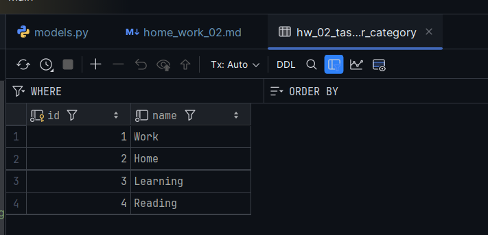

## <a id="s6" style="color: #9000F0">Домашнее задание 8 (2 in Django): Проект "Менеджер задач"</a>    
Цель: Создать структуру менеджера задач ([п. 1](#s1)) и зарегистрировать модели в 
панели администратора Django.  

### Реализовать модели:  
1. Модель Task:  
- Описание: Задача для выполнения.  
- Поля:  
  - title: Название задачи. Уникально для даты.   [п. 2](#s2). 
  - description: Описание задачи.  
  - categories: Категории задачи. Многие ко многим.  
  - status: Статус задачи. Выбор из: New, In progress, Pending, Blocked, Done.  
  - deadline: Дата и время дедлайн.  
  - created_at: Дата и время создания. Автоматическое заполнение.  
2. Модель SubTask:  
- Описание: Отдельная часть основной задачи (Task).  
- Поля:  
  - title: Название подзадачи.  
  - description: Описание подзадачи.  
  - task: Основная задача. Один ко многим.  
  - status: Статус задачи. Выбор из: New, In progress, Pending, Blocked, Done.  
  - deadline: Дата и время дедлайн.  
  - created_at: Дата и время создания. Автоматическое заполнение.  
3. Модель Category:  
- Описание: Категория выполнения.  
- Поля:  
  - name: Название категории.  

### Шаги для выполнения задания:  
1. Создайте модели:       [п. 2](#s2).  
  В файле models.py вашего приложения добавьте модели с указанными полями и описаниями.  
2. Создайте миграции:     [п. 3](#s3).  
  Выполните команду для создания миграций.  
3. Примените миграции:    [п. 3](#s3).  
  Выполните команду для применения миграций.  
4. Зарегистрируйте модели в админке:  [п. 4](#s4).  
  В файле admin.py вашего приложения зарегистрируйте __все__ модели.  
5. Зафиксируйте изменения в GIT:  [п. 6](#s6).  
  Создайте новый коммит и запушьте его в ваш Git.  
6. Создайте записи через админку:  [п. 5](#s5).  
   - <span style="color: #505050">Создайте суперпользователя</span> - [пп. 1.6](#ss1.6).
   - Перейдите в административную панель Django.
   - Добавьте несколько объектов для каждой модели.  
7. Оформите ответ:
  Прикрепите ссылку на гит и скриншоты где видны созданные объекты к ответу на домашнее задание.  


---
### <span style="color: #008000">Источники</span>  
<span style="color: #606060">Основное видео - урок от 04.06.2025</span> [<font color="#696969">[2 - ▶  Video 15.2]</font>](#v2).  
1. ▶ Video 15.1: <a id="v1">https://player.vimeo.com/video/1090076209?h=56080a1f80.</a>    
2. ▶ Video 15.2: <a id="v2">https://player.vimeo.com/video/1090394708?h=3fb99c3623.</a>  
3. Presentation <a id="p1">Les15-Django_15-Models-1.pdf.</a>  
4. Conspectus <a id="c1">Les15-Django_15---Models-1.pdf.</a>  
5. Presentation <a id="p2">Les15-Django_16-Models-2.pdf.</a>  
6. Conspectus <a id="c2">Les15-Django_16---Models-2.pdf.</a>  
7. Presentation <a id="p3">Pr01-Adpractice_Pr1-04_06.pdf.</a>  
8. Conspectus <a id="c3">Pr01-Adpractice_PrfS1-04_06.pdf.</a>  
9. hw_01_first_app / <a id="hw1">home_work_01.md</a>.


---
## <a id="s1" style="color: #008000">1.Создание и регистрация приложения "Менеджер задач"</a>
Внести изменения в файлы DjangoProject_config/<a>settings.py</a> и DjangoProject_config/<a>urls.py</a>.

<div style="font: bold normal 110% sans-serif; color: #8A2BE2; white-space: pre; border: 2px outset #8A2BE2; padding: 5px;">        ДЕЙСТВИЯ</div>  


### <a id="ss1.1" style="color: #8A2BE2">**1.1.** Создание Django-приложения</a> <a>hw_02_task_manager</a>  
<span style="color: #606060">См. [[9](#hw1)], пп. 2.(1).</span>  
```
  python manage.py startapp hw_02_task_manager
```


### <a id="ss1.2" style="color: #8A2BE2">**1.2.** Регистрация приложения в проекте  ▶</a> <a>DjangoProject_config / settings.py</a>  
<span style="color: #606060">См. [[9](#hw1)], пп. 2.(2).</span>  
```python
INSTALLED_APPS = [
    # Встроенные приложения:
    'django.contrib.admin',
    ...,
    'django.contrib.staticfiles',
    # Моё приложение по ДЗ-2:
    'hw_02_task_manager',      # ИЛИ 'myapp.apps.MyappConfig'.
]
```


### <a id="ss1.3" style="color: #8A2BE2">**1.3.** Создание представления (Views)  ▶</a>  <a>hhw_02_task_manager / views.py</a>  
<span style="color: #606060">См. [[9](#hw1)], пп. 2.(3) и п. 5.</span>  
```python
from django.http import HttpResponse

def hello_django(request):                                      # __ NB! __   hello_django.
    return HttpResponse("<h1>Welcome to the Task Manager!</h1>")
```


### <a id="ss1.4" style="color: #8A2BE2">**1.4.** Определение URL-маршрута</a> <a>hw_02_task_manager / urls.py</a>  
<span style="color: #606060">См. [[9](#hw1)], пп. 2.(4) и п. 5.</span>  
```python
from django.urls import path
from . import views

urlpatterns = [
    path('hw_02/', views.welcome_to_the_app, name='welcome_to_the_app'),    # __ NB! __  'hw_01/'  and  hello_django.
]
```


### <a id="ss1.5" style="color: #8A2BE2">**1.5.** Подключение маршрутов приложения к проекту</a> <a>DjangoProject_config / urls.py</a>  
<span style="color: #606060">См. [[9](#hw1)], пп. 2.(5).</span>

```python
from django.contrib import admin
from django.urls import path, include

urlpatterns = [
  path('admin/', admin.site.urls),
  ...
  path('hw_02_task_manager/', include('hw_02_task_manager.urls')),  # Подключение маршрутов приложения hw_02_task_manager.
]
```


### <a id="ss1.6" style="color: #8A2BE2; padding: 0px; ">**1.6.** Создать и зарегистрировать Суперюзера</a>  
<span style="color: #606060">См. Video 15.1 [[1](#v1)] 42:30.</span>  
```
python manage.py createsuperuser
```
> Username (leave blank to use 'odnab'): od_hw02  
> Email address: od_hw02@django.com  


---
## <a id="s2" style="color: #008000">2. Создание моделей для приложения "Менеджер задач"</a>
Список валидаторов Django 5.0: https://django.fun/docs/django/5.0/ref/validators/.  

Уникальность названия для даты публикации прописывается параметром 
<span style="color: #606060">См. [[4](#c1)], c. 24.</span>:  
```python
unique_for_date='publish_date'
```
- null - в <span style="color: blue;">Базах Данных</span> без значений.  
- blank - в <span style="color: red;">ФОРМАХ</span> без значений.  


---
## <a id="s3" style="color: #008000">3. Создание и применение миграций</a>
После изменений в МОДЕЛИ:  
```
python manage.py makemigrations
python manage.py migrate
```


---
## <a id="s4" style="color: #008000">4. Регистрация модели в Админке</a>
Для регистрации всех моделей в админке в файл <a>admin.py</a> добавить такой код:
```python
from django.contrib import admin
from hw_02_task_manager.models import Category, Task, SubTask

admin.site.register(Category)
admin.site.register(Task)
admin.site.register(SubTask)
```


--- 
## <a id="s5" style="color: #008000">5. Создание записей через Админку</a>
Запустить локальный сервер Django с помощью manage.py в терминале:
```
python manage.py runserver
```
Перейти по созданному URL адресу http://127.0.0.1:8000 для проверки корректности 
реализации, где выбрать из списка нужное ([<font color="#696969">Fig. 1</font>](#img1)):  

  

<a id="img1" style="margin: 40px; color:#606060;">Fig. 1.</a>

Чтобы увидеть стандартную начальную страницу Django-приложения с текстом приветствия 
из <a>hw_02_task_manager / views.py</a> (<a id="img2">Fig. 2</a>), нужно 
изменить эндпоинт в адресной строке браузера на http://127.0.0.1:8000/hw-02/home/, где:
- <a style="color:#D01050">hw-02/</a> - имя приложения, прописанное в <a>DjangoProject_config / urls.py</a>,
- <a style="color:#D01050">home/</a> - страница с приветствием.  

  

<a id="img2" style="margin: 40px; color:#606060;">Fig. 2.</a>  

---
<div style="font: bold normal 110% sans-serif; color: #8A2BE2; white-space: pre; border: 2px outset #8A2BE2; padding: 5px;">        Добавление записей через Админку</div>  

Перейти на страницу с адресом http://127.0.0.1:8000/admin/.

  

<a id="img3" style="margin: 40px; color:#606060;">Fig. 3. Список категорий в Админке.</a>

  

<a id="img4" style="margin: 40px; color:#606060;">Fig. 4. Список задач в Админке.</a>

  

<a id="img5" style="margin: 40px; color:#606060;">Fig. 5. Пример задачи в Админке.</a>

  

<a id="img6" style="margin: 40px; color:#606060;">Fig. 6. Список подзадач в Админке.</a>

  

<a id="img7" style="margin: 40px; color:#606060;">Fig. 7. Пример подзадачи в Админке.</a>

  

<a id="img8" style="margin: 40px; color:#606060;">Fig. 8. Структура таблиц приложения "hw_02_task_manager" в БД.</a>

  

<a id="img9" style="margin: 40px; color:#606060;">Fig. 9. Таблица "Категории".</a>

  

<a id="img10" style="margin: 40px; color:#606060;">Fig. 10. Таблица "Задачи".</a>

  

<a id="img11" style="margin: 40px; color:#606060;">Fig. 11. Таблица "Подзадачи".</a>

  

<a id="img12" style="margin: 40px; color:#606060;">Fig. 12. Таблица "Многие-ко-многим".</a>


---

## <a id="s6" style="color: #008000">6. Git</a>
- Запуште проект в Git-репозиторий и прикрепите как решение ссылку на него.

Ссылка на приложение по ДЗ <a>hw_02_task_manager</a>: https://github.com/odnabu/Django-Python-Advanced/tree/main/hw_02_task_manager.  

Ссылка на весь проект <a>DjangoProject</a>: https://github.com/odnabu/Django-Python-Advanced/tree/main.  

---
[//]: # (<span style="color: #8A2BE2; margin: 20px 10px;">▣</span> )


