Python Advanced - Django
23.06.2025

## <a id="s6" style="color: #9000F0">Домашнее задание 9 (3 in Django): Проект "Менеджер задач" — Продолжение</a>    
Цель: Добавить строковое представление (str) и метаданные (Meta) ([п. 1](#s1)) к моделям менеджера задач, 
а также настроить административную панель для удобного управления этими моделями.

#### 1. Реализуйте изменения в моделях:  
<span style="color: #8A2BE2; margin: 0 0 0 0px; padding: 0 15px 0 0;">▣</span>__Модель Task:__  
- Добавить метод str, который возвращает название задачи.  
- Добавить класс Meta с настройками:
  - Имя таблицы в базе данных: 'task_manager_task'.    
  - Сортировка по убыванию даты создания.   
  - Человекочитаемое имя модели: 'Task'.  
  - Уникальность по полю 'title'.  

<span style="color: #8A2BE2; margin: 0 0 0 0px; padding: 0 15px 0 0;">▣</span>__Модель SubTask:__  
- Добавить метод str, который возвращает название подзадачи.
- Добавить класс Meta с настройками:
  - Имя таблицы в базе данных: 'task_manager_subtask'. 
  - Сортировка по убыванию даты создания. 
  - Человекочитаемое имя модели: 'SubTask'. 
  - Уникальность по полю 'title'.

<span style="color: #8A2BE2; margin: 0 0 0 0px; padding: 0 15px 0 0;">▣</span>__Модель Category:__  
- Добавить метод str, который возвращает название категории. 
- Добавить класс Meta с настройками:
  - Имя таблицы в базе данных: 'task_manager_category'. 
  - Человекочитаемое имя модели: 'Category'. 
  - Уникальность по полю 'name'.

#### 2. Настройте отображение моделей в админке:   
В файле admin.py вашего приложения добавьте классы администратора для настройки 
отображения моделей Task, SubTask и Category.

#### 3. Зафиксируйте изменения в Git: 
Создайте новый коммит и запушьте его в ваш Git.

#### 4. Создайте записи через Админку:
  1) Создайте суперпользователя. 
  2) Перейдите в административную панель Django. 
  3) Добавьте несколько объектов для каждой модели.

#### 5. Оформите ответ:  
Прикрепите ссылку на гит и скриншоты, где видны созданные объекты к ответу на домашнее задание.


<div style="font: bold normal 110% sans-serif; color: #8A2BE2; white-space: pre; border-top: 2px dotted #008000; padding: 5px;"></div>  

### <span style="color: #008000">Источники</span>  
<span style="color: #606060">Видео - урок от 16.06.2025</span> [<font color="#696969">[1 - ▶  Video 17]</font>](#v1).  
1. ▶ Video 17 "Модели и админ панель. Работа с пользователями": <a id="v1">https://player.vimeo.com/video/1093667373?h=963d44b2ac.</a>    
2. Presentation <a id="p1">Les17-Copy of Django_17-Models_Admin_panel.pdf.</a>  
3. Conspectus <a id="c1">Les17-Copy of Django_17---Models_Admin_panel.pdf.</a>  
4. Presentation <a id="p2">Les17-Copy of Django_18-Users.pdf.</a>  
5. Conspectus <a id="c2">Les17-Django_18---Users.pdf.</a>  
6. home_work_02.md / <a id="hw2">home_work_02.md</a>.
7. Руководство по оформлению Markdown файлов: https://gist.github.com/Jekins/2bf2d0638163f1294637.
8. "Model Meta options". link: https://docs.djangoproject.com/en/5.2/ref/models/options/.
9. "constraints in Model Meta". link: https://docs.djangoproject.com/en/5.2/ref/models/options/#constraints.
10. "Constraints reference". link: https://docs.djangoproject.com/en/5.2/ref/models/constraints/.


<div style="font: bold normal 110% sans-serif; color: #8A2BE2; white-space: pre; border-top: 2px dotted #008000; padding: 5px;"></div>  

## <a id="s1" style="color: #008000">1. Изменения в моделях приложения "Менеджер задач"</a>
Внести изменения в файлы DjangoProject_config/<a>models.py</a> и DjangoProject_config/<a>admin.py</a>.

<div style="font: bold normal 110% sans-serif; color: #8A2BE2; white-space: pre; border: 2px outset #8A2BE2; padding: 5px;">        ДЕЙСТВИЯ</div>  


### <a id="ss1.1" style="color: #8A2BE2">**1.1.** Модели Task, SubTask, Category</a>  
Список валидаторов Django 5.0: https://django.fun/docs/django/5.0/ref/validators/.  
- null - в <span style="color: blue;">Базах Данных</span> без значений.  
- blank - в <span style="color: red;">ФОРМАХ</span> без значений.  

<span style="color: #606060;">См. [[6](#hw2)], пп. 1.1.</span> Пример кода для модели Task:  
```
      class Meta:
        db_table = 'task_manager_task'
        ordering = ['-created_at']
        verbose_name = 'Task'
        verbose_name_plural = 'Tasks'
        constraints = [
            models.UniqueConstraint(fields=['title'], name='unique_task_title'),
        ]

    def __str__(self):
        return self.title
```

### <a id="ss1.2" style="color: #8A2BE2">**1.2.** Миграции для сохранения изменений как в БД так и в Админке</a>  

После изменений в МОДЕЛЯХ:
```
python manage.py makemigrations hw_02_task_manager
python manage.py migrate hw_02_task_manager
```
Запустить локальный сервер Django с помощью manage.py в терминале:
```
 python manage.py runserver
```


<div style="font: bold normal 110% sans-serif; color: #8A2BE2; white-space: pre; border-top: 2px dotted #008000; padding: 5px;"></div>  

## <a id="s2" style="color: #008000">2. Отображение моделей в Админке для приложения "Менеджер задач"</a>

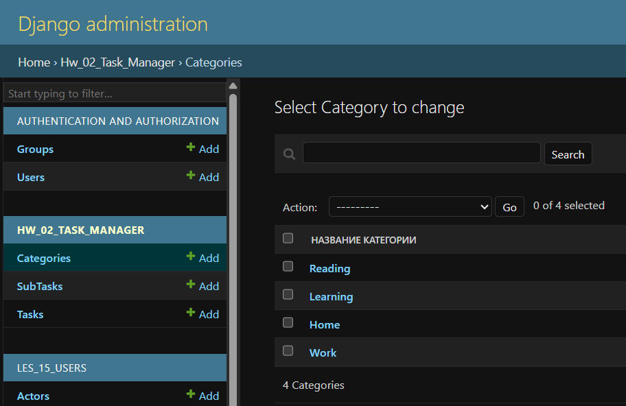  

<a id="img1" style="margin: 40px; color:#606060;">Fig. 1. CategoryAdmin.</a>

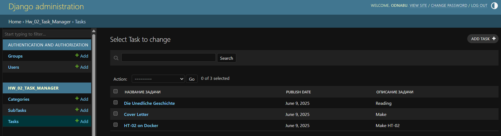  

<a id="img2" style="margin: 40px; color:#606060;">Fig. 2. TaskAdmin.</a>

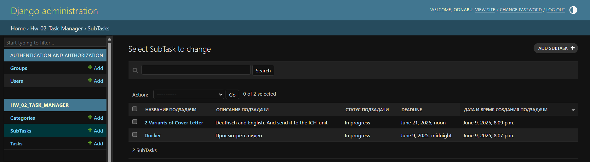  

<a id="img3" style="margin: 40px; color:#606060;">Fig. 3. SubTaskAdmin.</a>


<div style="font: bold normal 110% sans-serif; color: #8A2BE2; white-space: pre; border-top: 2px dotted #008000; padding: 5px;"></div>  

## <a id="s3" style="color: #008000">3. Создание записей через Админку</a>

### <a id="ss3.1" style="color: #8A2BE2">**3.1.** Создание суперпользователя</a>  
Перейти по созданному URL адресу Админ-панель http://127.0.0.1:8000/admin/.

  

<a id="img4" style="margin: 40px; color:#606060;">Fig. 4. Редактирование суперпользователя.</a>

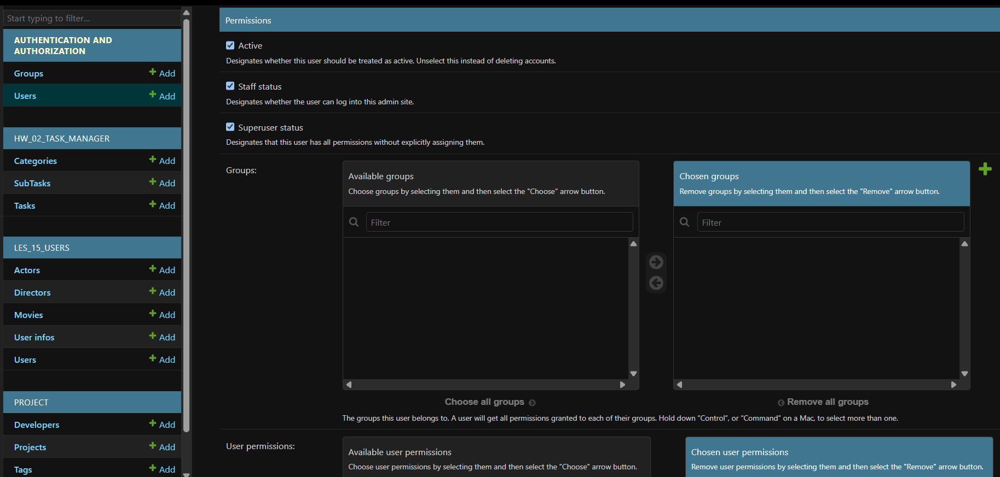  

<a id="img5" style="margin: 40px; color:#606060;">Fig. 5. Редактирование суперпользователя.</a>

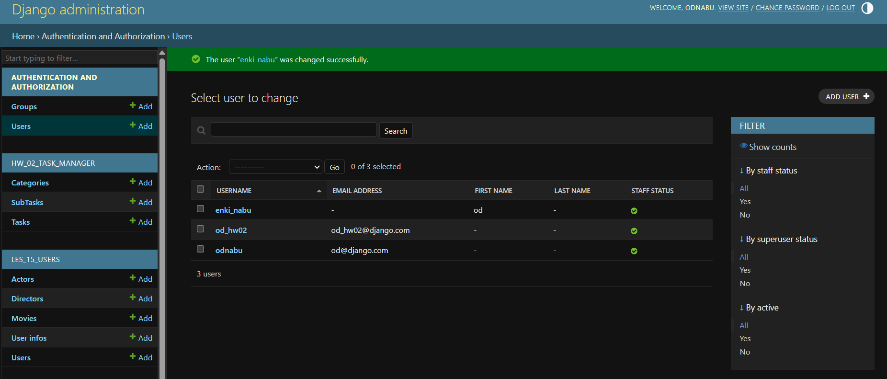  

<a id="img6" style="margin: 40px; color:#606060;">Fig. 6. Результат редактирование суперпользователя.</a>


### <a id="ss3.1" style="color: #8A2BE2">**3.2.** Добавление объектов для каждой модели</a>  

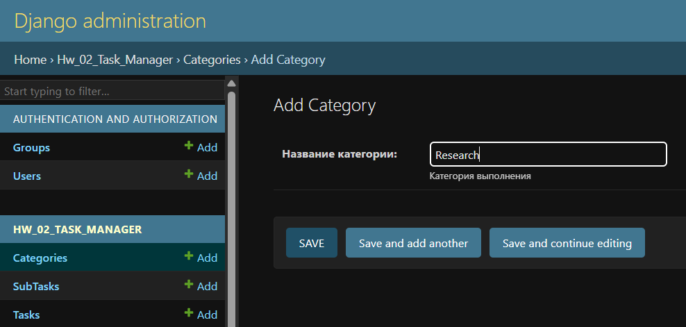  

<a id="img7" style="margin: 40px; color:#606060;">Fig. 7. Добавление категории.</a>

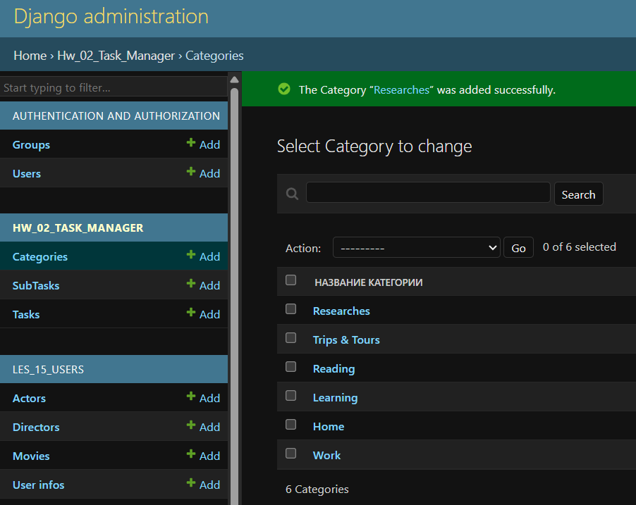  

<a id="img8" style="margin: 40px; color:#606060;">Fig. 8. Результат добавления категорий.</a>

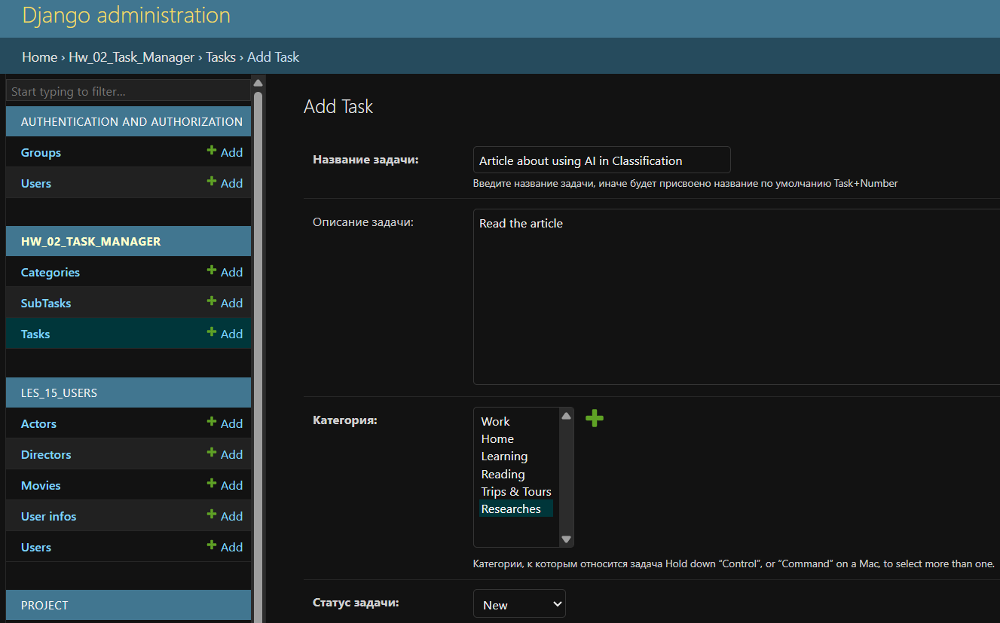  
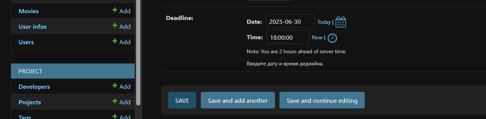

<a id="img9" style="margin: 40px; color:#606060;">Fig. 9. Добавление задачи.</a>

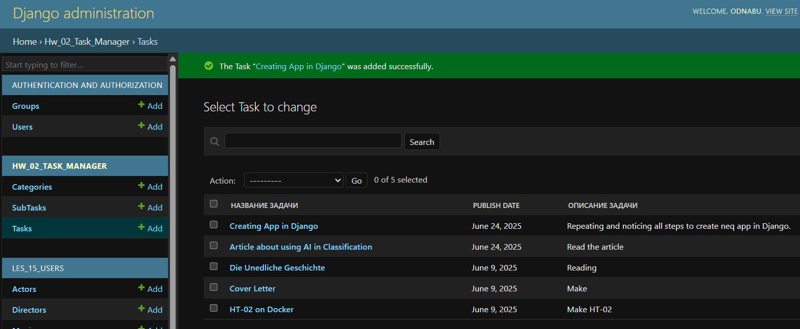  

<a id="img10" style="margin: 40px; color:#606060;">Fig. 10. Результат добавления задач.</a>

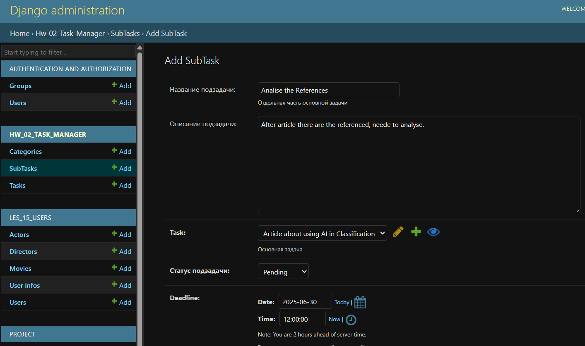  

<a id="img11" style="margin: 40px; color:#606060;">Fig. 11. Добавление подзадачи.</a>

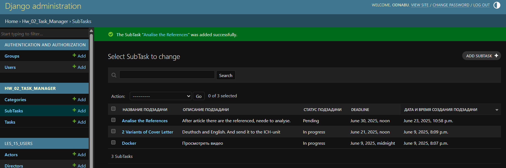  

<a id="img12" style="margin: 40px; color:#606060;">Fig. 12. Результат добавления подзадачи.</a>


---
<div style="font: bold normal 110% sans-serif; color: #8A2BE2; white-space: pre; border-top: 2px dotted #008000; padding: 5px;"></div>  

## <a id="s6" style="color: #008000">6. Git</a>
- Запуште проект в Git-репозиторий и прикрепите как решение ссылку на него.

Ссылка на отчет по ДЗ <a>home_work_03.md</a> со скриншотами: https://github.com/odnabu/Django-Python-Advanced/blob/main/hw_02_task_manager/home_work_03.md.  

Ссылка на приложение по ДЗ <a>hw_02_task_manager</a>: https://github.com/odnabu/Django-Python-Advanced/tree/main/hw_02_task_manager.  

Ссылка на весь проект <a>DjangoProject</a>: https://github.com/odnabu/Django-Python-Advanced/tree/main.  

---
<div style="font: bold normal 110% sans-serif; color: #8A2BE2; white-space: pre; border-top: 2px dotted #8A2BE2; padding: 5px;"></div>

[//]: # (<span style="color: #8A2BE2; margin: 20px 40px; padding: 5px; background: #000000;">▣ ⚜️ ☑️ ✔️ 🟪 ■ ※ ⁂ ⁙ ⁘ ⨠  ■ ◲◳ ◆ ◇ ◈ ◀ ▶ ◁ ▷ ▹ ▼ ▲ ▽ △ ▢ ₪₪₪</span>  )

[//]: # (🔷🔹 🟩 ❇️♾️⚜️✳️❎✅☑️✔️🟪🔳🔲  )
[//]: # (■ ⁜ ※ ⁂ ⁙ ⁘ ⫷ ⫸ ⩕ ⨠ ⨝ ⋘ ⋙ ∵ ∴ ∶ ∷ ■ ◪ ◩ ◲ ◳ ◆ ◇ ◈ ▼ ▽ ◀ ▶ ◁ ▷ ▹ ▲ △ ▢ ₪₪₪  )
[//]: # (<span style="color: #F00000; border: 2px solid yellow; padding: 3px;">\__ NB! \__  **текст** </span>)

