Python Advanced - Django
24.06.2025

## <a id="s6" style="color: #9000F0">Домашнее задание 10 (4 in Django): <br> Проект "Менеджер задач" — ORM запросы</a>    
Цель: Освоение основных операций CRUD (Create, Read, Update, Delete) на примере заданных моделей.

<div style="font: small-caps 120% sans-serif; color: #8A2BE2; padding: 0 15px 0 0;">▣ &nbsp;&nbsp; Выполните запросы:</div>  


#### 1. Создание записей:   
 
- Task:  
  - title: "Prepare presentation".  
  - description: "Prepare materials and slides for the presentation".  
  - status: "New".  
  - deadline: Today's date + 3 days.  
- SubTasks для "Prepare presentation":
  - title: "Gather information".
    - description: "Find necessary information for the presentation".
    - status: "New".
    - deadline: Today's date + 2 days.
  - title: "Create slides".
    - description: "Create presentation slides".
    - status: "New".
    - deadline: Today's date + 1 day.

#### 2. Чтение записей:   
- Tasks со статусом "New":
  - Вывести все задачи, у которых статус "New".
- SubTasks с просроченным статусом "Done":
  - Вывести все подзадачи, у которых статус "Done", но срок выполнения истек.

#### 3. Изменение записей:  
- Измените статус "Prepare presentation" на "In progress".
- Измените срок выполнения для "Gather information" на два дня назад.
- Измените описание для "Create slides" на "Create and format presentation slides".

#### 4. Удаление записей:  
- Удалите задачу "Prepare presentation" и все ее подзадачи.

<div style="font: small-caps 120% sans-serif; color: #8A2BE2; padding: 0 15px 0 0;">▣ &nbsp;&nbsp; Оформите ответ:</div>  

Прикрепите все выполненные запросы (код) и скриншоты с консоли к ответу на домашнее задание.


<div style="font: bold normal 110% sans-serif; color: #8A2BE2; white-space: pre; border-top: 2px dotted #008000; padding: 5px;"></div>  

### <span style="color: #008000">Источники</span>  
<span style="color: #606060">Основное видео - урок от 18.06.2025</span> [<font color="#696969">[1 - ▶  Video 19-1]</font>](#v1).  
1. ▶ Video 19-1 "19: ORM запросы Часть 1" (18.06.2025): <a id="v1">https://player.vimeo.com/video/1094371338?h=231da4ccae.</a>    
2. ▶ Video 19-2 "19: ORM запросы Часть 2" (19.06.2025): <a id="v2">https://player.vimeo.com/video/1094663469?h=f20d4a456d.</a>    
3. Presentation <a id="p1">Les19-Django_19-ORM_запросы_1-18_06.pdf.</a>  
4. Conspectus <a id="c1">Les19-Django_19---ORM_запросы_1-18_06.pdf.</a>  
5. Presentation <a id="p2">Les19-Django_20-ORM_запросы_2-19_06.pdf.</a>  
6. Conspectus <a id="c2">Les19-Django_20---ORM_запросы_2-19_06.pdf.</a>  
7. Приложение **project**: файл <a id="les3">views.py</a>.
8. Приложение **home_work_02**: файл <a id="hw3">home_work_03.md</a>.  
9. Руководство по оформлению Markdown файлов: https://gist.github.com/Jekins/2bf2d0638163f1294637.


<div style="font: bold normal 110% sans-serif; color: #8A2BE2; white-space: pre; border-top: 2px dotted #008000; padding: 5px;"></div>  

## <a id="s1" style="color: #008000">1. Выполнение ORM запросов</a>

<span style="color: #F00000; border: 1px solid black; padding: 3px;">**ORM**  - Object-Relational Mapping</span>

В приложении **home_work_02** в файле <a>views.py</a> добавить все запросы по примеру в проекте на уроках 
<span style="color: #606060;">[[7](#les1)]</span>.

- null - в <span style="color: blue;">Базах Данных</span> без значений.  
- blank - в <span style="color: red;">ФОРМАХ</span> без значений.  


<div style="font: bold normal 110% sans-serif; color: #8A2BE2; white-space: pre; border: 2px outset #8A2BE2; padding: 5px;">        ДЕЙСТВИЯ</div>

!!! ВСЕГДА запускать команды python manage.py shell, migrate, runserver — находясь в корне проекта, рядом с manage.py.

<span style="font: small-caps 120% sans-serif; color: #8A2BE2; padding: 0 15px 0 0;">▣</span>&nbsp;&nbsp;
Для запуска Django Shell нужно ввести следующую команду в терминале в корневой директории проекта:
```
  python manage.py shell
```
<span style="font: small-caps 120% sans-serif; color: #8A2BE2; padding: 0 15px 0 0;">▣</span>&nbsp;&nbsp;
Запустить сервер командой в терминале, чтобы отслеживать изменения в Админ-панели:
```
   python manage.py runserver
```

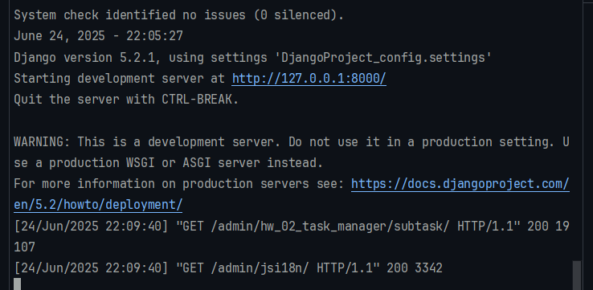  

<a id="img0" style="margin: 40px; color:#606060;">Fig. 0. Запущенный сервер во 2-ой вкладке терминала.</a>


### <a id="ss1.1" style="color: #8A2BE2">**1.1.** Создание записей</a>  

<span style="font: small-caps 120% sans-serif; color: #8A2BE2; padding: 0 15px 0 0;">▣</span>&nbsp;&nbsp;
Для того чтобы использовать модели или сторонние библиотеки, их необходимо импортировать:
```
  from <package/module> import <names of functions or methods>
```


<span style="color: #8A2BE2">TASK "Prepare presentation"</span>

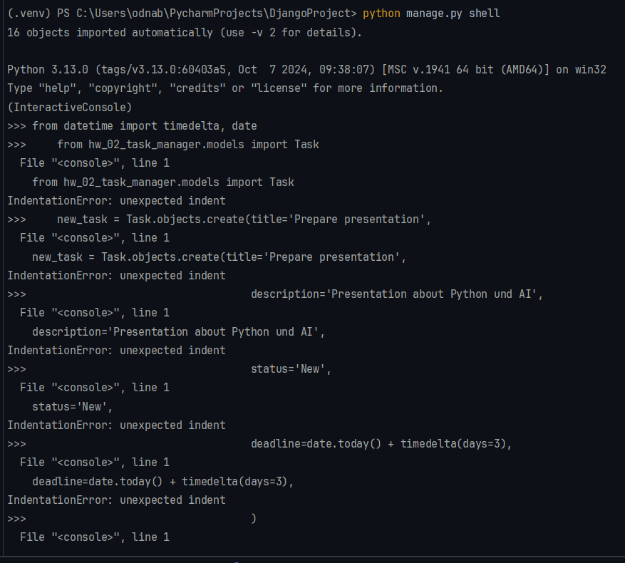  

<a id="img1" style="margin: 40px; color:#606060;">Fig. 1. Выполнение команд на "Создание записи: Task".</a>

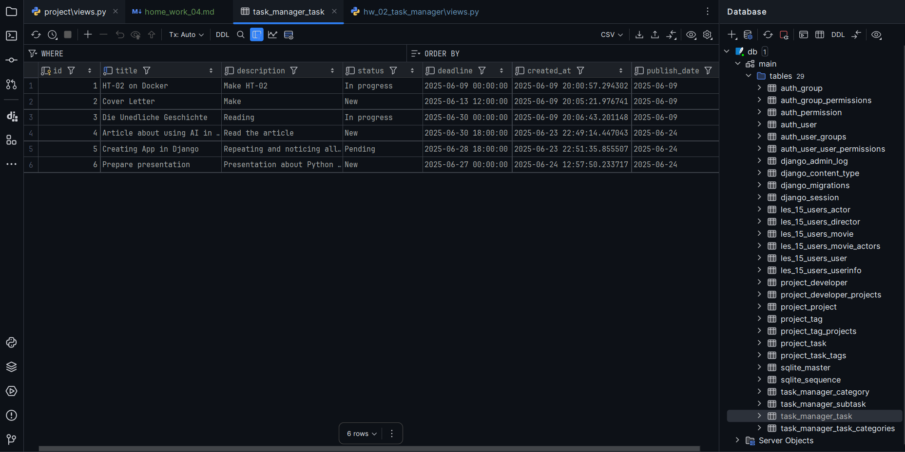  

<a id="img2" style="margin: 40px; color:#606060;">Fig. 2. Вид таблицы в БД после выполнения ORM.</a>

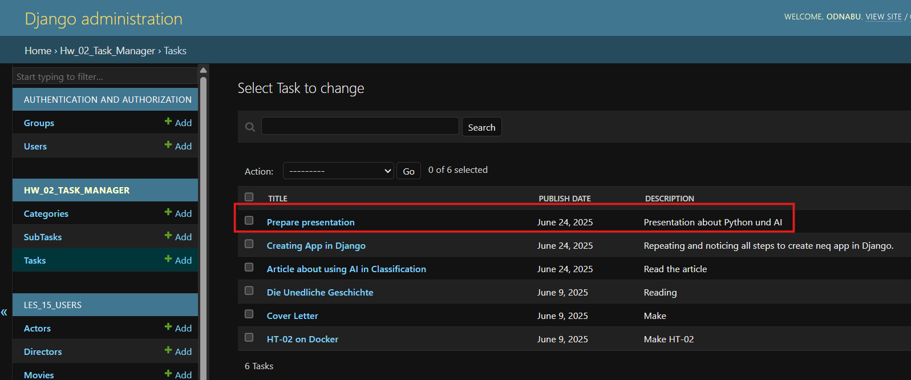  

<a id="img3" style="margin: 40px; color:#606060;">Fig. 3. Результат выполнения ORM-команды на создание задачи в Админ-панели в Браузере.</a>


<span style="color: #8A2BE2">SubTASK "Gather information"</span>

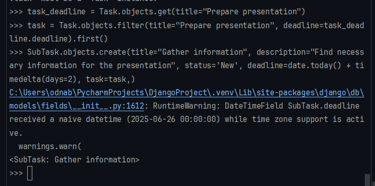  

<a id="img4" style="margin: 40px; color:#606060;">Fig. 4. Создание записи:  SubTasks "Gather information" для "Prepare presentation" с .</a>

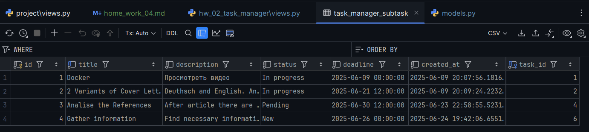  

<a id="img5" style="margin: 40px; color:#606060;">Fig. 5. Результат создания SubTasks "Gather information" в БД.</a>

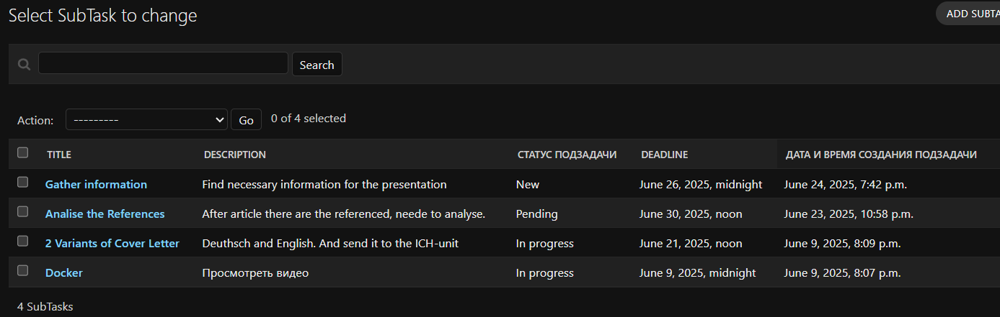  

<a id="img6" style="margin: 40px; color:#606060;">Fig. 6. Результат выполнения ORM-команды на создание 
SubTasks "Gather information" в Админ-панели в Браузере.</a>


<span style="color: #8A2BE2">SubTASK "Create slides"</span>

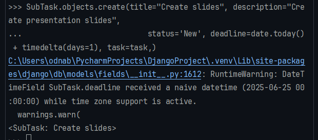  

<a id="img7" style="margin: 40px; color:#606060;">Fig. 7. Создание записи:  SubTasks "Create slides" для "Prepare presentation" с .</a>

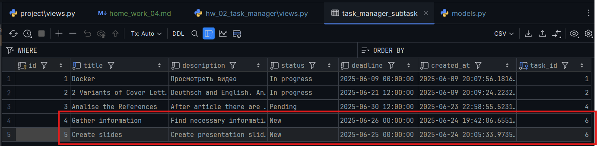  

<a id="img8" style="margin: 40px; color:#606060;">Fig. 8. Результат создания SubTasks "Create slides" в БД.</a>

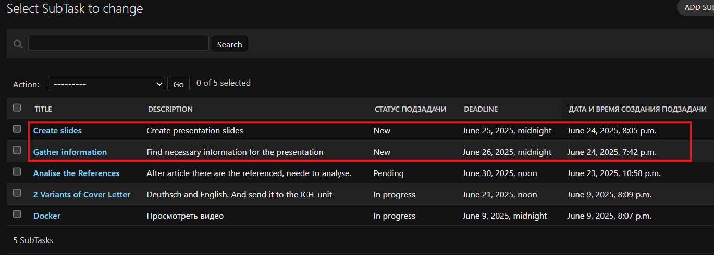  

<a id="img9" style="margin: 40px; color:#606060;">Fig. 9. Результат выполнения ORM-команды на создание 
SubTasks "Create slides" в Админ-панели в Браузере.</a>


<div style="font: bold normal 110% sans-serif; color: #8A2BE2; white-space: pre; border-top: 2px dotted #008000; padding: 5px;"></div>

### <a id="ss1.2" style="color: #8A2BE2">**1.2.** Чтение записей</a>

- Tasks со статусом "New": Вывести все задачи, у которых статус "New".

  

<a id="img10" style="margin: 40px; color:#606060;">Fig. 10. Чтение записи:  Tasks со статусом "New".</a>


- SubTasks с просроченным статусом "Done": Вывести все подзадачи, у которых статус "Done", 
но срок выполнения истек.

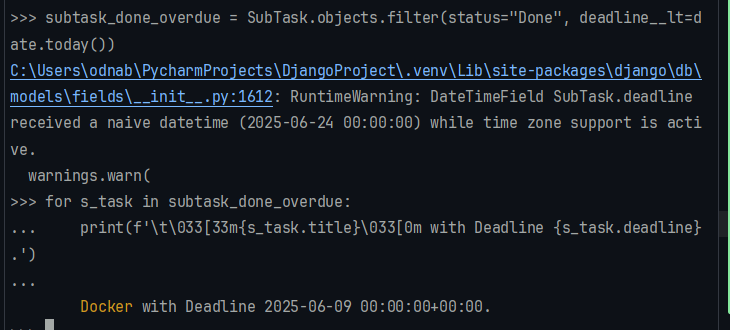  

<a id="img11" style="margin: 40px; color:#606060;">Fig. 11. Чтение записи:  SubTasks с просроченным статусом "Done".</a>


<div style="font: bold normal 110% sans-serif; color: #8A2BE2; white-space: pre; border-top: 2px dotted #008000; padding: 5px;"></div>

### <a id="ss1.3" style="color: #8A2BE2">**1.3.** Изменение записей</a>

- Измените статус "Prepare presentation" на "In progress".

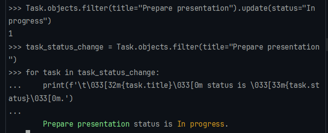  

<a id="img12" style="margin: 40px; color:#606060;">Fig. 12. Изменение записи:  Task с измененным статусом.</a>


- Измените срок выполнения для "Gather information" на два дня назад.

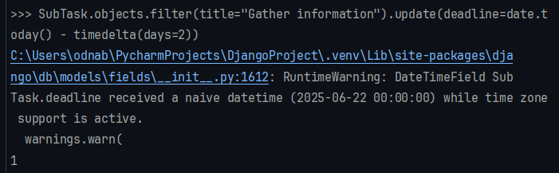  

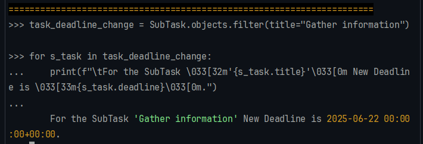  

<a id="img13" style="margin: 40px; color:#606060;">Fig. 13. Изменение записи:  SubTask "Gather information".</a>
 

- Измените описание для "Create slides" на "Create and format presentation slides".

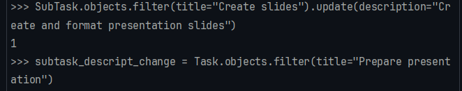  

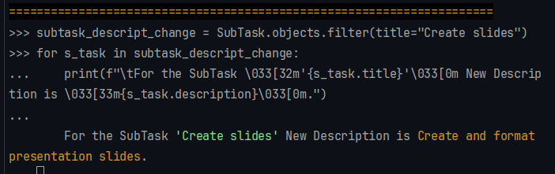  

<a id="img14" style="margin: 40px; color:#606060;">Fig. 14. Изменение записи:  SubTask "Create slides".</a>


<span style="color: #8A2BE2">Результаты ИЗМЕНЕНИЯ записей в БД и Админке</span>

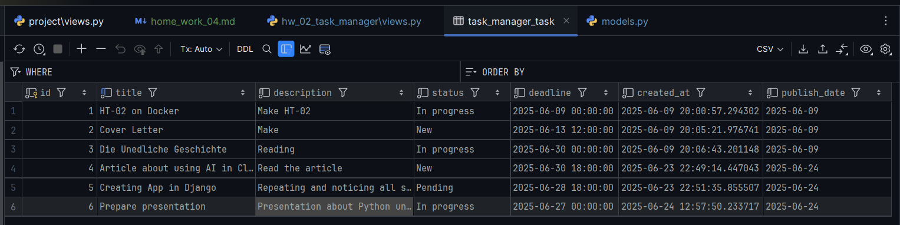  

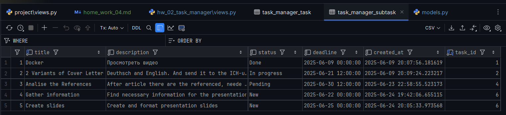  

<a id="img15" style="margin: 40px; color:#606060;">Fig. 15. Результат изменения записи и подзаписи в БД.</a>

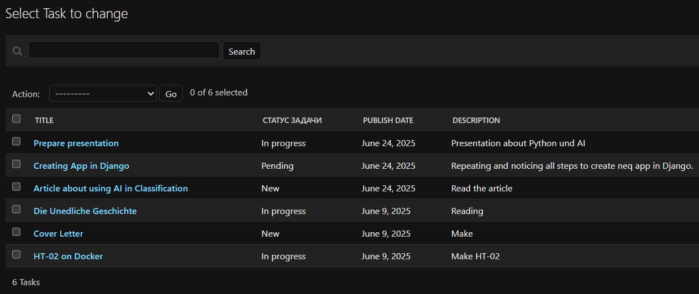  

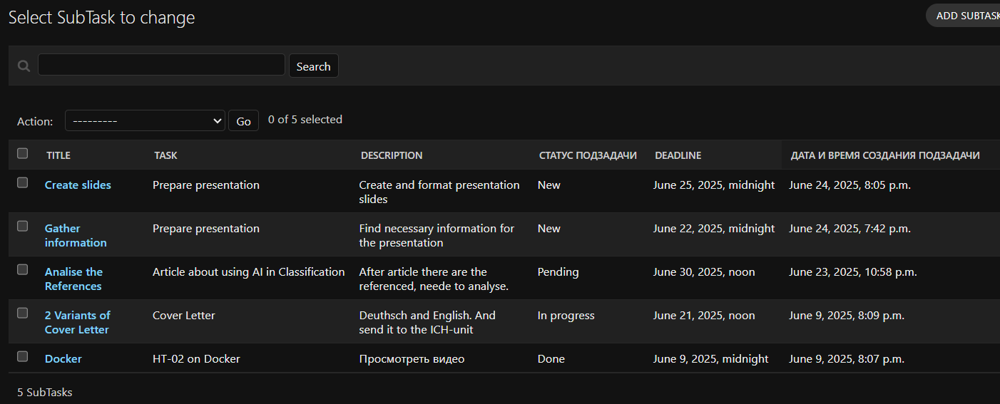  

<a id="img16" style="margin: 40px; color:#606060;">Fig. 16. Результат изменения записи и подзаписи в Админке.</a>


<div style="font: bold normal 110% sans-serif; color: #8A2BE2; white-space: pre; border-top: 2px dotted #008000; padding: 5px;"></div>

### <a id="ss1.4" style="color: #8A2BE2">**1.4.** Удаление записей</a>
Удалите задачу "Prepare presentation" и все ее подзадачи.

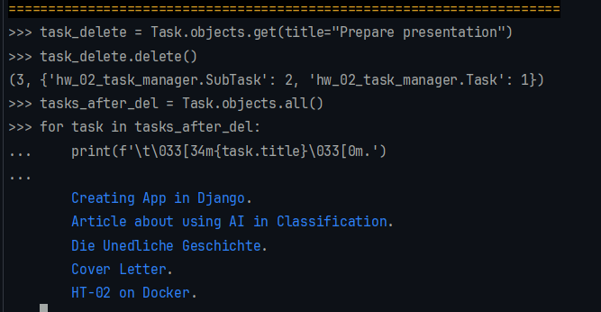  

<a id="img17" style="margin: 40px; color:#606060;">Fig. 17. Удаление записи "Prepare presentation".</a>


<span style="color: #8A2BE2">Результаты УДАЛЕНИЯ записей в БД и Админке</span>

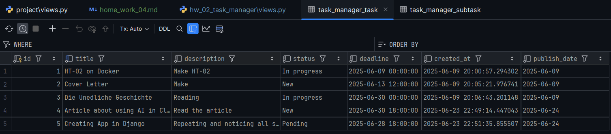  

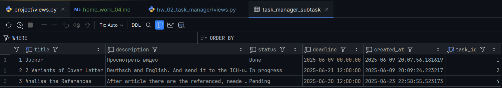  

<a id="img18" style="margin: 40px; color:#606060;">Fig. 18. Результат удаления записи и подзаписи в БД.</a>

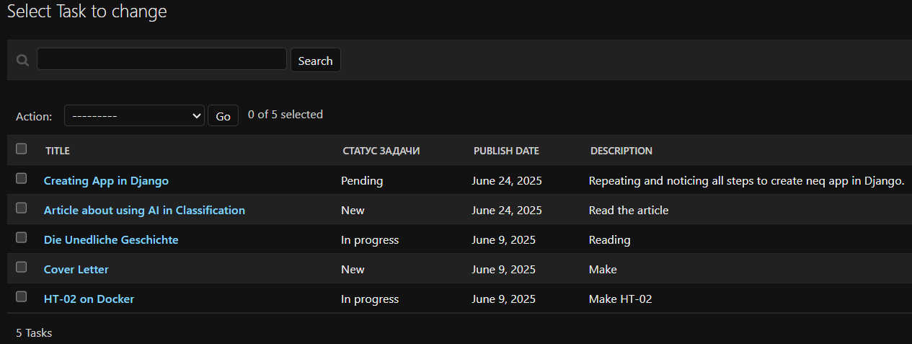  

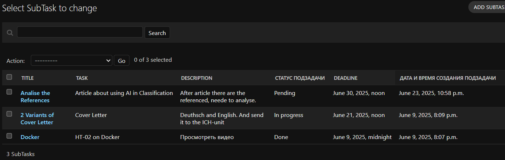  

<a id="img19" style="margin: 40px; color:#606060;">Fig. 19. Результат удаления записи и подзаписи в Админке.</a>


<div style="font: bold normal 110% sans-serif; color: #8A2BE2; white-space: pre; border-top: 2px dotted #008000; padding: 5px;"></div>  


---
<div style="font: bold normal 110% sans-serif; color: #8A2BE2; white-space: pre; border-top: 2px dotted #008000; padding: 5px;"></div>  

## <a id="s6" style="color: #008000">6. Git</a>
- Запуште проект в Git-репозиторий и прикрепите как решение ссылку на него.

Ссылка на отчет по ДЗ <a>home_work_04.md</a> со скриншотами: https://github.com/odnabu/Django-Python-Advanced/blob/main/hw_02_task_manager/home_work_04.md.  

Ссылка на приложение по ДЗ <a>hw_02_task_manager</a>: https://github.com/odnabu/Django-Python-Advanced/tree/main/hw_02_task_manager.  

Ссылка на весь проект <a>DjangoProject</a>: https://github.com/odnabu/Django-Python-Advanced/tree/main.  

---
<div style="font: bold normal 110% sans-serif; color: #8A2BE2; white-space: pre; border-top: 2px dotted #8A2BE2; padding: 5px;"></div>

[//]: # (<span style="color: #8A2BE2; margin: 20px 40px; padding: 5px; background: #000000;">▣ ⚜️ ☑️ ✔️ 🟪 ■ ※ ⁂ ⁙ ⁘ ⨠  ■ ◲◳ ◆ ◇ ◈ ◀ ▶ ◁ ▷ ▹ ▼ ▲ ▽ △ ▢ ₪₪₪</span>  )  

[//]: # (<div style="font: small-caps 120% sans-serif; color: #8A2BE2; margin: 0 0 0 0px; padding: 0 15px 0 0;">▣ &nbsp;&nbsp; Выполните запросы:</div>  )
[//]: # (🔷🔹 🟩 ❇️♾️⚜️✳️❎✅☑️✔️🟪🔳🔲  )
[//]: # (■ ⁜ ※ ⁂ ⁙ ⁘ ⫷ ⫸ ⩕ ⨠ ⨝ ⋘ ⋙ ∵ ∴ ∶ ∷ ■ ◪ ◩ ◲ ◳ ◆ ◇ ◈ ▼ ▽ ◀ ▶ ◁ ▷ ▹ ▲ △ ▢ ₪₪₪  )
[//]: # (<span style="color: #F00000; border: 2px solid yellow; padding: 3px;">\__ NB! \__  **текст** </span>)
[//]: # (&nbsp;&nbsp; spaces)

<div style="font: bold normal 110% sans-serif; color: #8A2BE2; white-space: pre; border-top: 2px dotted #008000; padding: 5px;"></div>
<div style="font: bold normal 110% sans-serif; color: #8A2BE2; white-space: pre; border-top: 2px dotted #008000; padding: 5px;"></div>

Как в Django Shell (и вообще в интерактивной Python-среде) можно вводить **многострочные запросы**:

### ✅ **Вариант 1: Использовать круглые скобки `()`**

Это самый простой и читаемый способ:

```python
task = Task.objects.create(
    title="Design logo",
    description="Create a logo for the project",
    status="New",
    deadline=date.today() + timedelta(days=5)
)
```

Python понимает, что пока скобка не закрыта — команда не завершена, и не выбрасывает ошибку.

---

### ✅ **Вариант 2: Использовать `\` в конце строки**

Вместо скобок можно поставить обратный слэш `\`:

```python
task = Task.objects.create(\
    title="Design logo", \
    description="Create a logo for the project", \
    status="New", \
    deadline=date.today() + timedelta(days=5)\
)
```

Но такой способ считается менее читаемым и более капризным (пробел после `\` может вызвать ошибку).

---

### ✅ **Вариант 3: Вызвать `input()` и передавать блок кода**

Редко используется, но тоже возможно. Например:

```python
exec("""
task = Task.objects.create(
    title="Design logo",
    description="Create a logo for the project",
    status="New",
    deadline=date.today() + timedelta(days=5)
)
""")
```

---

### 🌟 Совет для Pycharm Terminal:

При использовании встроенного терминала в PyCharm:

* Можно просто писать скобки и нажимать `Enter` — появятся `...`, означающее, что Python ждет продолжения.
* Чтобы выйти из блока многострочного ввода, нажми `Enter` на **пустой строке**.

