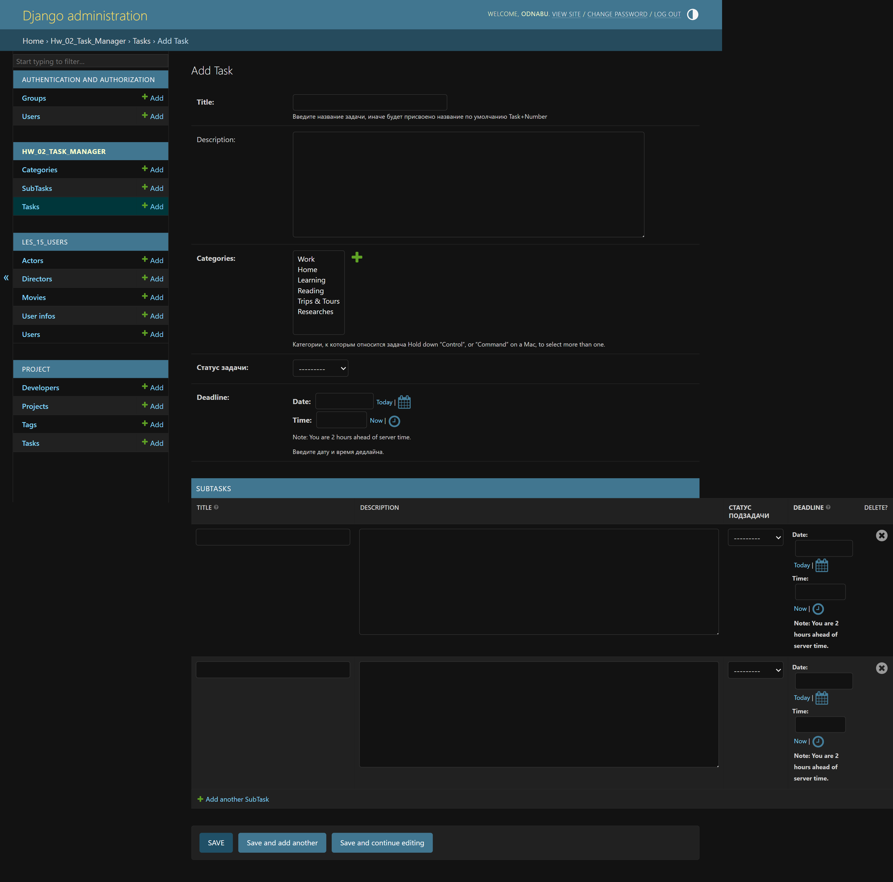
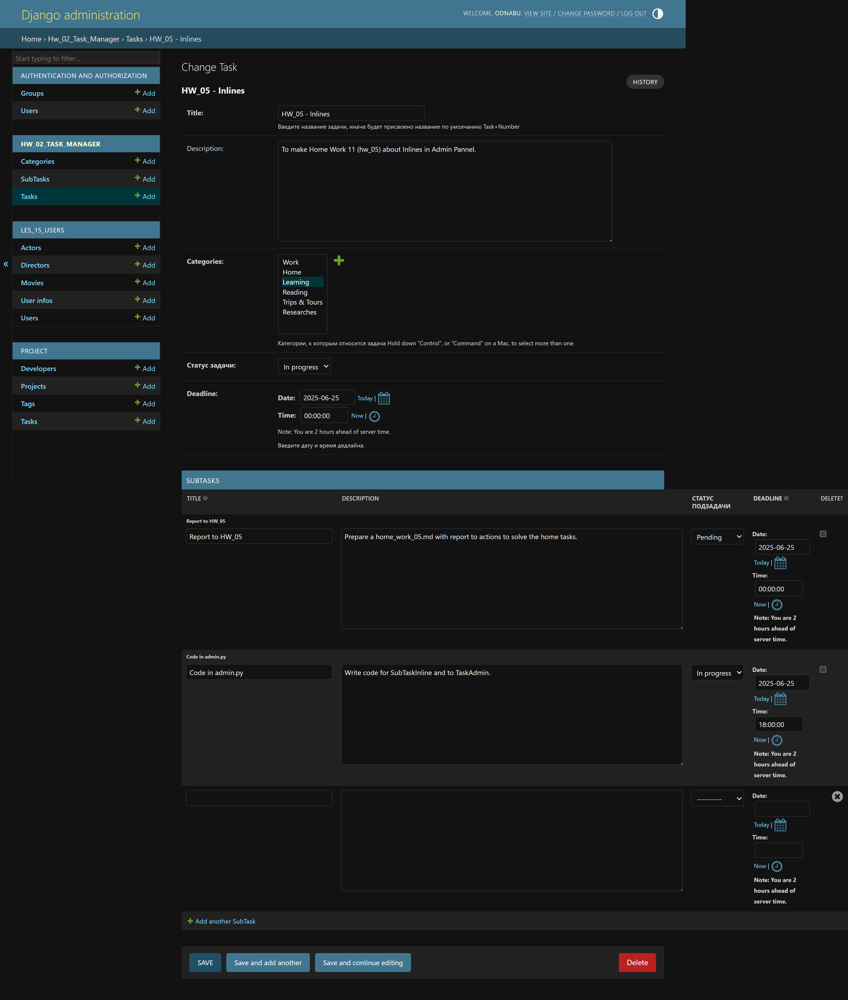
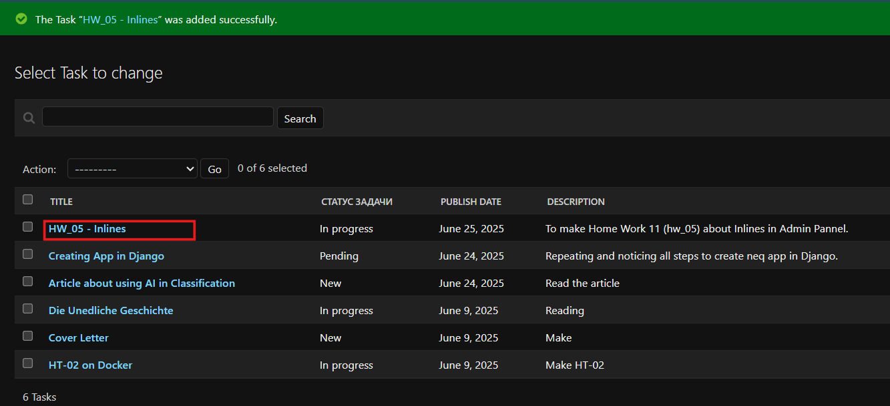
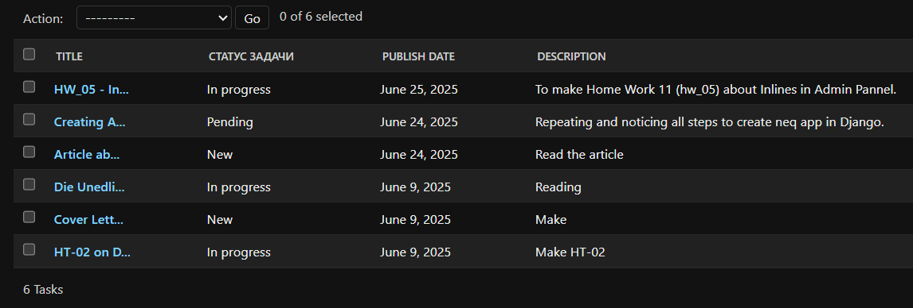
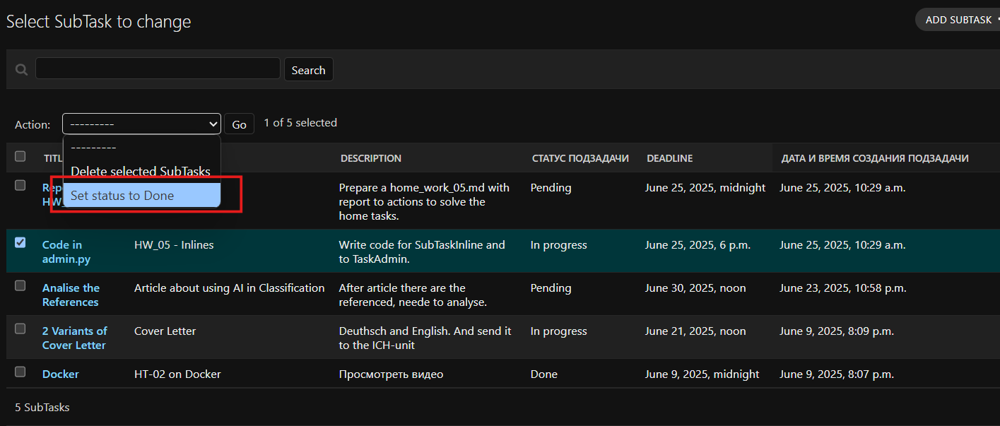
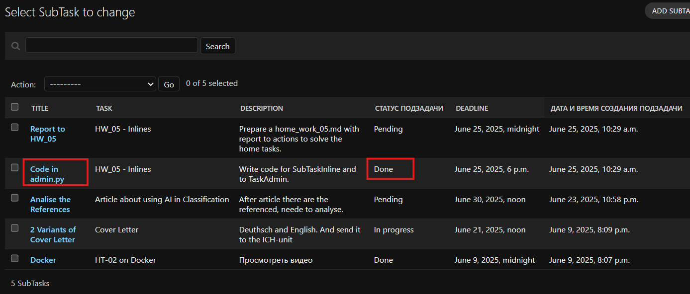

Python Advanced - Django  
24.06.2025

## <div style="color: #9000F0">Домашнее задание 11 (5 in Django): <br> Проект "Менеджер задач" — Инлайн формы и Admin actions</div>    
 
####  Задание 1.  
- Добавить настройку инлайн форм для админ класса задач. 
При создании задачи должна появиться возможность создавать сразу и подзадачу.

####  Задание 2.   
- Названия задач могут быть длинными и ухудшать читаемость в Админ панели, поэтому требуется 
выводить в списке задач укороченный вариант – первые 10 символов с добавлением «...», 
если название длиннее. При этом при выборе задачи для создания подзадачи должно отображаться 
полное название. Необходимо реализовать такую возможность.

####  Задание 3.  
- Реализовать свой action для Подзадач, который поможет выводить выбранные в 
Админ панели объекты в статус Done.


<div style="font: bold normal 110% sans-serif; color: #8A2BE2; white-space: pre; border-top: 2px dotted #008000; padding: 5px;"></div>  

### <span style="color: #008000">Источники</span>  
<span style="color: #606060">Видео - урок от 23.06.2025</span> [<font color="#696969">[1 - ▶  Video 20]</font>](#v1).  
1. ▶ Video 20 "Инлайн формы в Admin панели" (23.06.2025): <a id="v1">https://player.vimeo.com/video/1095537775?h=756820df7e.</a>    
2. Presentation <a id="p1">Les20-Python Adv_L20-Инлайн формы-23_06.pdf.</a>  
3. Conspectus <a id="c1">Les20-Python Adv_L20---Инлайн формы-23_06.pdf.</a>  
4. Приложение **home_work_02**: файл <a id="hw4">home_work_04.md</a>.  
5. Руководство по оформлению Markdown файлов: https://gist.github.com/Jekins/2bf2d0638163f1294637.


<div style="font: bold normal 110% sans-serif; color: #8A2BE2; white-space: pre; border: 2px outset #8A2BE2; margin: 60px 0 40px 0; padding: 5px 0 5px 25px;">ОТЧЕТ</div>

## <a id="s1" style="color: #008000">1. Настройка инлайн-форм для админ класса задач</a>  

### <a id="s1.1" style="color: #008000">1.1. Код для подключения инлайн-форм</a>  
В приложении **home_work_02** в файле <a>admin.py</a> добавить код для настроек Инлайн-форм 
по примеру в **les_15_users** на уроке [<font color="#696969">[1 - ▶  Video 20, 48:00]</font>](#v1).

<div style="margin: 20px 20px 20px 0;">
<b style="color: #F00000; border: 2px solid #6B0000; padding: 10px; margin: 0 10px 0 0;"> NB ! </b>
Чтобы настроить ИНЛАЙНЫ в Админке, нужно сначала переместить код для 
SubTaskAdmin и для SubTaskInline <b style="color: red">ВЫШЕ</b> TaskAdmin!
</div>

```python
class SubTaskInline(admin.TabularInline):
    model = SubTask     # Вывод поля SubTask во вкладке Task.
    extra = 2           # Кол-во пустых форм для создания подзадач.
```
В код для `class TaskAdmin(admin.ModelAdmin):` добавить строку:
```python
    inlines = [SubTaskInline]
```
<div style="font: bold normal 110% sans-serif; color: #8A2BE2; white-space: pre; border-top: 2px dotted #008000; padding: 5px;"></div>  


### <a id="ss1.2" style="color: #008000">**1.2.** Миграции для сохранения изменений как в БД так и в Админке</a>  

<div style="margin: 40px 20px 20px 0;">
<span style="color: #F00000; border: 2px solid #6B0000; padding: 10px;"> NB ! </span>
<b style="color: #F00000; border: 1px solid black; padding: 5px;">!!! ВСЕГДА</b>
запускать команды python manage.py shell, migrate, runserver — находясь в корне проекта, рядом с manage.py.
</div>  

После изменений в МОДЕЛЯХ сделать и применить миграции:
```
    python manage.py makemigrations hw_02_task_manager
    python manage.py migrate hw_02_task_manager
```
Запустить локальный сервер Django с помощью manage.py в терминале [<font color="#696969">[1 - ▶  Video 20, 57:60]</font>](#v1):
```
   python manage.py runserver
```
<div style="font: bold normal 110% sans-serif; color: #8A2BE2; white-space: pre; border-top: 2px dotted #008000; padding: 5px;"></div>  


### <a id="ss1.3" style="color: #008000">1.3. Проверить результат в Админ-панели</a>  

Проверить вид Админ-панели для добавления TaskAdmin. Должно появиться поле добавления подзадачи SubTask.

  

<a id="img1" style="margin: 40px; color:#606060;">Fig. 1. Вид вкладки Task в Админ-панели для создания новой задачи.
Во вкладке появилось поле добавления подзадачи SubTask.</a>

<div style="margin: 40px 20px 20px 0;">
<b style="color: #F00000; border: 2px solid #6B0000; margin: 0 10px 0 0; padding: 10px;"> NB ! </b>
Для добавления <u>НОВОЙ</u> задачи с подзадачами нужно устранить 
<b style="color: #F00000; border: 1px solid black; padding: 5px;">ОШИБКУ</b>, 
</div>  

которая возникает из-за НЕбезопасности POST-запросов, включая формы в админке:  
добавить `CSRF_TRUSTED_ORIGINS` в <a>settings.py</a> (рядом с `ALLOWED_HOSTS`), потому что 
ALLOWED_HOSTS отвечает за доступ к сайту, а CSRF_TRUSTED_ORIGINS — 
за безопасность POST-запросов, включая формы в админке.
```python
CSRF_TRUSTED_ORIGINS = [
    "http://127.0.0.1:8000",
    "http://localhost:8000",
]
```

  

<a id="img2" style="margin: 40px; color:#606060;">Fig. 2. Процесс добавления новой задачи сразу с 2-мя подзадачами.</a>

  

<a id="img3" style="margin: 40px; color:#606060;">Fig. 3. Результат добавления новой задачи.</a>


<div style="font: bold normal 110% sans-serif; color: #8A2BE2; white-space: pre; border-top: 2px dotted #008000; padding: 5px;"></div>  

## <a id="s2" style="color: #008000">2. Укороченный вариант Названия задач в Админ панели</a>  

### <a id="s2.1" style="color: #008000">2.1. Код функции short_title в модели TaskAdmin</a>  
В файле <a>admin.py</a> (не в модели!) выполняется проверка длины для объекта класса 
`TaskAdmin` (`obj.title`) внутри самого класса. При такой проверке внутри класса `TaskAdmin` 
отображения в Админке других классов не затрагиваются.  

Вызов функции (или метод) `short_title()` в строке <a id="cd1" style="color: #696969">(code 1)</a>:
```python
    short_title.short_description = "Title"
```
Эта команда обеспечивает настройку для **Django admin** и меняет заголовок колонки в 
списке объектов модели (`list_display`). Соответственно, вместо 'title' в `list_display` 
нужно вписать имя метода `short_title`.

### Работает это так:
Когда в `admin.py` для класса (здесь `TaskAdmin`) указано:  
```python
    list_display = ('short_title', 'status', 'publish_date')
```
Django ищет:  
- поле модели с таким именем (например, `status`),
- **или метод** модели/админ-класса с именем `short_title`.

И если это метод, то можно указать, как будет называться его колонка в таблице в Админке — 
именно с помощью кода в строке [<font color="#696969">(code 1)</font>](#cd1).  
Без кода [<font color="#696969">(code 1)</font>](#cd1): если не задать `short_description`, то 
Django выведет колонку с заголовком `Short title`, что не всегда удобно.

| Часть кода                      | Значение                                     |
| ------------------------------- | -------------------------------------------- |
| `short_title(...)`              | Метод, возвращающий сокращённое имя          |
| `short_title.short_description` | Название колонки в админке                   |
| `"Title"`                       | Надпись в шапке таблицы вместо `Short title` |


### <a id="s2.2" style="color: #008000">2.2. Результат в модели Админке</a>  

  

<a id="img4" style="margin: 40px; color:#606060;">Fig. 4. Укороченный вариант Названия задач в Админ панели.</a>


<div style="font: bold normal 110% sans-serif; color: #8A2BE2; white-space: pre; border-top: 2px dotted #008000; padding: 5px;"></div>  

## <a id="s3" style="color: #008000">3. Пользовательские действия (actions)</a>  
См. подробно в лекции [<font style="color: #606060;">[2, слайд 32]</font>](#p1) и видео.
[<font style="color: #606060;">[1 - ▶  Video 20, 1:18:50]</font>](#v1).

Сначала нужно определить функцию `set_status_to_done()`, которая будет выполнять <i style="color: Magenta">action</i> 
в Админ-панели по массовому изменению статуса Подзадачи на Done.

  

<a id="img5" style="margin: 40px; color:#606060;">Fig. 5. Изменение статуса выбранной Подзадачи в Админ-панели.</a>

  

<a id="img6" style="margin: 40px; color:#606060;">Fig. 6. Результат изменения статуса Подзадачи.</a>


<div style="font: bold normal 110% sans-serif; color: #8A2BE2; white-space: pre; border-top: 2px dotted #008000; padding: 5px;"></div>  

## <a id="s4" style="color: #008000">4. GitHub</a>
- Запуште проект в Git-репозиторий и прикрепите как решение ссылку на него.

Ссылка на отчет по ДЗ <a>home_work_05.md</a> со скриншотами: https://github.com/odnabu/Django-Python-Advanced/blob/main/hw_02_task_manager/home_work_05.md.  

Ссылка на приложение по ДЗ <a>hw_02_task_manager</a>: https://github.com/odnabu/Django-Python-Advanced/tree/main/hw_02_task_manager.  

Ссылка на весь проект <a>DjangoProject</a>: https://github.com/odnabu/Django-Python-Advanced/tree/main.  

---
<div style="font: bold normal 110% sans-serif; color: #8A2BE2; white-space: pre; border-top: 2px dotted #8A2BE2; padding: 5px; margin: 40px 0 40px 0"></div>

[//]: # (<div style="margin: 40px 0 40px 0"></div>)

[//]: # (<span style="color: #8A2BE2; margin: 20px 40px; padding: 5px; background: #000000;">▣ ⚜️ ☑️ ✔️ 🟪 ■ ※ ⁂ ⁙ ⁘ ⨠  ■ ◲◳ ◆ ◇ ◈ ◀ ▶ ◁ ▷ ▹ ▼ ▲ ▽ △ ▢ ₪₪₪</span>  )  

[//]: # (<div style="font: small-caps 120% sans-serif; color: #8A2BE2; margin: 0 0 0 0px; padding: 0 15px 0 0;">▣ &nbsp;&nbsp; Выполните запросы:</div>  )
[//]: # (🔷🔹 🟩 ❇️♾️⚜️✳️❎✅☑️✔️🟪🔳🔲  )
[//]: # (■ ⁜ ※ ⁂ ⁙ ⁘ ⫷ ⫸ ⩕ ⨠ ⨝ ⋘ ⋙ ∵ ∴ ∶ ∷ ■ ◪ ◩ ◲ ◳ ◆ ◇ ◈ ▼ ▽ ◀ ▶ ◁ ▷ ▹ ▲ △ ▢ ₪₪₪  )


[//]: # (<div style="color: #F00000; margin: 40px 20px 20px 0;">)

[//]: # (<span style="border: 2px solid #6B0000; padding: 10px;"> NB ! </span>)

[//]: # (</div>)


[//]: # (&nbsp;&nbsp; spaces)
[//]: # (<div style="font: small-caps 120% sans-serif; color: #8A2BE2; padding: 0 15px 0 0;">▣ &nbsp;&nbsp; Выполните запросы:</div>  )

[//]: # (<div style="font: bold normal 110% sans-serif; color: #8A2BE2; white-space: pre; border-top: 2px dotted #008000; padding: 5px;"></div>)
