Python Advanced - Django  
13.07.2025

## <div style="color: #9000F0">Домашнее задание 12 (6 in Django): <br> Проект "Менеджер задач" — Создание API для управления задачами</div>    

Цель: Освоить работу с Django REST Framework для создания, получения и агрегирования данных, используя модели задач.

####  Задание 1.  Эндпоинт для создания задачи  
Создайте эндпоинт для создания новой задачи. Задача должна быть создана с полями 
- title, 
- description, 
- status, 
- deadline.

Шаги для выполнения:
1. Определите сериализатор для модели Task.
2. Создайте представление для создания задачи.
3. Создайте маршрут для обращения к представлению.

####  Задание 2.  Эндпоинты для получения списка задач и конкретной задачи по её ID  
Создайте два новых эндпоинта для:
- Получения списка задач.
- Получения конкретной задачи по её уникальному ID.

Шаги для выполнения:
1. Создайте представления для получения списка задач и конкретной задачи.
2. Создайте маршруты для обращения к представлениям.

####  Задание 3.  Агрегирующий эндпоинт для статистики задач  
Создайте эндпоинт для получения статистики задач, таких как:   
- общее количество задач, 
- количество задач по каждому статусу,
- количество просроченных задач.

Шаги для выполнения:
1. Определите представление для агрегирования данных о задачах.
2. Создайте маршрут для обращения к представлению.

#### Оформите ответ следующим образом:
1. Код эндпоинтов: Вставьте весь код представлений и маршрутов.
2. Скриншоты ручного тестирования: Приложите скриншоты консоли или Postman, подтверждающие 
успешное выполнение запросов для каждого эндпоинта.


<div style="font: bold normal 110% sans-serif; color: #8A2BE2; white-space: pre; border-top: 2px dotted #008000; padding: 5px;"></div>  

### <span style="color: #008000">Источники</span>  
<span style="color: #606060">Видео - уроки от *26.06.2025*</span> [<font color="#696969">[1 - ▶  Video 22]</font>](#v1).  
1. ▶ Video 22 "ORM запросы: часть 2. Основы работы с Django REST Framework", *26.06.2025*: <a id="v1">https://player.vimeo.com/video/1096548490?h=90388f38c9</a>.    
2. ▶ Video 23 "Практикум 6 (на самом деле здесь лекция 22)", *26.06.2025*: <a id="v2">https://player.vimeo.com/video/1096570497?h=215c856805</a>.    
3. ▶ Video AdPr_04 "Additional practicum 4: Django", *27.06.2025*: <a id="v3">https://player.vimeo.com/video/1096892865?h=8b8ab72fb6</a>.    
4. Presentation <a id="p1">Les22-Copy of Django_21-ORM_REST-26_06.pdf</a>.  
5. Conspectus <a id="c1">Les22-Copy of Django_21---ORM_REST-26_06.pdf</a>.  
6. Presentation <a id="p2">Les22-Copy of Django_22-Serializer-26_06.pdf</a>.  
7. Conspectus <a id="c2">Les22-Copy of Django_22---Serializer-26_06.pdf</a>.  
8. Приложение **home_work_05**: файл <a id="hw5">home_work_05.md</a>.  
9. Руководство по оформлению Markdown файлов: https://gist.github.com/Jekins/2bf2d0638163f1294637.


<div style="font: bold normal 110% sans-serif; color: #8A2BE2; white-space: pre; border: 2px outset #8A2BE2; margin: 60px 0 40px 0; padding: 5px 0 5px 25px;">ОТЧЕТ</div>

## <a id="s1" style="color: #008000">1. Эндпоинт для создания задачи</a>  

<div style="margin: 20px 20px 20px 0;">
<b style="color: #F00000; border: 2px solid #6B0000; padding: 10px; margin: 0 10px 0 0;"> NB ! </b>
Практики по сериализации <b style="color: red">НЕ</b> было.
<p style="margin: 0 0 0 65px;"> Из презентаций и конспекта НЕ очевидно, какой код и куда вставлять.
<br> Поэтому дальше решение с Чатом GPT. Спасибо, что он есть :)
</div>

### <a id="s1.1" style="color: #008000">1.1. Миграции для сохранения изменений как в БД так и в Админке</a>  

<div style="margin: 40px 20px 20px 0;">
<span style="color: #F00000; border: 2px solid #6B0000; padding: 10px;"> NB ! </span>
<b style="color: #F00000; border: 1px solid black; padding: 5px;">!!! ВСЕГДА</b>
</div>  

запускать команды `python manage.py shell`, `migrate`, `runserver` — находясь в корне проекта, рядом с <a>manage.py</a>
  (см. [<font color="#696969">[7 - hw_05]</font>](#hw1)).

После изменений в МОДЕЛЯХ сделать и применить миграции [<font color="#696969">[1 - ▶  Video 20, 57:60]</font>](#v1):
```
    python manage.py makemigrations hw_02_task_manager
    python manage.py migrate hw_02_task_manager
```
Запустить локальный сервер Django с помощью <a>manage.py</a> в терминале [<font color="#696969">[1 - ▶  Video 20, 57:60]</font>](#v1):
```
   python manage.py runserver
```
<div style="font: bold normal 110% sans-serif; color: #8A2BE2; white-space: pre; border-top: 2px dotted #008000; padding: 5px;"></div>  


### <a id="ss1.2" style="color: #008000">1.2. Создание 2-х новых эндпоинтов</a>  
Смотри примеры написания эндпоинтов на уроке [<font color="#696969">[3 - ▶  Video AdPr_04, 8:30]</font>](#v3).  
А коды для сериализатора смотри в уроке по проекту <a>project</a>.

Работа с Django REST Framework — важный шаг к разработке API (https://chatgpt.com/s/t_68749dd00ff08191911b63d7cd22eb15).

#### <a id="ss1.2.1" style="color: #008000">1.2.1 Создание сериализатора для модели</a> `Task`

```python
# hw_02_task_manager/serializers.py

from rest_framework import serializers
from .models import Task

class TaskSerializer(serializers.ModelSerializer):
    class Meta:
        model = Task
        fields = ['id', 'title', 'description', 'status', 'deadline']
```

#### <a id="ss1.2.2" style="color: #008000">1.2.2. Представление для создания задачи</a>
Смотри файл <a>project/views.py</a>.

```python
# hw_02_task_manager/views.py

from rest_framework import generics
from .models import Task
from .serializers import TaskSerializer

class TaskCreateView(generics.CreateAPIView):
    queryset = Task.objects.all()
    serializer_class = TaskSerializer
```

#### <a id="ss1.2.3" style="color: #008000">1.2.3. Маршрут (URL) для обращения к представлению</a>
Смотри файл <a>project/urls.py</a>.

```python
# hw_02_task_manager/urls.py

from django.urls import path
from .views import TaskCreateView

urlpatterns = [
    path('tasks/create/', TaskCreateView.as_view(), name='task-create'),
]
```

А в корневом `urls.py`: УЖЕ добавлен ПУТЬ к приложению.

```python
# config/urls.py

from django.contrib import admin
from django.urls import path, include

urlpatterns = [
    path('admin/', admin.site.urls),
    ...
    path('hw-02/', include('hw_02_task_manager.urls')),     # HW_02 --> HW_06
    ...
]
```

### <a id="ss1.3" style="color: #008000">1.3. Проверка результата в БРАУЗЕРЕ</a>  

1) --> зайти на домашнюю страницу и проверить работу приложения: http://127.0.0.1:8000/hw-02/home/
На домашней странице будет видно приветствие: "Welcome to the Task Manager!".
2) --> для этого ПЕРЕЙТИ по ссылке: http://127.0.0.1:8000/hw-02/tasks/create/.

Откроется страница такого добавления задачи `Task`:

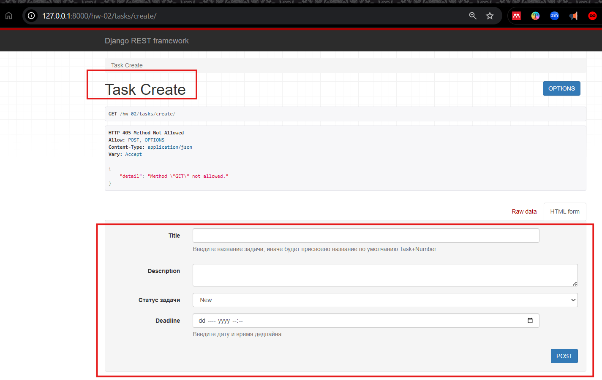  

<a id="img1" style="margin: 40px; color:#606060;">Fig. 1. Страница по эндпоинту `http://127.0.0.1:8000/hw-02/tasks/create/` 
для создания новой задачи.</a>

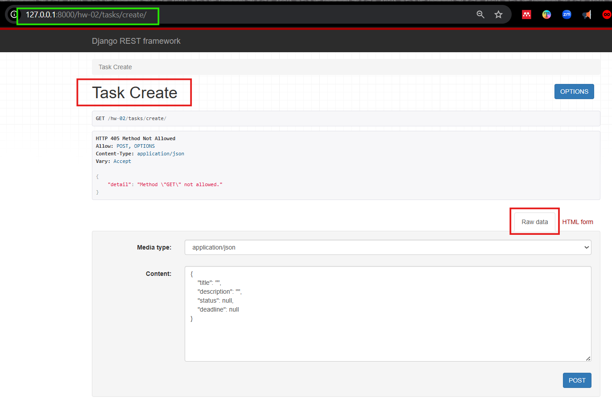  

<a id="img2" style="margin: 40px; color:#606060;">Fig. 2. Или так - в поле JSON.</a>

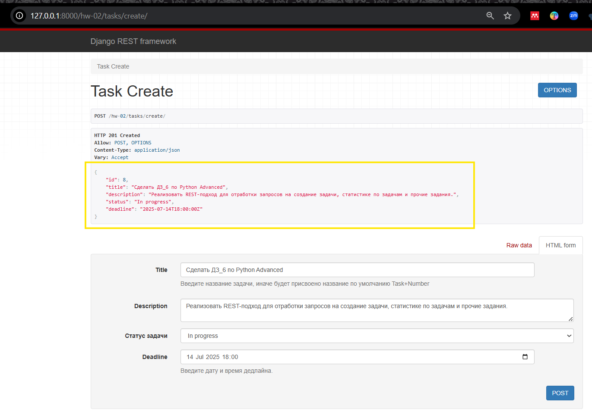  

<a id="img3" style="margin: 40px; color:#606060;">Fig. 3. Результат отправки запроса на создание задачи.</a>

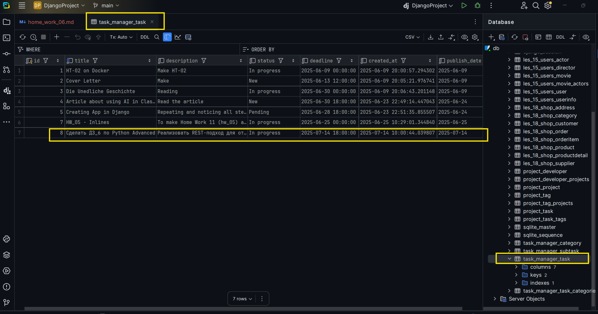  

<a id="img4" style="margin: 40px; color:#606060;">Fig. 4. Результат добавления задачи в БД 
приложения hw_02_task_manager.</a>


<div style="font: bold normal 110% sans-serif; color: #8A2BE2; white-space: pre; border-top: 2px dotted #008000; padding: 5px;"></div>  

## <a id="s2" style="color: #008000">2. Эндпоинты для получения списка задач и конкретной задачи по её ID</a>  
Решение Чата: https://chatgpt.com/s/t_6874dd6a4ac48191a01ed7d4a83b59d6.

### <a id="s2.1" style="color: #008000">2.1. Список всех задач (GET /api/tasks/)</a>  
В файл <a>hw_02_task_manager / views.py</a> добавить такой код:
```python
from rest_framework.generics import ListAPIView

class TaskListView(ListAPIView):
    queryset = Task.objects.all()           # Список всех задач
    serializer_class = TaskSerializer
```

### <a id="s2.2" style="color: #008000">2.2. Получение задачи по ID (`GET /api/tasks/<int:pk>/`)</a>  
В файл <a>hw_02_task_manager / views.py</a> добавить такой код:
```python
from rest_framework.generics import RetrieveAPIView

class TaskDetailView(RetrieveAPIView):
    queryset = Task.objects.all()           # Получение задачи по ID
    serializer_class = TaskSerializer
```

### <a id="s2.3" style="color: #008000">2.3. Подключение маршрутов</a>  
В файл <a>hw_02_task_manager / urls.py</a> добавить такой код:
```python
from .views import TaskListView, TaskDetailView

urlpatterns = [
    path('tasks/', TaskListView.as_view(), name='task-list'),
    path('tasks/<int:pk>/', TaskDetailView.as_view(), name='task-detail'),
]
```

### <a id="s2.4" style="color: #008000">2.4. Проверка результата в БРАУЗЕРЕ</a>  

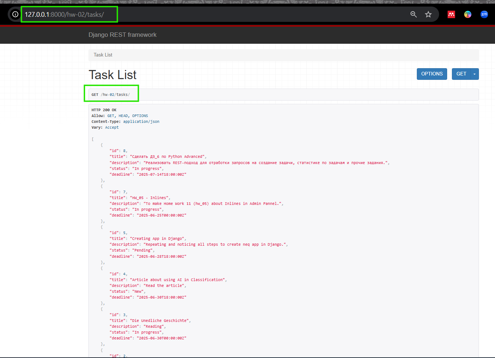  

<a id="img5" style="margin: 40px; color:#606060;">Fig. 5. Результата перехода по эндпоинту 
`http://127.0.0.1:8000/hw-02/tasks/` - по-сути, выполнение GET-запроса на вывод списка всех задач.</a>

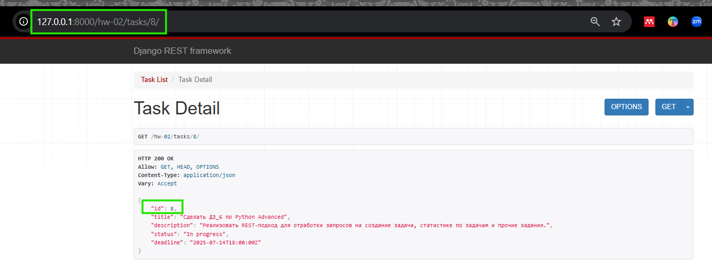  

<a id="img6" style="margin: 40px; color:#606060;">Fig. 6. Результата перехода по эндпоинту 
`http://127.0.0.1:8000/hw-02/tasks/8/` - выполнение GET-запроса на вывод задачи по ID.</a>


<div style="font: bold normal 110% sans-serif; color: #8A2BE2; white-space: pre; border-top: 2px dotted #008000; padding: 5px;"></div>  

## <a id="s3" style="color: #008000">3. Агрегирующий эндпоинт для статистики задач</a>  
Решение Чата: https://chatgpt.com/s/t_6874dd6a4ac48191a01ed7d4a83b59d6.

Например:

* Всего задач
* По каждому статусу: `New`, `In Progress`, `Done`
* Сколько задач просрочено

### <a id="s3.1" style="color: #008000">3.1. View для статистики</a>  
В файл <a>hw_02_task_manager / views.py</a> добавить код:
```python
from .models import Task
from rest_framework.views import APIView
from rest_framework.response import Response
from django.utils import timezone

class TaskStatisticsView(APIView):
    def get(self, request):
        total_tasks = Task.objects.count()
        new_tasks = Task.objects.filter(status='New').count()
        in_progress_tasks = Task.objects.filter(status='In Progress').count()
        done_tasks = Task.objects.filter(status='Done').count()
        overdue_tasks = Task.objects.filter(deadline__lt=timezone.now(), status__in=['New', 'In Progress']).count()

        return Response({
            "total": total_tasks,
            "new": new_tasks,
            "in_progress": in_progress_tasks,
            "done": done_tasks,
            "overdue": overdue_tasks
        })
```


### <a id="s3.2" style="color: #008000">3.2. Добавление маршрута</a>  
В файл <a>hw_02_task_manager / urls.py</a> добавить код:
```python
from .views import TaskStatisticsView

urlpatterns = [
    path('tasks/statistics/', TaskStatisticsView.as_view(), name='task-statistics'),
]
```

---
<span style="font: small-caps 120% sans-serif; color: #8A2BE2; padding: 0 15px 0 0;">▣ &nbsp;&nbsp; Что значит `urlpatterns += [...]`</span>  
Это просто расширение <span style="color: #8A2BE2;">существующего списка маршрутов</span>.  
Пример:  
```python
urlpatterns = [
    path('tasks/', TaskListView.as_view(), name='task-list'),
]

urlpatterns += [
    path('tasks/statistics/', TaskStatisticsView.as_view(), name='task-statistics'),
]
```
То есть сначала объявили список `urlpatterns`, а потом <span style="color: #8A2BE2;">добавили в него</span> 
новый маршрут — как будто сказали: «Допиши ещё один маршрут к уже существующим».

#### <span style="color: #8A2BE2;">Почему у меня работает без</span> `+`
Если **сразу** все маршруты были записаны в одном списке, например:
```python
urlpatterns = [
    path('tasks/', TaskListView.as_view(), name='task-list'),
    path('tasks/<int:pk>/', TaskDetailView.as_view(), name='task-detail'),
    path('tasks/statistics/', TaskStatisticsView.as_view(), name='task-statistics'),
]
```
— то всё абсолютно корректно. Просто сразу был задан весь список целиком, без поэтапного добавления. 
Это даже **лучше читается**.


#### <span style="color: #8A2BE2;">Когда используют</span> `+=`

`urlpatterns += [...]` чаще применяют:  
* **при подключении нескольких файлов маршрутов**, например `urls_auth`, `urls_api`, и т.д.
* **в шаблонах**, где список `urlpatterns` формируется динамически
* **в больших проектах**, когда маршруты импортируются из других приложений и добавляются "поштучно"


<span style="font: small-caps 120% sans-serif; color: #8A2BE2; padding: 0 15px 0 0;">▣ &nbsp;&nbsp; Вывод</span>

| Вариант                | Работает? | Когда использовать                                           |
| ---------------------- | --------- |--------------------------------------------------------------|
| `urlpatterns = [...]`  | ✅         | Когда всё объявляется сразу                                 |
| `urlpatterns += [...]` | ✅         | Когда новые маршруты добавляются позже или в других файлах  |


### <a id="s3.3" style="color: #008000">3.3. Проверка результата в БРАУЗЕРЕ</a>  

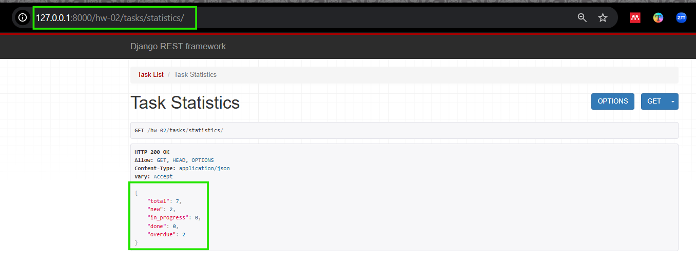  

<a id="img7" style="margin: 40px; color:#606060;">Fig. 7. Результата перехода по эндпоинту 
`http://127.0.0.1:8000/hw-02/tasks/statistics/` - выполнение GET-запроса на статистику задач.</a>


<div style="font: bold normal 110% sans-serif; color: #8A2BE2; white-space: pre; border-top: 2px dotted #008000; padding: 5px;"></div>  

## <a id="s4" style="color: #008000">4. Итог</a>

| Метод | URL                  | Назначение                         |
| ----- | -------------------- |------------------------------------|
| GET   | `/tasks/`            | Получить список задач              |
| GET   | `/tasks/<int:pk>/`   | Получить задачу по ID              |
| GET   | `/tasks/statistics/` | Получить агрегированную статистику |


<div style="font: bold normal 110% sans-serif; color: #8A2BE2; white-space: pre; border-top: 2px dotted #008000; padding: 5px;"></div>  

## <a id="s5" style="color: #008000">5. ДОПОЛНИТЕЛЬНО</a>

### <a id="s5.1" style="color: #008000">5.1. Пагинация в Django REST Framework (DRF)</a>  
Решение от Чата: https://chatgpt.com/s/t_6874f199102c8191bc0dd3a9249b1ad1.


<span style="font: small-caps 120% sans-serif; color: #8A2BE2; padding: 0 15px 0 0;">▣ &nbsp;&nbsp; Пагинация</span>  
Пагинация — это способ разделить большой список объектов на страницы.  
Например, если в базе данных 10 000 задач, сервер **не должен отправлять их все сразу** — 
это тяжело для сети, клиента и твоей машины.
С пагинацией можно получить, например, **по 10 задач за раз**, и можно листать страницы с помощью 
`?page=2`, `?page=3` и т.д.

#### <span style="color: #008000;">Зачем нужна пагинация?</span>
* Уменьшает нагрузку на сервер.
* Ускоряет отклик API.
* Удобна для фронтенда (подгружает частями).
* Предотвращает перегрузку клиента большим количеством данных.

#### <span id="s5.1.1" style="color: #008000;">5.1.1. Как добавить пагинацию в Django REST Framework (DRF)</span>

#### <span style="color: #008000;">1)</span> Включить пагинацию в `settings.py`
Добавить (или отредактировать) следующий блок:  
```python
REST_FRAMEWORK = {
    'DEFAULT_PAGINATION_CLASS': 'rest_framework.pagination.PageNumberPagination',
    'PAGE_SIZE': 10,  # можно поставить 5, 20 и т.д.
}
```

#### <span style="color: #008000;">2)</span> Ничего больше в представлениях менять не нужно
Если используется `ListAPIView` или `APIView`, возвращающую `queryset`.  
<span style="color: #8A2BE2;">DRF сам применит пагинацию</span>.

#### <span style="color: #008000;">Как это выглядит при запросе:</span>
Если сделать запрос `GET /tasks/`, то вместо огромного списка будет выведено, например:
```json
{
  "count": 25,
  "next": "http://127.0.0.1:8000/tasks/?page=2",
  "previous": null,
  "results": [
    {
      "id": 1,
      "title": "Prepare presentation",
      ...
    },
    ...
  ]
}
```
Поле `results` — это и есть текущая страница.
А ссылки `next` и `previous` позволяют переходить между страницами.

Можно создать **свою пагинацию**, для этого смотри https://chatgpt.com/s/t_6874f199102c8191bc0dd3a9249b1ad1.

#### <span id="s5.1.2" style="color: #008000;">5.1.2. Результат добавления пагинации в Django REST Framework (DRF)</span>

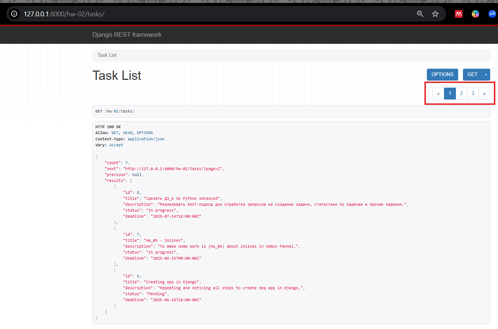  

<a id="img8" style="margin: 40px; color:#606060;">Fig. 8. Результата перехода по эндпоинту 
`http://127.0.0.1:8000/hw-02/tasks/` - пагинация в Django REST Framework (DRF).</a>


### <a id="s5.2" style="color: #008000">5.2. Красивая визуализация через Swagger или ReDoc</a>  
Решение от Чата: https://chatgpt.com/s/t_6874f98f71348191ac3aca944724b74e.  

#### <span id="s5.2.1" style="color: #008000;">5.2.1. Что такое Swagger и ReDoc?</span>
Оба инструмента используются для:  
- автоматической генерации **документации к API**
- визуализации эндпоинтов и их параметров
- возможности протестировать запросы прямо из браузера

Когда создаются сериализаторы и представления — документация с использованием этих инструментов 
появляется автоматически! 

---
<span style="font: small-caps 120% sans-serif; color: #8A2BE2; padding: 0 15px 0 0;">▣ &nbsp;&nbsp; Swagger UI</span>  

**Swagger UI — это:**  
- Интерактивная документация.
- Подсвечивает параметры, показывает типы данных, примеры.
- Позволяет **отправлять запросы прямо из браузера**.
- Включён по умолчанию в [drf-spectacular](https://drf-spectacular.readthedocs.io/) и [drf-yasg](https://drf-yasg.readthedocs.io).

**Плюсы:**
- Удобен для разработки
- Возможность тестировать API в реальном времени

**Минусы:**
- Интерфейс может казаться немного «техническим»

---
<span style="font: small-caps 120% sans-serif; color: #8A2BE2; padding: 0 15px 0 0;">▣ &nbsp;&nbsp; ReDoc</span>

**ReDoc — это:**  
- Очень красивая, минималистичная документация.
- Неинтерактивная (по умолчанию): ты не можешь отправить запрос прямо из интерфейса.
- Подходит больше для финального представления API пользователям/заказчику.

**Плюсы:**
- Приятный, чистый интерфейс
- Легко читать, особенно когда много эндпоинтов

**Минусы:**
- Нет кнопок «Try it out» (если только специально не донастроить)

---
<span style="font: small-caps 120% sans-serif; color: #8A2BE2; padding: 0 15px 0 0;">▣ &nbsp;&nbsp; Что лучше?</span>  

|              | **Swagger**           | **ReDoc**                   |
|--------------| --------------------- |-----------------------------|
| Визуально    | Технический интерфейс | Эстетичный, чистый          |
| Для dev      | ✅ Подходит            | ❌ Не всегда удобно        |
| Тест API     | ✅ Можно из браузера   | ❌ Нельзя (по умолчанию)  |
| Читаемость   | Средняя               | Отличная                    |
| Подходит для | Разработки            | Демонстрации/документации   |


### Совет Чата:

* Для **разработки и тестирования** лучше начать со **Swagger**
* Когда проект готов, для красивой публикации — **ReDoc**


---
#### <span id="s5.2.2" style="color: #008000;">5.2.2. Подключение Swagger и ReDoc</span>
Дальше как подключить `drf-yasg` или `drf-spectacular` — две библиотеки, которые дают 
и Swagger, и ReDoc из коробки: https://chatgpt.com/s/t_68750090abbc81918daa7484591c3fb8.  

Подключение **Swagger** и **ReDoc** осуществляется с помощью библиотеки [`drf-yasg`](https://drf-yasg.readthedocs.io/en/stable/). 
Она простая, мощная и позволяет включить обе документации одновременно.


#### <span style="color: #008000;">Шаг 1:</span> Установить необходимые библиотеки
<font style="color: #606060;">Смотри ответ Чата: https://chatgpt.com/s/t_68754b4d5bd881918ec7aee68491c339.</font>  
Лучше сразу ставить `drf-spectacular`, потому что `drf-yasg` уже не поддерживается официально 
и не обновлялся с 2021 года (<font style="color: #606060;">см. объяснение здесь https://chatgpt.com/s/t_68754e95df2081919cd8dd9da20b6c08</font>).  
В терминале проекта (где активировано виртуальное окружение `.venv`) ввести:  
```bash
pip install drf-spectacular
```
`drf-yasg` можно не устанавливать по причине, поясненной выше:
```bash
# pip install drf-yasg
```

#### <span style="color: #008000;">Шаг 2:</span> Добавить в <a>settings.py</a> код:
<font style="color: #606060;">Смотри ответ Чата: https://chatgpt.com/s/t_68754b4d5bd881918ec7aee68491c339.</font>  
В конец файла добавить:
```python
REST_FRAMEWORK = {
    'DEFAULT_SCHEMA_CLASS': 'drf_spectacular.openapi.AutoSchema',
}

SPECTACULAR_SETTINGS = {
    'TITLE': 'Task Manager API',
    'DESCRIPTION': 'API для управления задачами и подзадачами',
    'VERSION': '1.0.0',
}
```
Если блок `REST_FRAMEWORK` уже есть, просто добавить в него строку с `'DEFAULT_SCHEMA_CLASS'` 
(https://chatgpt.com/s/t_68755042f6e08191844c3f6e5874a0b8).


#### <span style="color: #008000;">Шаг 3:</span> Настроить маршруты в `DjangoProject_config / urls.py`
<font style="color: #606060;">Смотри ответ Чата: https://chatgpt.com/s/t_68754b4d5bd881918ec7aee68491c339.</font>  
Открыть `urls.py` в config (в папке проекта `DjangoProject_config / urls.py`) и добавить следующий код:
```python
from django.urls import path, include    # Закомментировать, потому что уже есть в файле.
from drf_spectacular.views import (
    SpectacularAPIView,
    SpectacularRedocView,
    SpectacularSwaggerView,
)

urlpatterns = [
    # Схема OpenAPI:
    path('schema/', SpectacularAPIView.as_view(), name='schema'),
    # документация Swagger UI:
    path('swagger/', SpectacularSwaggerView.as_view(url_name='schema'), name='swagger-ui'),
    # документация Redoc UI:
    path('redoc/', SpectacularRedocView.as_view(url_name='schema'), name='redoc'),
]
```
Теоретически, `drf-spectacular` не требует шаблонов, потому что Swagger и Redoc работают через JS.


#### <span style="color: #008000;">Шаг 4:</span> В <a>urls.py</a> добавить эндпоинты:
<font style="color: #606060;">Смотри детально здесь: https://chatgpt.com/s/t_68754e95df2081919cd8dd9da20b6c08.</font>  

```python
from drf_spectacular.views import SpectacularAPIView, SpectacularSwaggerView, SpectacularRedocView

urlpatterns += [
    path('schema/', SpectacularAPIView.as_view(), name='schema'),
    path('swagger/', SpectacularSwaggerView.as_view(url_name='schema'), name='swagger-ui'),
    path('redoc/', SpectacularRedocView.as_view(url_name='schema'), name='redoc'),
]
```


#### <span style="color: #008000;">Шаг 5:</span> Проверить результат

1. Запустить / ПЕРЕзапустить сервер:
```bash
python manage.py runserver
```
2. Перейти в браузере по адресам:

* [http://127.0.0.1:8000/swagger/](http://127.0.0.1:8000/swagger/) — Swagger UI
* [http://127.0.0.1:8000/redoc/](http://127.0.0.1:8000/redoc/) — ReDoc


---
#### <span style="color: #008000;">ПРИМЕЧАНИЯ:</span>

##### <span style="color: #008000;">* Примечание 1</span>
Документация появится **автоматически** на основе сериализаторов и view-классов, 
определенных в приложении, если используется `APIView` или `ViewSet`.

##### <span style="color: #008000;">* Примечание 2</span>
При переходе по http://127.0.0.1:8000/schema/, браузер не открывает страницу, а предлагает 
скачать .yaml файл — и это нормально, потому что:
  * `SpectacularAPIView.as_view()` по умолчанию возвращает OpenAPI-схему в формате 
  YAML или JSON, а не HTML-страницу.
  * Эта точка `(/schema/)` используется Swagger и ReDoc для получения описания API, но 
  сама по себе она не для людей. <font style="color: #606060;">Детальнее по этому примечанию об открывающемся окне с предложением 
сохранить .yaml файл смотри здесь: https://chatgpt.com/s/t_687550e66d148191b5fd9678ab999752.</font>  
**Как избавиться от `unable to guess serializer`**  
Чтобы `TaskStatisticsView` корректно отображался в документации — нужно в:
    * Наследоваться от `GenericAPIView` - <a>hw_02_task_manager / views.py</a> добавить код ниже.
    * Добавить `serializer_class`
Код в <a>hw_02_task_manager / views.py</a>:
```python
from rest_framework.response import Response
from rest_framework.generics import GenericAPIView
from .serializers import TaskStatisticsSerializer  # нужно создать этот сериализатор

class TaskStatisticsView(GenericAPIView):
    serializer_class = TaskStatisticsSerializer

    def get(self, request):
        data = {
            "total_tasks": 10,
            "completed_tasks": 3,
        }
        return Response(data)
```

А в `serializers.py`:
```python
from rest_framework import serializers

class TaskStatisticsSerializer(serializers.Serializer):
    total_tasks = serializers.IntegerField()
    completed_tasks = serializers.IntegerField()
```
Это **сделает документацию красивее**, но **не обязательно** для работы самих эндпоинтов.

<span style="font: small-caps 120% sans-serif; color: #008000; padding: 0 15px 0 0;">▣ &nbsp;&nbsp; Итого по п. 5.2.2:</span>  

| Путь        | Назначение                                   |
| ----------- | -------------------------------------------- |
| `/schema/`  | Описание API (JSON или YAML)                 |
| `/swagger/` | Человекоудобная документация (интерактивная) |
| `/redoc/`   | Альтернативный формат документации           |


#### <span id="s5.2.3" style="color: #008000;">5.2.3. Результат подключения Swagger и ReDoc</span>

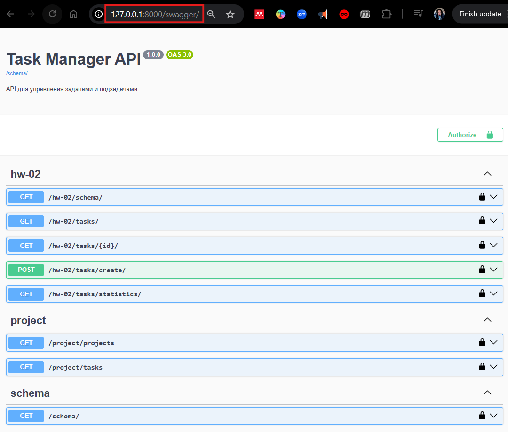  

<a id="img9" style="margin: 40px; color:#606060;">Fig. 9. Результат перехода по эндпоинту 
`http://127.0.0.1:8000/swagger/` - документация Swagger UI.</a>

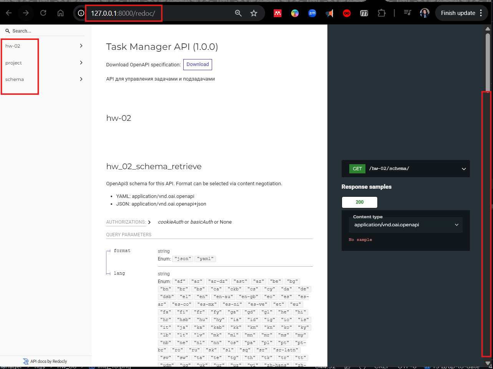  

<a id="img10" style="margin: 40px; color:#606060;">Fig. 10. Результат перехода по эндпоинту 
`http://127.0.0.1:8000/redoc/` - документация ReDoc UI.</a>

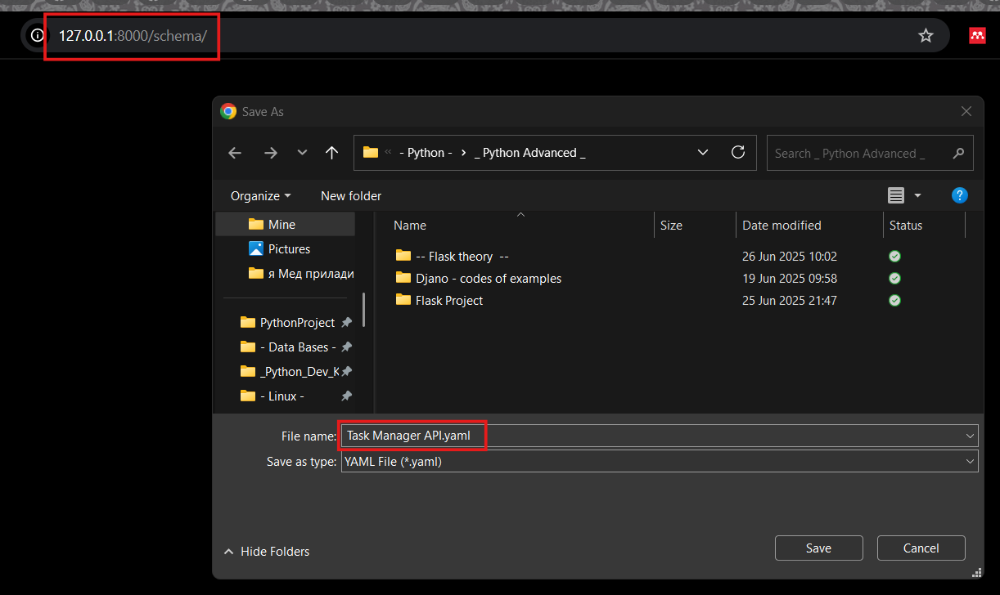  

<a id="img11" style="margin: 40px; color:#606060;">Fig. 11. Результат перехода по эндпоинту 
`http://127.0.0.1:8000/schema/` - документация ReDoc UI.</a>


<div style="font: bold normal 110% sans-serif; color: #8A2BE2; white-space: pre; border-top: 2px dotted #008000; padding: 5px;"></div>  

## <a id="s6" style="color: #008000">6. GitHub</a>
- Запуште проект в Git-репозиторий и прикрепите как решение ссылку на него.

Ссылка на отчет по ДЗ <a>home_work_06.md</a> со скриншотами: .  

Ссылка на приложение по ДЗ <a>hw_02_task_manager</a>: https://github.com/odnabu/Django-Python-Advanced/tree/main/hw_02_task_manager.  

Ссылка на весь проект <a>DjangoProject</a>: https://github.com/odnabu/Django-Python-Advanced/tree/main.  

---
<div style="font: bold normal 110% sans-serif; color: #8A2BE2; white-space: pre; border-top: 2px dotted #8A2BE2; padding: 5px; margin: 40px 0 40px 0"></div>

[//]: # ([<font color="#696969">[1 - ▶  Video 22, 48:00]</font>]&#40;#v1&#41;)
[//]: # ([<font style="color: #606060;">[2, слайд 32]</font>]&#40;#p1&#41;)

[//]: # (<div style="margin: 40px 0 40px 0"></div>)

[//]: # (<span style="color: #8A2BE2; margin: 20px 40px; padding: 5px; background: #000000;">▣ ⚜️ ☑️ ✔️ 🟪 ■ ※ ⁂ ⁙ ⁘ ⨠  ■ ◲◳ ◆ ◇ ◈ ◀ ▶ ◁ ▷ ▹ ▼ ▲ ▽ △ ▢ ₪₪₪</span>  )  

[//]: # (<div style="font: small-caps 120% sans-serif; color: #8A2BE2; margin: 0 0 0 0px; padding: 0 15px 0 0;">▣ &nbsp;&nbsp; Выполните запросы:</div>  )
[//]: # (🔷🔹 🟩 ❇️♾️⚜️✳️❎✅☑️✔️🟪🔳🔲  )
[//]: # (■ ⁜ ※ ⁂ ⁙ ⁘ ⫷ ⫸ ⩕ ⨠ ⨝ ⋘ ⋙ ∵ ∴ ∶ ∷ ■ ◪ ◩ ◲ ◳ ◆ ◇ ◈ ▼ ▽ ◀ ▶ ◁ ▷ ▹ ▲ △ ▢ ₪₪₪  )


[//]: # (<div style="color: #F00000; margin: 40px 20px 20px 0;">)

[//]: # (<span style="border: 2px solid #6B0000; padding: 10px;"> NB ! </span>)

[//]: # (</div>)


[//]: # (&nbsp;&nbsp; spaces)
[//]: # (<div style="font: small-caps 120% sans-serif; color: #8A2BE2; padding: 0 15px 0 0;">▣ &nbsp;&nbsp; Выполните запросы:</div>  )

[//]: # (<div style="font: bold normal 110% sans-serif; color: #8A2BE2; white-space: pre; border-top: 2px dotted #008000; padding: 5px;"></div>)
