Python Advanced - Django  
16.07.2025

## <div style="color: #9000F0">Домашнее задание 13 (7 in Django): <br> Проект "Менеджер задач" — Создание и настройка сериализаторов и добавление представлений</div>    
Цель: Освоить настройку сериализаторов для работы с подзадачами и категориями, включая:  
  - переопределение полей, 
  - использование вложенных сериализаторов, 
  - методов create и update, 
  - классы представлений.

###  Задание 1.  Переопределение полей сериализатора  
Создайте SubTaskCreateSerializer, в котором поле created_at будет доступно только для чтения (read_only).

__Шаги для выполнения:__  
- Определите SubTaskCreateSerializer в файле serializers.py.
- Переопределите поле created_at как read_only.

###  Задание 2.  Переопределение методов create и update  
Создайте сериализатор для категории CategoryCreateSerializer, переопределив методы create и update 
для проверки уникальности названия категории. Если категория с таким названием уже существует, возвращайте ошибку валидации.

__Шаги для выполнения:__  
- Определите CategoryCreateSerializer в файле serializers.py.
- Переопределите метод create для проверки уникальности названия категории.
- Переопределите метод update для аналогичной проверки при обновлении.

###  Задание 3.  Использование вложенных сериализаторов  
Создайте сериализатор для TaskDetailSerializer, который включает вложенный сериализатор для 
полного отображения связанных подзадач (SubTask).  
Сериализатор должен показывать все подзадачи, связанные с данной задачей.  

__Шаги для выполнения:__  
- Определите TaskDetailSerializer в файле serializers.py.
- Вложите SubTaskSerializer внутрь TaskDetailSerializer.

###  Задание 4.  Валидация данных в сериализаторах  
Создайте TaskCreateSerializer и добавьте валидацию для поля deadline, чтобы дата не могла 
быть в прошлом. Если дата в прошлом, возвращайте ошибку валидации.  

__Шаги для выполнения:__  
- Определите TaskCreateSerializer в файле serializers.py.
- Переопределите метод validate_deadline для проверки даты.

###  Задание 5.  Создание классов представлений  
Создайте классы представлений для работы с подзадачами (`SubTasks`), включая:   
- создание,
- получение,
- обновление,
- удаление подзадач.   
Используйте классы представлений (APIView) для реализации этого функционала.  

__Шаги для выполнения:__  
  - Создайте классы представлений для создания и получения списка подзадач (`SubTaskListCreateView`).
  - Создайте классы представлений для получения, обновления и удаления подзадач (`SubTaskDetailUpdateDeleteView`).
  - Добавьте маршруты в файле <a>urls.py</a>, чтобы использовать эти классы.


<div style="font: bold normal 110% sans-serif; color: #8A2BE2; white-space: pre; border-top: 2px dotted #008000; padding: 5px;"></div>  

### <m style="color: #008000">Источники</m>  
<m style="color: #606060">Видео - уроки от *14.07.2025*</m>  [<font color="#696969">[1 - ▶  Video ___]</font>](#v1).  
1. ▶ Video __ "", *14.07.2025*: <m id="v1"></m>.    
2. ▶ Video __ "", *14.07.2025*: <m id="v2"></m>.    
3. ▶ Video __ "", *14.07.2025*: <m id="v3"></m>.    
4. Presentation <a id="p1">Les24-Django_23-REST-14_07.pdf</a>.    
5. Conspectus <a id="c1">Les24-Django_23---REST-14_07.pdf</a>.  
6. Presentation <a id="p2">Les24-Django_24-REST-14_07-pyth_25.pdf</a>.  
7. Conspectus <a id="c2">Les24-Django_24---REST-14_07-pyth_25.pdf</a>.  
8. Приложение **home_work_06**: файл <m id="hw6">home_work_06.md</m>.  
9. Руководство по оформлению Markdown файлов: https://gist.github.com/Jekins/2bf2d0638163f1294637.


<div style="font: bold normal 110% sans-serif; color: #8A2BE2; white-space: pre; border: 2px outset #8A2BE2; margin: 60px 0 40px 0; padding: 5px 0 5px 25px;">ОТЧЕТ</div>

## <m id="s1" style="color: #008000">1. Переопределение полей сериализатора</m>  

<div style="margin: 20px 20px 20px 0;">
<b style="color: #F00000; border: 2px solid #6B0000; padding: 10px; margin: 0 10px 0 0;"> NB ! </b>
<p style="margin: 0 0 0 65px;"> Из презентаций и конспекта <b style="color: red">НЕ</b>  очевидно, какой код и в какой ФАЙЛ вставлять.
<br> Поэтому дальше решение с Чатом GPT. Хорошо, что он есть 🥰 Без него я бы этот курс не закончила.
</div>

### <m id="s1.1" style="color: #008000">1.1. Миграции</m>  

<div style="margin: 40px 20px 20px 0;">
<m style="color: #F00000; border: 2px solid #6B0000; padding: 10px;"> NB ! </m> 
<b style="color: #F00000; border: 1px solid black; padding: 5px;">!!! ВСЕГДА</b> после изменения в моделях (НЕ в сериализаторе) выполнять и применят миграции.
</div>  

Запускать команды `python manage.py shell`, `migrate`, `runserver` — находясь в корне проекта, рядом с <a>manage.py</a>
  (см. [<font color="#696969">[8 - hw_07]</font>](#hw6)).

После изменений в МОДЕЛЯХ сделать и применить миграции [<font color="#696969">[1 - ▶  Video 20, 57:60]</font>](#v1):
```
    python manage.py makemigrations hw_02_task_manager
    python manage.py migrate hw_02_task_manager
```
Запустить локальный сервер Django с помощью <a>manage.py</a> в терминале [<font color="#696969">[1 - ▶  Video 20, 57:60]</font>](#v1):
```
   python manage.py runserver
```


---

### <m id="ss1.2" style="color: #008000">1.2. SubTaskCreateSerializer</m>  
Смотри решение тут [ChatGPT](https://chatgpt.com/s/t_68789c352618819192f6bac3d5b4052a).  
Добавить <m style="color: #f08000">SubTaskCreateSerializer</m> в файле <a>serializers.py</a>.  
```python
class SubTaskCreateSerializer(serializers.ModelSerializer):
    class Meta:
        model = SubTask
        fields = '__all__'           # ['id', 'title', 'description', 'status', 'deadline']
        read_only_fields = ['created_at']
```
Переопределение поля `created_at` как `read_only`.


<div style="font: bold normal 110% sans-serif; color: #8A2BE2; white-space: pre; border-top: 2px dotted #008000; padding: 5px;"></div>  

## <m id="s2" style="color: #008000">2. Переопределение методов create и update</m>  
Смотри решение тут [ChatGPT](https://chatgpt.com/s/t_68789c352618819192f6bac3d5b4052a).  

### <m id="s2.1" style="color: #008000">2.1. `CategoryCreateSerializer` с методом `create`</m>  
В файл <a>hw_02_task_manager / serializers.py</a> добавить код для метода `create`.  
Переопределение метода `create` для проверки уникальности названия категории реализуется 
с помощью условия для `Category.objects.filter(name=name)`. Если категория с таким именем
уже существует, рейзится ошибка `ValidationError`.    

Здесь <m style="color: #9000F0">функция __super()__</m> в контексте сериализатора Django REST Framework (DRF) 
используется, чтобы ___обратиться к родительскому классу и вызвать у него метод___.  
При переопределении метода `create` в сериализаторе (например, `CategoryCreateSerializer`), 
можно задавать какую-то свою проверку или дополнительную логику. 
Но потом всё равно нужно собственно создать объект модели — и вот тут имеет смысл использовать `super()`.  

<m style="color: #9000F0">Что делает `super().create(validated_data)`:</b>  
- Вызывает метод `create()` у родительского класса `ModelSerializer` (см. документацию 
по <m style="color: #9000F0">rest_framework</m>).
- Этот метод автоматически вызывает `Model.objects.create(**validated_data)` и таким образом
создаёт объект модели и сохраняет его в базе данных.


### <m id="s2.2" style="color: #008000">2.2. `CategoryCreateSerializer` с методом `update`</m>  
В файл <a>hw_02_task_manager / serializers.py</a> добавить код для метода `update`.  
Переопределение метода `update` для проверки уникальности названия категории реализуется 
с помощью условия для `Category.objects.exclude(pk=instance.pk, name=name).filter(name=name)`. 
Если вводится имя категории, которое уже существует в БД, рейзится ошибка `ValidationError`.  

### <m id="s2.3" style="color: #008000">2.3. Результаты выполнения задания 1 и 2</m>  

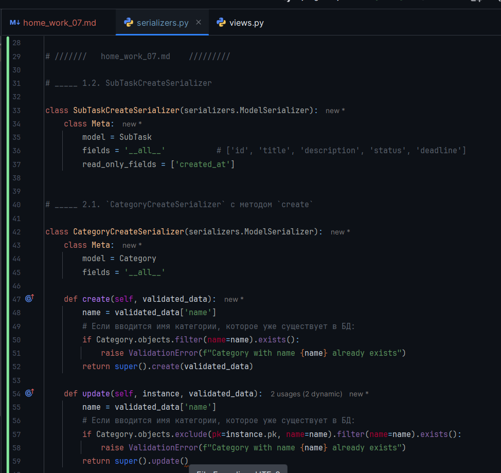  

<m id="img1" style="margin: 40px; color:#606060;">Fig. 1. Сериализаторы с проверкой в файле <a>hw_02_task_manager / serializers.py</a>.</m>


<div style="font: bold normal 110% sans-serif; color: #8A2BE2; white-space: pre; border-top: 2px dotted #008000; padding: 5px;"></div>  

## <m id="s3" style="color: #008000">3. Использование вложенных сериализаторов</m>  
Смотри решение тут [ChatGPT](https://chatgpt.com/s/t_68789c352618819192f6bac3d5b4052a).  

### <m id="s3.1" style="color: #008000">3.1. Сериализатор</m> `TaskDetailSerializer`  

В файл <a>hw_02_task_manager / serializers.py</a> добавить код для сериализатора `TaskDetailSerializer`.  
Сериализатор `TaskDetailSerializer` включает вложенный сериализатор для  
полного отображения связанных подзадач (`SubTask`).


<div style="margin: 20px 20px 20px 0;">
<b style="color: #F00000; border: 2px solid #6B0000; padding: 10px; margin: 0 10px 0 0;"> NB ! </b>
Обязательно убедиться,
<p style="margin: 0 0 0 65px;"> что у модели SubTask <i style="color: red">есть</i> внешний ключ:
</div>

```python
    task = models.ForeignKey(Task, related_name='subtasks', ...)
```
<b style="color: red">тогда</b> `source='subtasks'`.


### <m id="s3.2" style="color: #008000">3.2. Результаты выполнения задания 3</m>  

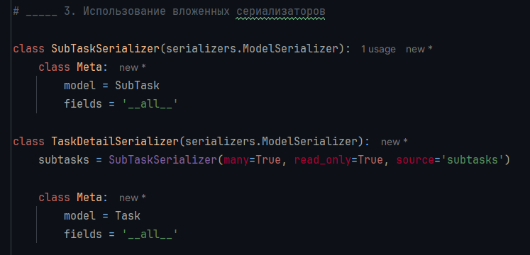  

<m id="img2" style="margin: 40px; color:#606060;">Fig. 2. Сериализатор `TaskDetailSerializer` c вложенным сериализатором `SubTaskSerializer`.</m>


<div style="font: bold normal 110% sans-serif; color: #8A2BE2; white-space: pre; border-top: 2px dotted #008000; padding: 5px;"></div>  

## <m id="s4" style="color: #008000">4. Валидация данных в сериализаторах</m>  
Смотри решение тут [ChatGPT](https://chatgpt.com/s/t_68789c352618819192f6bac3d5b4052a).  

### <m id="s4.1" style="color: #008000">4.1. Сериализатор</m> `TaskCreateSerializer`  
В файл <a>hw_02_task_manager / serializers.py</a> добавить код для класса 
`TaskCreateSerializer` с валидацией `deadline`.

### <m id="s4.2" style="color: #008000">4.2. Результаты выполнения задания 3</m>  

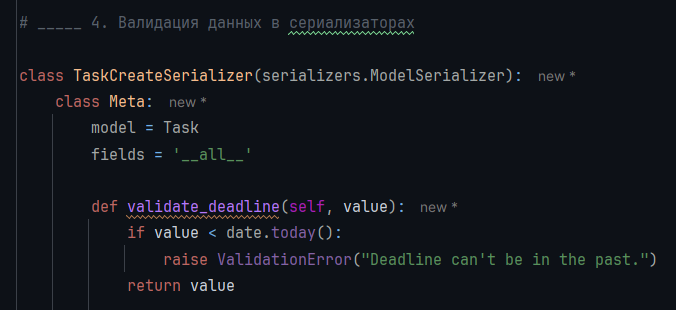  

<m id="img3" style="margin: 40px; color:#606060;">Fig. 3. Сериализатор `TaskCreateSerializer` с валидацией `deadline`.</m>


<div style="font: bold normal 110% sans-serif; color: #8A2BE2; white-space: pre; border-top: 2px dotted #008000; padding: 5px;"></div>  

## <m id="s5" style="color: #008000">5. Создание классов представлений</m>  
Смотри решение тут [ChatGPT](https://chatgpt.com/s/t_68789c352618819192f6bac3d5b4052a).  
По сути — создание <m style="color: #9000F0">представлений (APIView)</m>.  
В файл <a>hw_02_task_manager / views.py</a> добавить код для представлений.

### <m id="s5.1" style="color: #008000">5.1. Представления</m> `SubTaskListCreateView`  
`SubTaskListCreateView` — класс представлений для создания и получения списка подзадач.

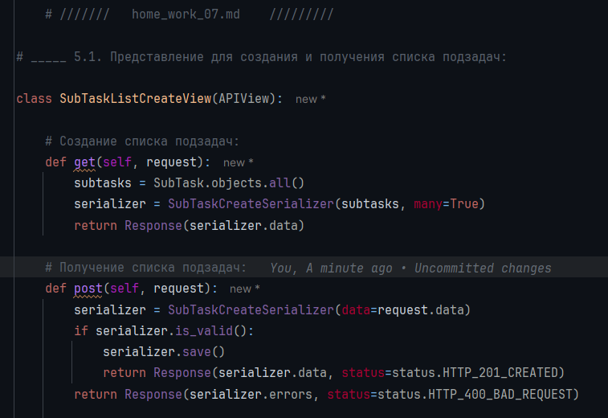  

<m id="img4" style="margin: 40px; color:#606060;">Fig. 4. Представление в <a>hw_02_task_manager / views.py</a> 
для создания и получения списка подзадач.</m>

### <m id="s5.2" style="color: #008000">5.2. Класс представлений</m> `SubTaskDetailUpdateDeleteView`  
`SubTaskDetailUpdateDeleteView` — класс представлений для получения, обновления и удаления подзадач.

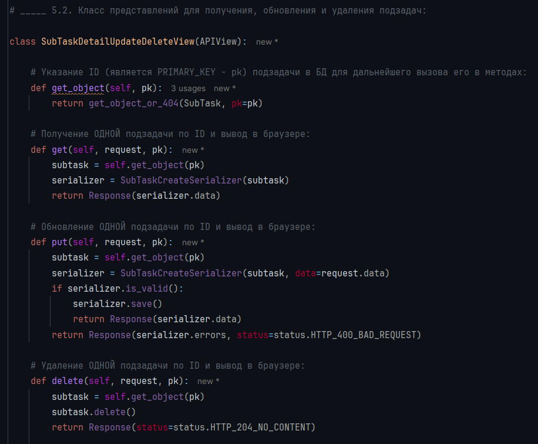  

<m id="img5" style="margin: 40px; color:#606060;">Fig. 5. Класс представлений `SubTaskDetailUpdateDeleteView` 
для получения, обновления и удаления подзадач.</m>

### <m id="s5.3" style="color: #008000">5.3. Маршруты в файле</m> <a>urls.py</a>  
Добавление маршрутов в файле <a>urls.py</a>, чтобы использовать классы `SubTaskListCreateView` и 
`SubTaskDetailUpdateDeleteView`.  

<m style="font: small-caps 120% sans-serif; color: #8A2BE2; padding: 0 15px 0 0;">▣ &nbsp;&nbsp; Команда</m> `from . import views`:  
Команда:
```python
from . import views
```
используется для <m style="color: #8A2BE2">импорта модуля</m> `views.py`, который находится __в той же папке__, 
что и файл, в котором осуществляется этот импорт (например, `urls.py`):  
- Точка `.` — это сокращение для __"текущего пакета__ / текущей директории".
- `views` — это имя файла `views.py`, без расширения.  

Таким образом, после этого импорта можно использовать функции, классы и переменные из `views.py` так:
```python
views.my_view_function
views.MyViewClass
```

Тогда, например, можно прописать маршруты так:
```python
from . import views

urlpatterns = [
    path('home/', views.home_view),
    path('tasks/', views.TaskListView.as_view()),
]
```
Это удобно, особенно если используется несколько функций или классов из `views`.  

Иногда пишут иначе:
```python
from .views import home_view, TaskListView
```
Это означает: _импортировать только нужные объекты из views.py_.  
Но если много вьюшек — тогда удобнее делать просто `from . import views`.

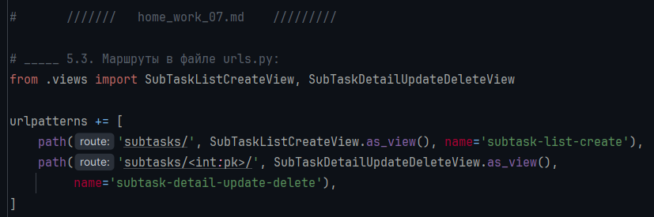  

<m id="img6" style="margin: 40px; color:#606060;">Fig. 6. Маршруты для <b>hw_07</b> в файле <a>urls.py</a>.</m>


---

### <m id="s5.4" style="color: #008000">5.4. ДОПОЛНИТЕЛЬНО</m>  
В детальном представлении задачи отобразить названия связанных с ней подзадач.   
Для этого используются вложенные сериализаторы в Django REST Framework.  
Описание решения смотри у Чата [ChatGPT](https://chatgpt.com/s/t_687a3c90c5f08191aa9e2ecdc4d4c23b) 
и еще здесь [ChatGPT](https://chatgpt.com/s/t_687a3d0f0c8481919ba2fa9519b9af44).  
И еще дополнительно здесь [ChatGPT](https://chatgpt.com/s/t_687a3d79efd08191a850f9711df40cc3) 
решение для __переключения между разными сериализаторами__ по query-параметру, 
например `?short=true`, чтобы получать: 
- либо полную информацию о задаче с подзадачами,
- либо только названия подзадач (короткий вариант).


<div style="font: bold normal 110% sans-serif; color: #8A2BE2; white-space: pre; border-top: 2px dotted #008000; padding: 5px;"></div>  

## <m id="s6" style="color: #008000">6. Проверка результатов hw_07 в БРАУЗЕРЕ</m>  

<b id="s4.1" style="color: #008000">⋘ 1 ⋙ </b> зайти на домашнюю страницу и проверить работу приложения: http://127.0.0.1:8000/hw-02/home/
На домашней странице будет видно приветствие: "Welcome to the Task Manager!".  

---
<b id="s4.2" style="color: #008000">⋘ 2 ⋙ </b> далее ПЕРЕЙТИ по ссылке: http://127.0.0.1:8000/hw-02/subtasks/.

Откроется страница со СПИСКОМ подзадач и полем для добавления новой подзадачи `SubTask`:

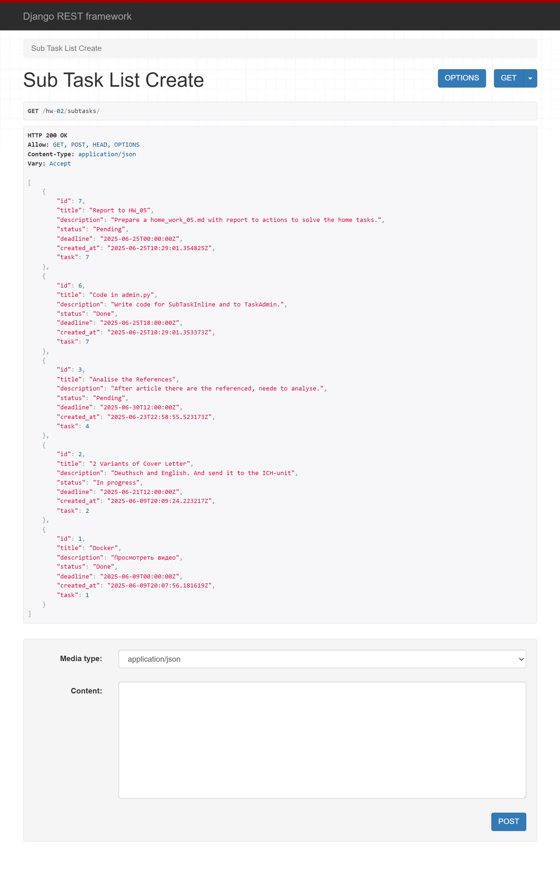  

<m id="img7" style="margin: 40px; color:#606060;">Fig. 7. Список всех подзадач и поля добавления новой подзадачи.</m>


---
<b id="s4.3" style="color: #008000">⋘ 3 ⋙ </b> далее ПЕРЕЙТИ по ссылке: http://127.0.0.1:8000/hw-02/subtasks/.

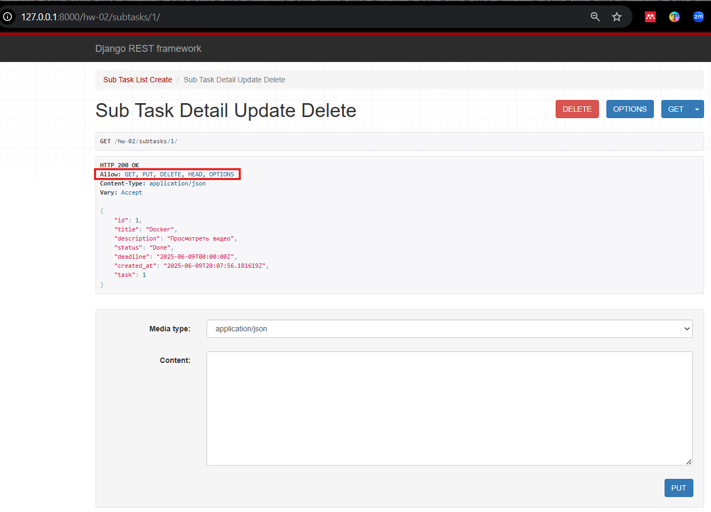  

<m id="img8" style="margin: 40px; color:#606060;">Fig. 8. Подзадача с ID=1 и полем добавления новой подзадачи.</m>

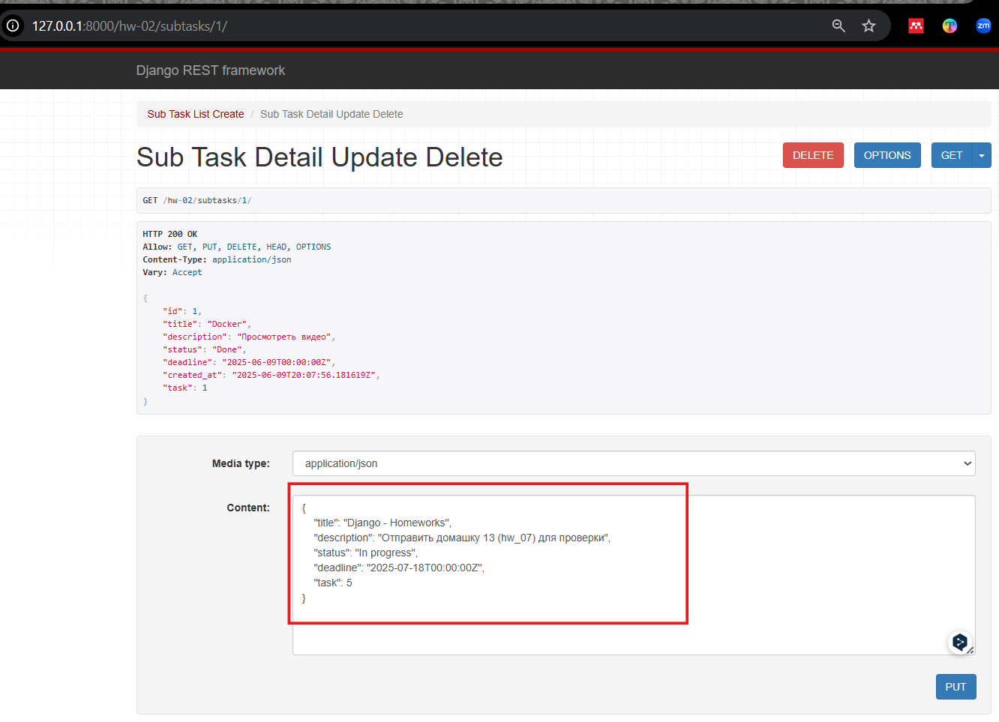  

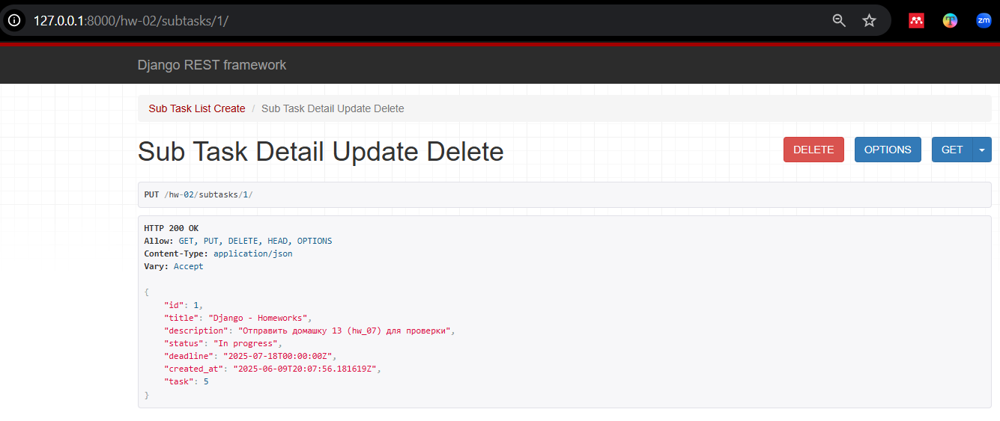  


<m id="img9" style="margin: 40px; color:#606060;">Fig. 9. Создание НОВОЙ подзадачи из-под ендпоинта с ID=1: 
http://127.0.0.1:8000/hw-02/subtasks/1/.</m>

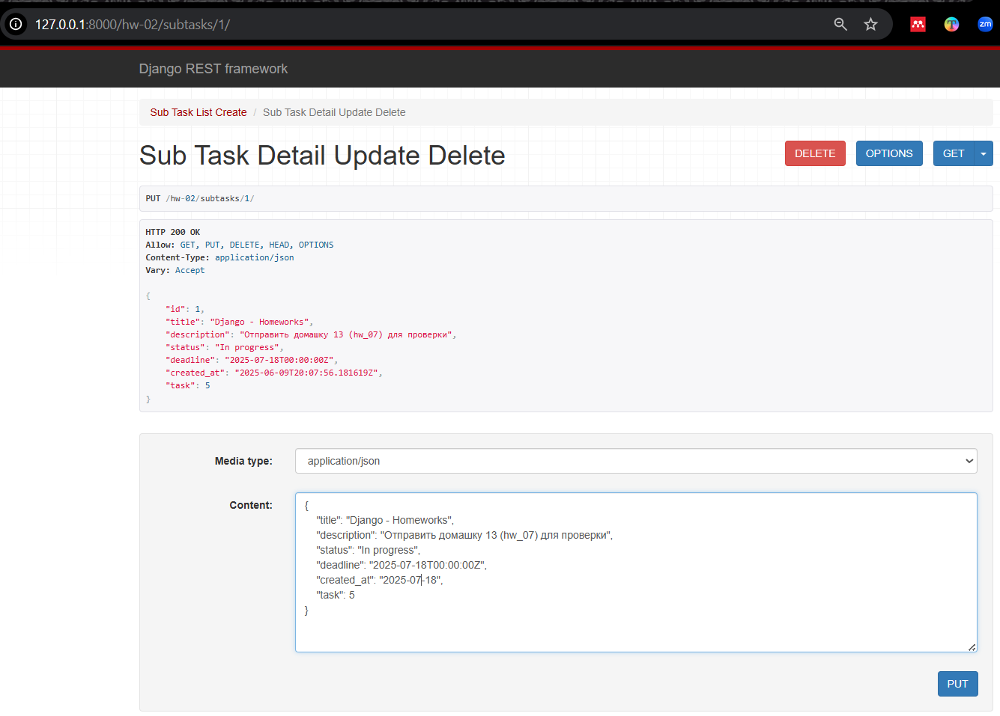  

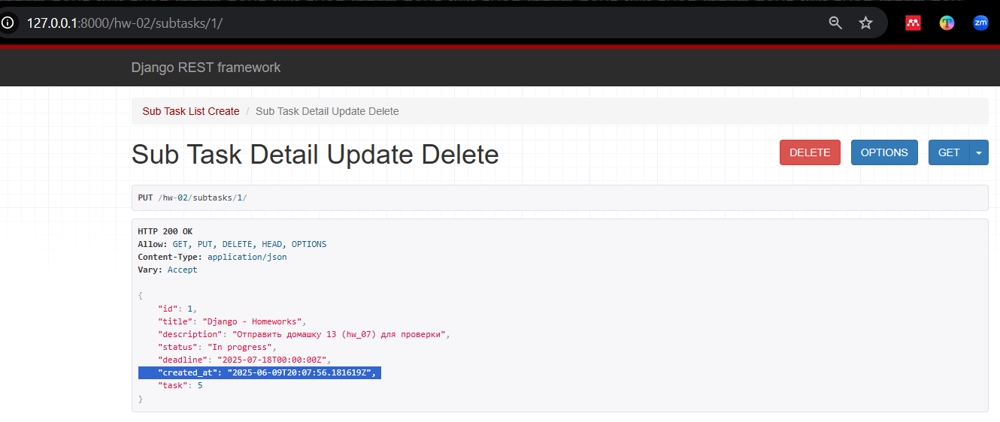  

<m id="img10" style="margin: 40px; color:#606060;">Fig. 10. Редактирование подзадачи с ID=1 задачи 5.</m> 
<br><m style="margin: 90px; color: red">ВОПРОС - почему дата стоит ЗАДАЧИ, а не дата создания ПОДзадачи????</m>


<div style="margin: 20px 20px 20px 0;">
<b style="color: #F00000; border: 2px solid #6B0000; padding: 10px; margin: 0 10px 0 0;"> NB ! </b> Если создавать подзадачу из-под страницы со СПИСКОМ подзадач,
<p style="margin: 0 0 0 65px;"> то почему-то время создания теперь
<b style="color: lawngreen">ПРАВИЛЬНОЕ</b> (см. рисунок 11 ниже).
<br> ??? Вот мне и НЕ понятно, почему так:
<br> - то ли из-за того что на рис. 9 в эндпоинте стоит ID=1 <a>subtasks/1/</a>, 
<br> - то ли еще какая-то причина...
</div>

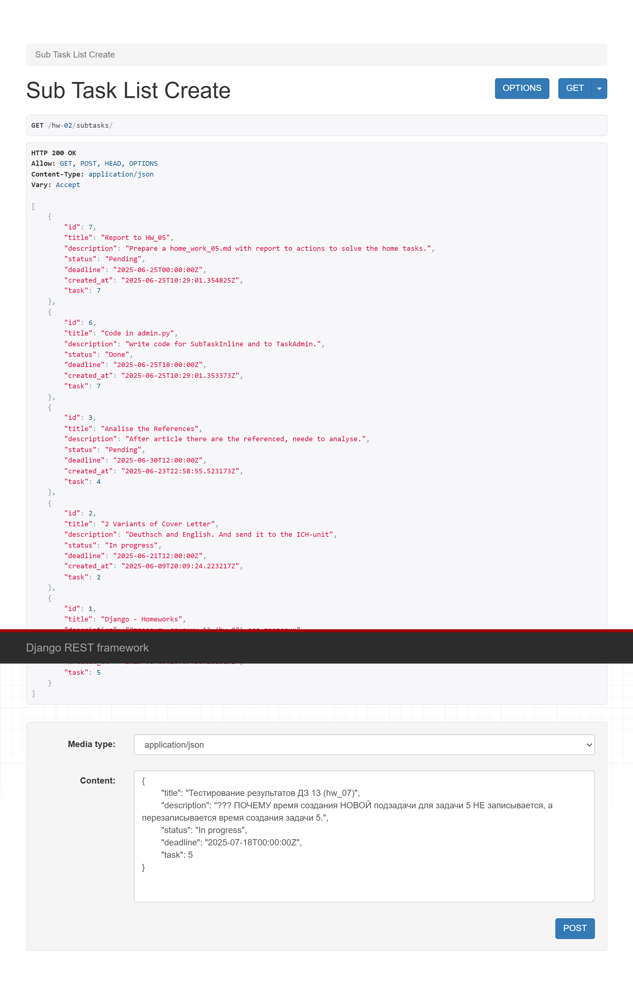  

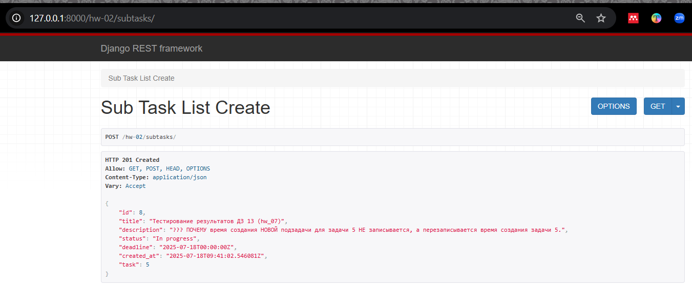  

<m id="img11" style="margin: 40px; color:#606060;">Fig. 11. ПРОВЕРКА даты создания НОВОЙ подзадачи в задаче 5 
из-под эндпоинта http://127.0.0.1:8000/hw-02/subtasks/ для проверки ___времени создания ПОДзадачи___.</m> 
<br> <m style="margin: 85px;"> Дата создания подзадачи теперь АКТУАЛЬНАЯ.</m> 


---
<b id="s4.4" style="color: #008000">⋘ 4 ⋙ </b> далее ПЕРЕЙТИ по ссылке: http://127.0.0.1:8000/hw-02/subtasks/.  
Создать подзадачу для проверки удаления подзадачи.

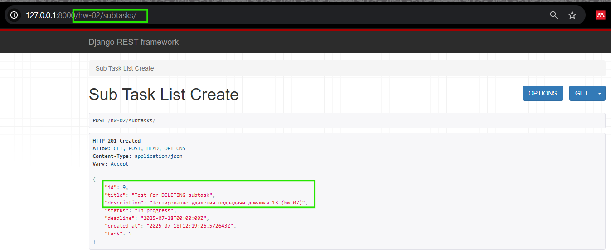  

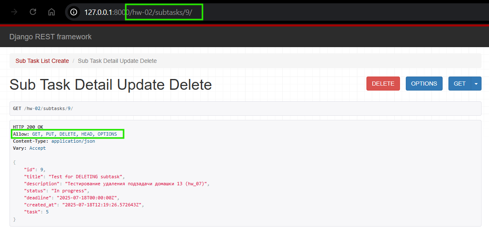  

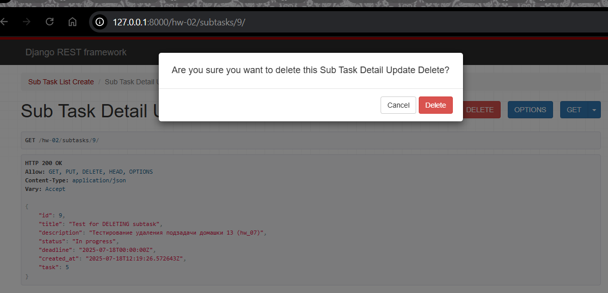

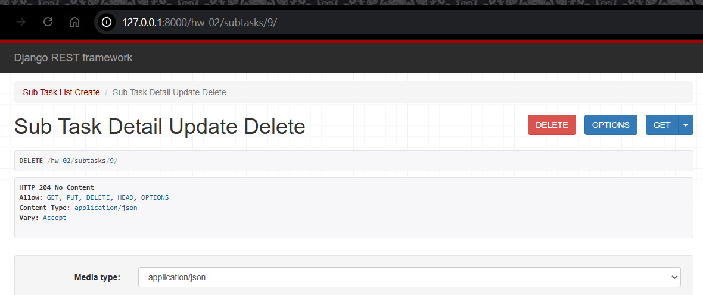  

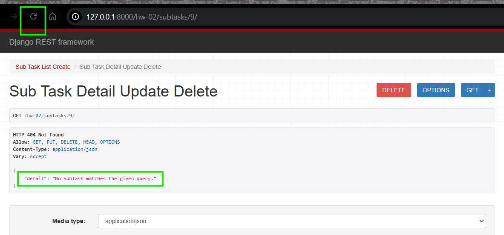  

<m id="img12" style="margin: 40px; color:#606060;">Fig. 12. Результат создания подзадичи в задаче 5 
и её последующего удаления.</m> 


<div style="font: bold normal 110% sans-serif; color: #8A2BE2; white-space: pre; border-top: 2px dotted #008000; padding: 5px;"></div>  

## <m id="s7" style="color: #008000">7. GitHub</m>
- Запуште проект в Git-репозиторий и прикрепите как решение ссылку на него.

Ссылка на отчет по ДЗ <a>home_work_07.md</a> со скриншотами: .  

Ссылка на приложение по ДЗ <a>hw_02_task_manager</a>: https://github.com/odnabu/Django-Python-Advanced/tree/main/hw_02_task_manager.  

Ссылка на весь проект <a>DjangoProject</a>: https://github.com/odnabu/Django-Python-Advanced/tree/main.  

---
<div style="font: bold normal 110% sans-serif; color: #8A2BE2; white-space: pre; border-top: 2px dotted #8A2BE2; padding: 5px; margin: 40px 0 40px 0"></div>

[//]: # ([<font color="#696969">[1 - ▶  Video 22, 48:00]</font>]&#40;#v1&#41;)
[//]: # ([<font style="color: #606060;">[2, слайд 32]</font>]&#40;#p1&#41;)

[//]: # (<div style="margin: 40px 0 40px 0"></div>)

[//]: # (<m style="color: #8A2BE2; margin: 20px 40px; padding: 5px; background: #000000;">▣ ⚜️ ☑️ ✔️ 🟪 ■ ※ ⁂ ⁙ ⁘ ⨠  ■ ◲◳ ◆ ◇ ◈ ◀ ▶ ◁ ▷ ▹ ▼ ▲ ▽ △ ▢ ₪₪₪</m>   )  

[//]: # (<div style="font: small-caps 120% sans-serif; color: #8A2BE2; margin: 0 0 0 0px; padding: 0 15px 0 0;">▣ &nbsp;&nbsp; Выполните запросы:</div>  )
[//]: # (🔷🔹 🟩 ❇️♾️⚜️✳️❎✅☑️✔️🟪🔳🔲  )
[//]: # (■ ⁜ ※ ⁂ ⁙ ⁘ ⫷ ⫸ ⩕ ⨠ ⨝ ⋘ ⋙ ∵ ∴ ∶ ∷ ■ ◪ ◩ ◲ ◳ ◆ ◇ ◈ ▼ ▽ ◀ ▶ ◁ ▷ ▹ ▲ △ ▢ ₪₪₪  )


[//]: # (<div style="color: #F00000; margin: 40px 20px 20px 0;">)

[//]: # (<m style="border: 2px solid #6B0000; padding: 10px;"> NB ! </m>)

[//]: # (</div>)


[//]: # (&nbsp;&nbsp; spaces)
[//]: # (<div style="font: small-caps 120% sans-serif; color: #8A2BE2; padding: 0 15px 0 0;">▣ &nbsp;&nbsp; Выполните запросы:</div>  )

[//]: # (<div style="font: bold normal 110% sans-serif; color: #8A2BE2; white-space: pre; border-top: 2px dotted #008000; padding: 5px;"></div>)


[//]: # (== RegEx в PyCharm ==)

[//]: # (Как найти все тексты между тегами <a>...</a> в PyCharm)

[//]: # (1️⃣ Открой нужный файл в PyCharm.)

[//]: # (2️⃣ Нажми Ctrl + F — откроется строка поиска.)

[//]: # (3️⃣ Нажми на .∗ значок ".*", чтобы включить режим RegEx &#40;регулярных выражений&#41;.)

[//]: # (4️⃣ Введи такой шаблон:)

[//]: # (<a>&#40;.*?&#41;</a>)

[//]: # (📌 Что означает шаблон:)

[//]: # (- <a> и </a> — буквально ищем открывающий и закрывающий теги.)

[//]: # (- &#40;.*?&#41; — захватывает любой текст между ними, включая кириллицу, пробелы и спецсимволы.)

[//]: # (- ? — делает захват нежадным, чтобы не схватывало всё сразу до последнего </a>.)

[//]: # (✨ Хочешь выделить или заменить текст?)

[//]: # (Если ты нажмёшь Ctrl + Shift + R — откроется Поиск и замена по шаблону.)

[//]: # (Можно заменить на, например:)

[//]: # ([ссылка: \1])

[//]: # ( \1 — это то, что попало в скобки &#40;.*?&#41;.)

