Python Advanced - Django  
19.07.2025

## <div style="color: #9000F0">Домашнее задание 14 (8 in Django): <br> Проект "Менеджер задач" — Extract методы. query_params</div>    

###  Задание 1.  Эндпоинт на получение списка всех задач по дню недели
Написать, или обновить, если уже есть, эндпоинт на получение списка всех задач по дню недели.
- Если никакой параметр запроса не передавался - по умолчанию выводить все записи.
- Если был передан день недели (например вторник) - выводить список задач только на этот день недели.

###  Задание 2.  Пагинация в отображении списка подзадач  
Добавить пагинацию в отображение списка подзадач. На одну страницу должно отображаться не более 5 объектов. 
Отображение объектов должно идти в порядке убывания даты (от самого последнего 
добавленного объекта к самому первому).

###  Задание 3.  Эндпоинт на получение списка всех подзадач по названию главной задачи и статусу подзадач  
Добавить или обновить, если уже есть, эндпоинт на получение списка всех подзадач 
по названию главной задачи и статусу подзадач.
- Если фильтр параметры в запросе не передавались - выводить данные по умолчанию, с учётом пагинации.
- Если бы передан фильтр параметр названия главной задачи - выводить данные по этой главной задаче.
- Если был передан фильтр параметр конкретного статуса подзадачи - выводить данные по этому статусу.
- Если были переданы оба фильтра - выводить данные в соответствии с этими фильтрами.


<div style="font: bold normal 110% sans-serif; color: #8A2BE2; white-space: pre; border-top: 2px dotted #008000; padding: 5px;"></div>  

### <m style="color: #008000">Источники</m>  
<m style="color: #606060">Видео - уроки от *14.07.2025* и от *15.07.2025*</m>  [<font color="#696969">[1 - ▶  Video 25, AdP5]</font>](#v1).  
[1] ▶ Video 25 "Python Adv 25: Extract методы, query_params" (1:52:40), *14.07.2025*: <m id="v1">https://player.vimeo.com/video/1101197544?h=08aba743e2</m>.  
[2] ▶ Video <u>AddPr5</u> "Additional practicum 5: mini project (Agile project)" (1:37:37), *15.07.2025*: <m id="v2">https://player.vimeo.com/video/1101471476?h=c62c9c2dc1</m>.  
[3] Presentation <a id="p1">Les25-Python Adv_25-15_07-Extract методы - Add Pr 2.pdf</a>. --->  Методы QuerySet, слайд 10.   
[4] Conspectus <a id="c1">Les25-Python Adv_25---15_07-Extract методы - Add Pr 2.pdf</a>. --->  Методы QuerySet, с. 2, 10.  
[5] Presentation <a id="p2">Les19-Django_19-ORM_запросы_1-18_06.pdf</a>. --->  Методы QuerySet, слайд 28.  
[6] Conspectus <a id="c2">Les19-Django_19---ORM_запросы_1-18_06.pdf</a>. --->  Методы QuerySet, с. 9.  
[7] Приложение **home_work_07**: файл <m id="hw7">home_work_07.md</m>.  
[8] Руководство по оформлению Markdown файлов: https://gist.github.com/Jekins/2bf2d0638163f1294637.  


| <m style="color: red"> NB! &nbsp; &nbsp;</m> БАРДАК с Видео-записями уроков!                                                                                                                                                                                                                                                 |
|:-----------------------------------------------------------------------------------------------------------------------------------------------------------------------------------------------------------------------------------------------------------------------------------------------------------------------------|
| ▶ Video 25 "Python Adv 25: Extract методы, query_params"  (1:52:40), *14.07.2025*: <br/><m id="v2">https://player.vimeo.com/video/1101197544?h=08aba743e2</m>.                                                                                                                                                               |
| ▶ Video __(1) "Additional practicum 5: mini project (Agile project)" (1:37:37), *15.07.2025*: <br/><m id="v____">https://player.vimeo.com/video/1101471476?h=c62c9c2dc1</m> - <br/> НА САМОМ ДЕЛЕ продолжение Урока <m style="color: red">25</m> - "Python Adv 25: Extract методы, query_params".                            |
| ▶ Video __(2) "Additional practicum 5: mini project (Agile project) (3:26:57), *15.07.2025*: <br/><m id="v____">https://player.vimeo.com/video/1101172994?h=485abc1389</m> - <br/><m style="color: red">ДУБЛИРУЕТСЯ видео 24</m> "Python Adv 24: Основы работы с Django REST Framework. Часть 2" (3:26:57), от *14.07.2025*. |
| ▶ Video 26 "Python Adv 26: Summary session 6", *15.07.2025*: <br/> <m id="v____">https://player.vimeo.com/video/1101535545?h=ed5a8d7fd2</m> - <br/>на самом деле <u>НАЧАЛО мини проекта</u> "Adile Mini-project".                                                                                                            |


<div style="font: bold normal 110% sans-serif; color: #8A2BE2; white-space: pre; border: 2px outset #8A2BE2; margin: 60px 0 40px 0; padding: 5px 0 5px 25px;">ОТЧЕТ</div>


### <m style="color: #008000">Миграции</m>  

<div style="margin: 40px 20px 20px 0;">
<m style="color: #F00000; border: 2px solid #6B0000; padding: 10px;"> NB ! </m> 
<b style="color: #F00000; border: 1px solid black; padding: 5px;">!!! ВСЕГДА</b> после изменения в моделях (НЕ в сериализаторе) выполнять и применят миграции.
</div>  

Запускать команды `python manage.py shell`, `migrate`, `runserver` — находясь в корне проекта, рядом с <a>manage.py</a>
  (см. [<font color="#696969">[8 - hw_08]</font>](#hw6)).

После изменений в МОДЕЛЯХ сделать и применить миграции [<font color="#696969">[1 - ▶  Video 20, 57:60]</font>](#v1):
```
    python manage.py makemigrations hw_02_task_manager
    python manage.py migrate hw_02_task_manager
```
Запустить локальный сервер Django с помощью <a>manage.py</a> в терминале [<font color="#696969">[1 - ▶  Video 20, 57:60]</font>](#v1):
```
   python manage.py runserver
```
---


## <m id="s1" style="color: #008000">1. Эндпоинт на получение списка всех задач по дню недели</m>  
<m style="color: #606060">Помогает попрактиковаться с обработкой параметров запроса и фильтрацией QuerySet.</m>  

<div style="margin: 20px 20px 20px 0;">
<b style="color: #F00000; border: 2px solid #6B0000; padding: 10px; margin: 0 10px 0 0;"> NB ! </b> Из презентаций и конспекта <b style="color: red">НЕ</b>  очевидно, какой код и в какой ФАЙЛ вставлять.
<p style="margin: 0 0 0 65px;"> Поэтому дальше решение с Чатом GPT. Хорошо, что он есть 🥰 Без него я бы этот курс не закончила.
</div>

Смотри решение у [ChatGPT](https://chatgpt.com/s/t_687e7fc530c881918f162d29c9dca719), как 
___пошагово___ реализовать эндпоинт для получения списка задач по дню недели.

#### Что нужно сделать:  
1. В представлении (`APIView` или `ListAPIView`) обрабатывать параметр `day` из `request.query_params`.
2. Если параметр передан — отфильтровать задачи, дата выполнения (`deadline`) которых соответствует нужному дню недели.
3. Если параметр не передан — вернуть все задачи.
4. Зарегистрировать маршрут в `urls.py`.


### <m id="ss1.1" style="color: #008000">1.1. Представление</m>  
В файл <a>views.py</a> добавить код для представления `TaskByWeekdayView(APIView)`.  


### <m id="ss1.2" style="color: #008000">1.2. URL-маршрут</m>  
В файл <a>urls.py</a> прописать маршруты для представления `TaskByWeekdayView`.
```python
  from hw_02_task_manager.views import TaskByWeekdayView
  
  urlpatterns += [
      path('tasks/by-day/', TaskByWeekdayView.as_view(), name='tasks-by-day'),
  ]
```


### <m id="ss1.3" style="color: #008000">1.3. День недели в каждой задаче в ответе API</m>  
Как добавить день недели к каждой задаче в ответ API, чтобы он красиво отображался в браузере смотри у 
[ChatGPT](https://chatgpt.com/s/t_687e8b0881ac81918722a04d4859d003).

#### Что нужно сделать:
В файл <a>serializers.py</a> добавить в сериализатор `TaskSerializer` поле `weekday`, 
которое будет вычисляться на основе `deadline`.

Если используется `TaskDetailSerializer`, можно просто добавить в него то же поле 
`weekday = serializers.SerializerMethodField()` и метод `get_weekday`.


### <m id="ss1.4" style="color: #008000">1.4. Использование эндпоинтов</m>  

* Получить все задачи:
  ```
  GET /tasks/by-day/
  ```
* Получить задачи на вторник:
  ```
  GET /tasks/by-day/?day=tuesday
  ```

#### Пояснение:
* `request.query_params.get('day')` получает параметр `day` из URL.
* `deadline__week_day` — специальный Django-фильтр для получения дня недели (`1` — воскресенье, `2` — понедельник и т.д.).
* сопоставляем человеко-читаемые дни с их номерами.

---

### <m id="ss1.5" style="color: #008000">1.5. Результаты выполнения задания 1 в браузере</m>  
Перейти по ссылке http://127.0.0.1:8000/hw-02/tasks/7/?subtask_titles=true.

<b id="s1.5.1" style="color: #008000">⋘ 1 ⋙ </b> зайти на домашнюю страницу и проверить работу приложения: http://127.0.0.1:8000/hw-02/home/
На домашней странице будет видно приветствие: "Welcome to the Task Manager!".  
---

<b id="s1.5.2" style="color: #008000">⋘ 2 ⋙ </b> далее ПЕРЕЙТИ по ссылке: http://127.0.0.1:8000/hw-02/tasks/by-day/.

Откроется страница со списком задач, отсортированными по дням недели от Monday до Sunday:

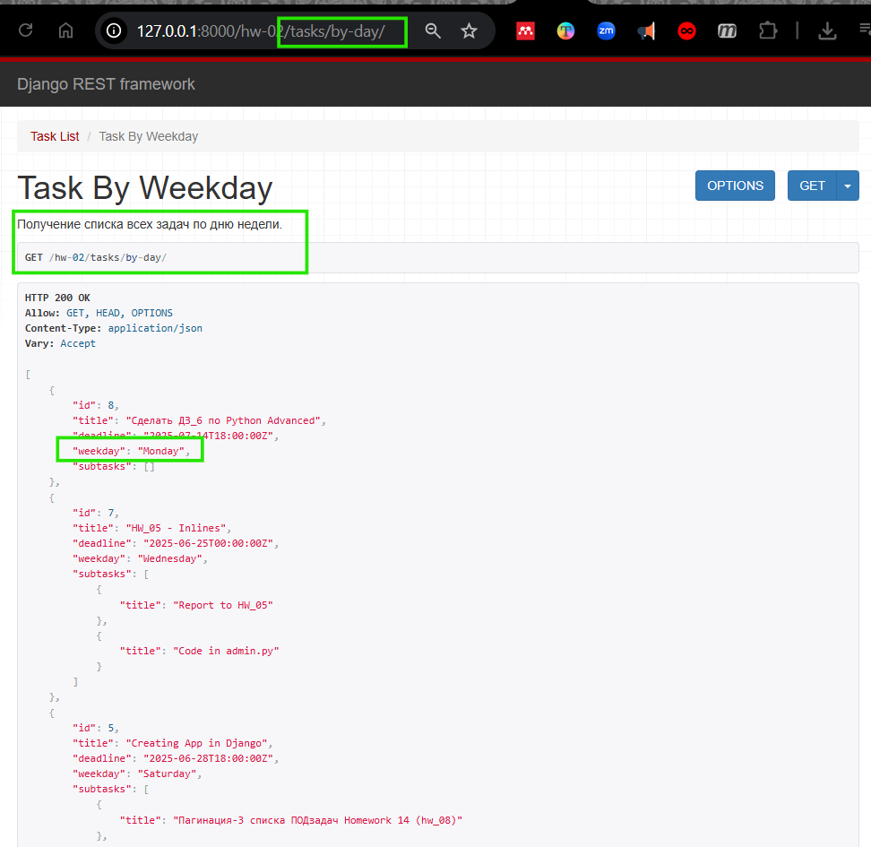  

<m id="img1.1" style="margin: 40px; color:#606060;">Fig. 1.1. Список всех задач, отсортированными по 
дням недели от Monday до Sunday.</m>

---

<b id="s1.5.3" style="color: #008000">⋘ 3 ⋙ </b> далее ПЕРЕЙТИ по ссылке: http://127.0.0.1:8000/hw-02/tasks/by-day/?day=monday.
Откроется страница с задачами на Понедельник.

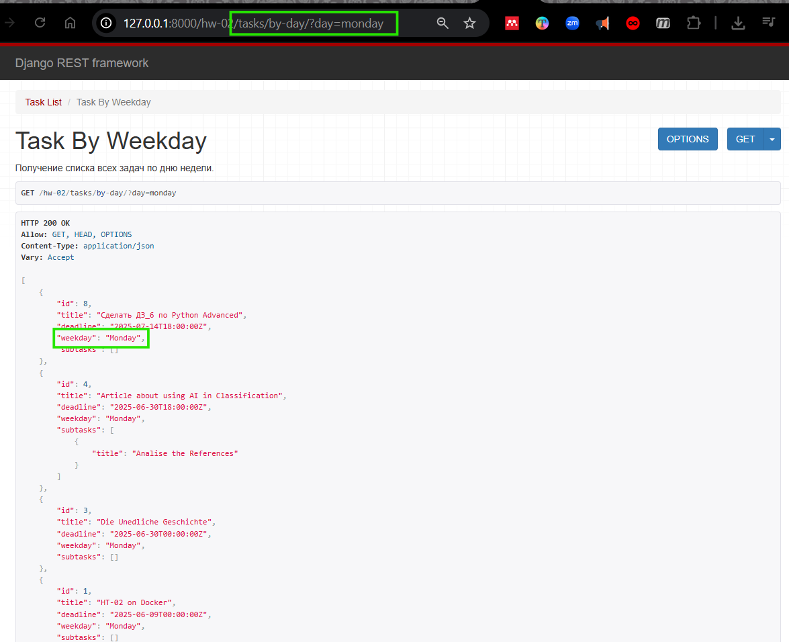  

<m id="img1.2" style="margin: 40px; color:#606060;">Fig. 1.2. Список задач на Monday.</m>

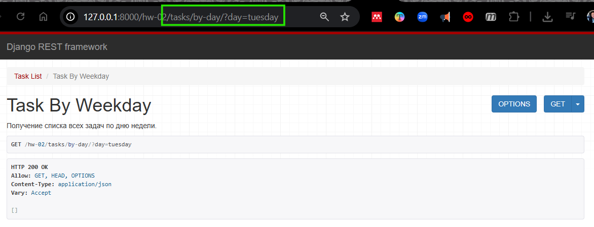

<m id="img9" style="margin: 40px; color:#606060;">Fig. 9. Пустой список задач на Tuesday: 
http://127.0.0.1:8000/hw-02/tasks/by-day/?day=tuesday.</m>

---

<b id="s1.5.4" style="color: #008000">⋘ 4 ⋙ </b> далее ПЕРЕЙТИ по ссылке: http://127.0.0.1:8000/hw-02/tasks/7/?subtask_titles=true.  
Откроется детальная информация по задаче со всеми подзадачами.

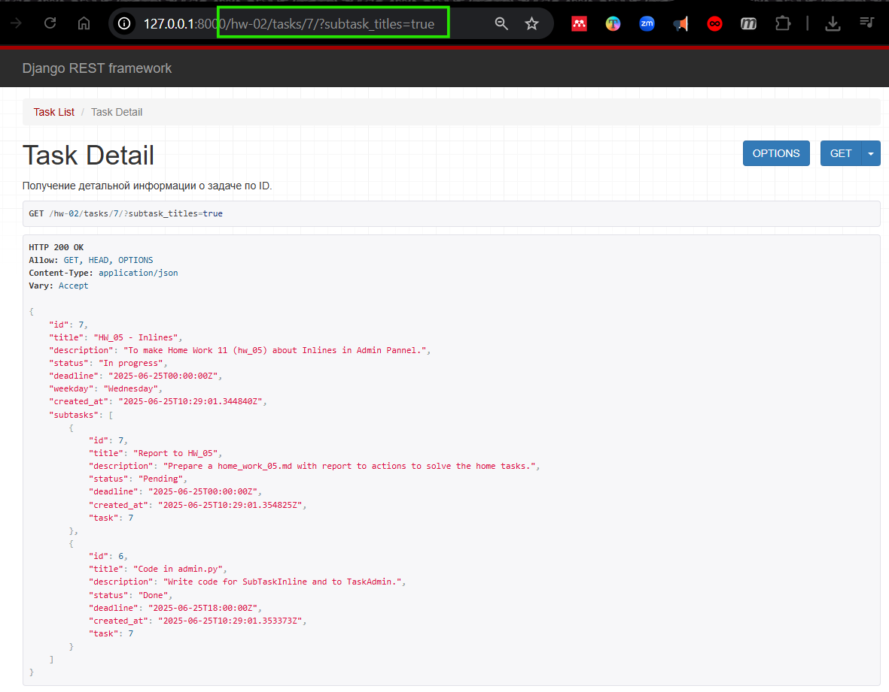<br/>  

<m id="img1.4" style="margin: 40px; color:#606060;">Fig. 1.4. Полная информация о задаче, включая подзадачи.</m>


<div style="font: bold normal 110% sans-serif; color: #8A2BE2; white-space: pre; border-top: 2px dotted #008000; padding: 5px;"></div>  


## <m id="s2" style="color: #008000">2. Пагинация в отображении списка подзадач</m>  
Смотри решение для __списка ЗАДАЧ__ в <a>home_work_06.md</a>, пункт "5.1. Пагинация в Django REST Framework (DRF)",
а так же у [ChatGPT](https://chatgpt.com/s/t_6874f199102c8191bc0dd3a9249b1ad1).  
Пример решения применительно к приложению __"library"__ смотри в [<font style="color: #606060;">[3, слайд 29]](#p1)</font> и в 
[<font style="color: #606060;">[4, с. 10]](#c1)</font>.  

РЕШЕНИЕ для моего случая смотри у [ChatGPT](https://chatgpt.com/s/t_687ddd5ddc6c8191a044f63bbb18cb53).  

### <m id="s2.1" style="color: #008000">2.1. Класс SubTaskPagination и корректировка кода для класса SubTaskListCreateView</m>  
В файл <a>hw_02_task_manager / views.py</a> импортировать класс `PageNumberPagination` из библиотеки `rest_framework`:
```python
    from rest_framework.pagination import PageNumberPagination
```
Добавить класс <m style="color: #f08000">SubTaskPagination</m> в файл <a>views.py</a>.  
```python
  class SubTaskPagination(PageNumberPagination):
      page_size = 5
      page_size_query_param = 'page_size'
      max_page_size = 20
```
И затем внести правки в код класса <m style="color: #f08000">SubTaskListCreateView</m>.  

---
### <m id="s2.2" style="color: #008000">2.2. GET-запрос с номером страницы и количеством подзадач на странице</m>  
Пример обращения по URL:  
```http request
    GET http://127.0.0.1:8000/hw-02/subtasks/?page=2&page_size=3
```
Возвращает 2-ую страницу списка ПОДзадач (page=2) с тремя элементами на странице (page_size=3).

---
### <m id="s2.3" style="color: #008000">2.3. Результаты выполнения задания 2</m>  
Перейти по эндпоинту: http://127.0.0.1:8000/hw-02/subtasks/?page=1 или http://127.0.0.1:8000/hw-02/subtasks/?page=2.

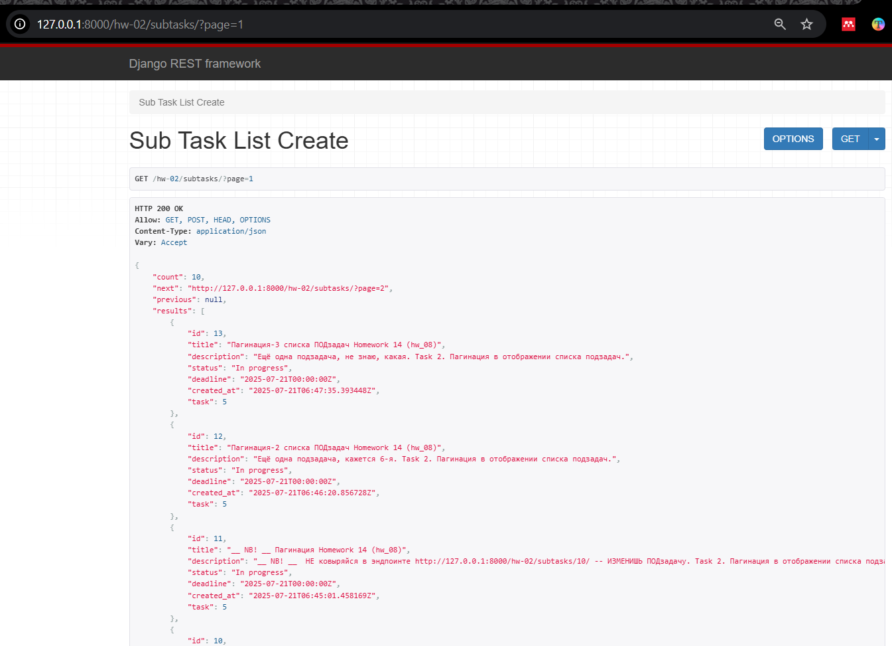  

<m id="img1" style="margin: 40px; color:#606060;">Fig. -------. Вид страницы со списком подзадач по эндпоинту http://127.0.0.1:8000/hw-02/subtasks/?page=1.</m>

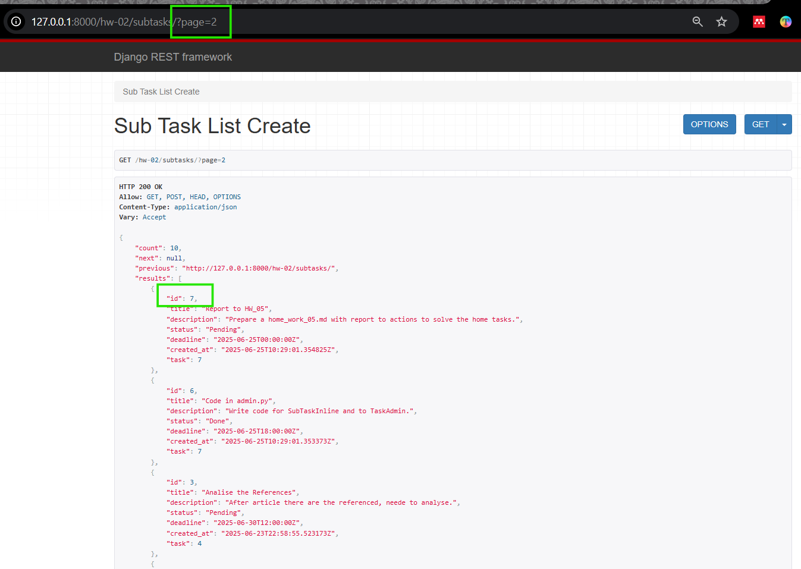  

<m id="img2" style="margin: 40px; color:#606060;">Fig. -------. Вид страницы со списком подзадач по эндпоинту http://127.0.0.1:8000/hw-02/subtasks/?page=2.</m>

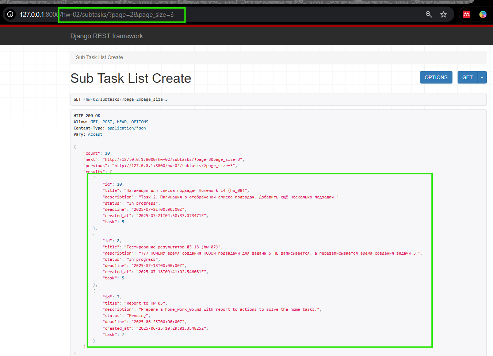  

<m id="img2" style="margin: 40px; color:#606060;">Fig. -------. Вид страницы по эндпоинту http://127.0.0.1:8000/hw-02/subtasks/?page=2&page_size=3.</m>

<div style="font: bold normal 110% sans-serif; color: #8A2BE2; white-space: pre; border-top: 2px dotted #008000; padding: 5px;"></div>  


## <m id="s3" style="color: #008000">3. Эндпоинт на получение списка всех подзадач по названию главной задачи и статусу подзадач</m>  
Смотри решение тут [ChatGPT](https://chatgpt.com/s/t_687ea949946081919729f2849f18e18f).  
Это задание учит не только фильтрации, но и тому, как правильно обрабатывать query-параметры. 
Следует учесть:
- фильтрации по названию задачи (task_title),
- фильтрации по статусу подзадачи (status),
- пагинации.

### <m id="s3.1" style="color: #008000">3.1. Расширение кода для представления</m> `SubTaskListCreateView`  
В файле <a>hw_02_task_manager / serializers.py</a> скорректировать код для сериализаторов:  
- `SubTaskSerializer` - вывести только необходимые поля.
- `SubTaskCreateSerializer` - вывести все поля для детальной информации по конкретной подзадаче.

В файле <a>hw_02_task_manager / views.py</a> дополнить код для представления `SubTaskListCreateView`, 
добавив фильтрацию по названию задачи и статусу подзадачи.

В файле <a>hw_02_task_manager / urls.py</a> проверить наличие маршрута для получения и создания подзадачи:
```python
  urlpatterns = [
      path('subtasks/', SubTaskListCreateView.as_view(), name='subtask-list-create'),
  ]
```


### <m id="s3.2" style="color: #008000">3.2. Результаты выполнения задания 3</m>  

<b id="s3.1" style="color: #008000">⋘ 1 ⋙ </b> Перейти по ссылке http://127.0.0.1:8000/hw-02/subtasks/.
На странице выведется список из 5 последних подзадач в соответствии с заданием о пагинации. 
В списке содержание подзадач будет представлено в краткой форме.

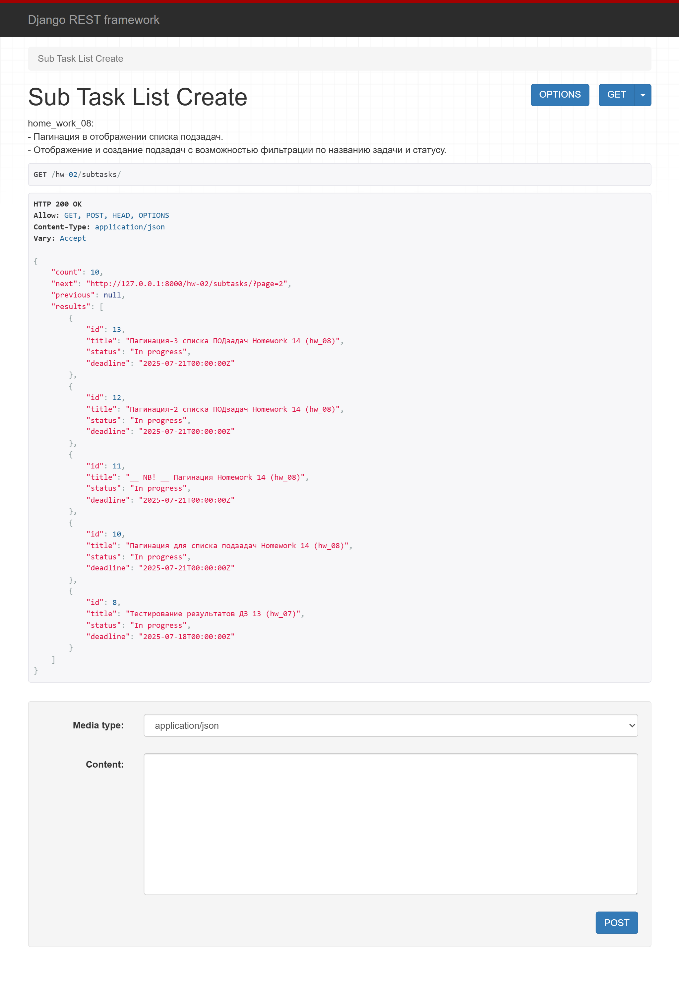  

<m id="img3.1" style="margin: 40px; color:#606060;">Fig. 3.1. Список из 5 последних подзадач.</m> 

---

<b id="s3.2" style="color: #008000">⋘ 2 ⋙ </b> Перейти по ссылке http://127.0.0.1:8000/hw-02/subtasks/?task_title=Homework.
На странице выведется результат запроса о выведении подзадач, относящихся к задаче, 
в названии которой есть слово "Homework". В результате выполнения запроса выведется список, в котором
содержание подзадач будет представлено в краткой форме.  

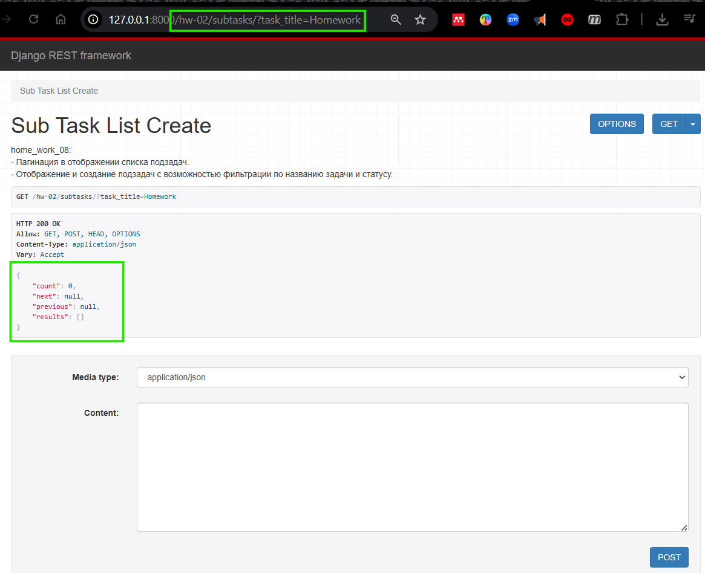  

<m id="img3.2" style="margin: 40px; color:#606060;">Fig. 3.2. ПУСТОЙ список из подзадач, относящихся к задаче, 
в названии которой есть слово "Homework".</m> 

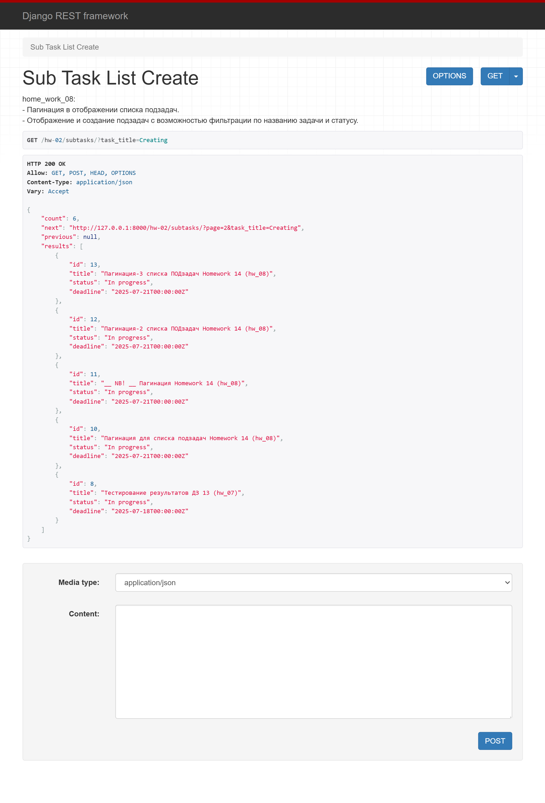  

<m id="img3.3" style="margin: 40px; color:#606060;">Fig. 3.3. Список из подзадач, относящихся к задаче, 
в названии которой есть слово "Creating".</m> 

---

<b id="s3.3" style="color: #008000">⋘ 3 ⋙ </b> Перейти по ссылке http://127.0.0.1:8000/hw-02/subtasks/?status=done.
На странице выведется результат запроса о выведении подзадач, относящихся к задаче, 
статус которой "done". В результате выполнения запроса выведется список, в котором
содержание подзадач будет представлено в краткой форме.  

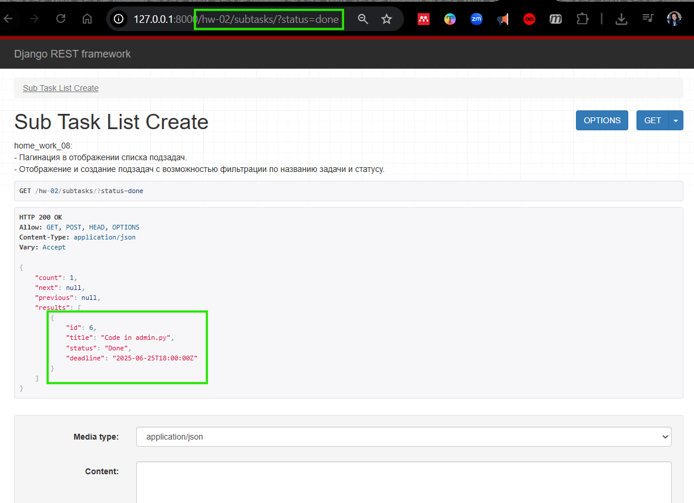  

<m id="img3.4" style="margin: 40px; color:#606060;">Fig. 3.4. Список из подзадач, относящихся к задаче, 
статус которой "done".</m> 

---

<b id="s3.4" style="color: #008000">⋘ 4 ⋙ </b> Перейти по ссылке http://127.0.0.1:8000/hw-02/subtasks/?task_title=Project&status=pending.
На странице выведется результат запроса с одновременной фильтрацией по названию задачи и по статусу подзадачи. 
В результате выполнения запроса выведется список, в котором содержание подзадач будет представлено 
в краткой форме.  

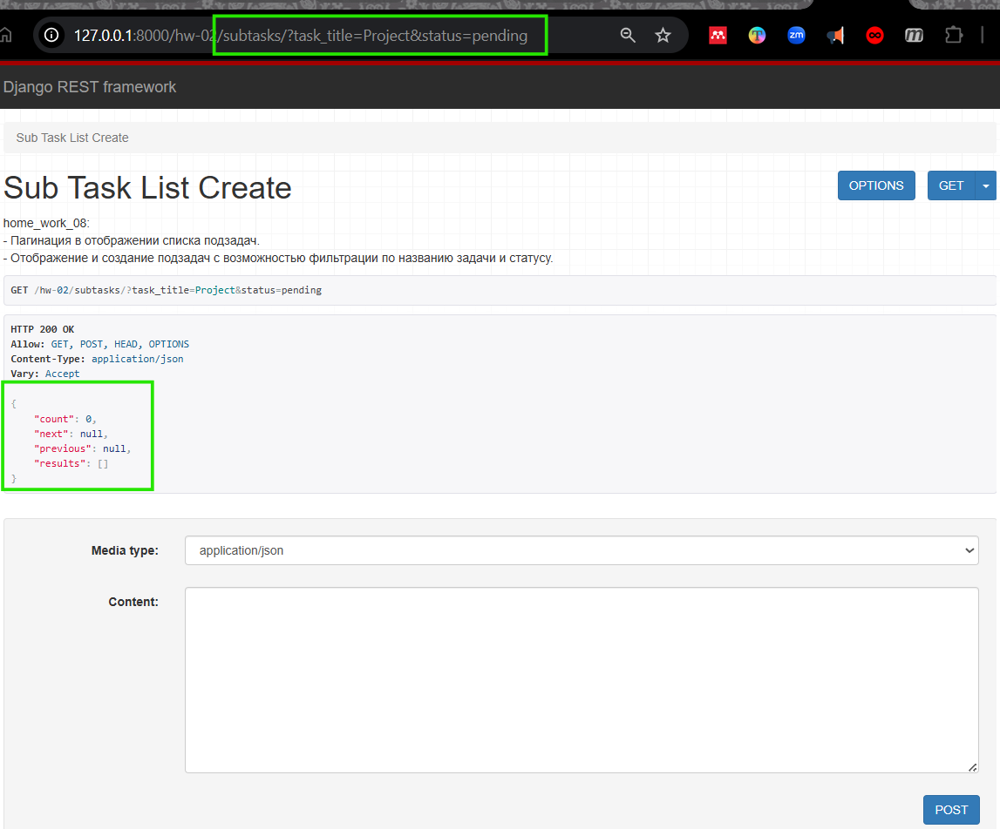<br/>  

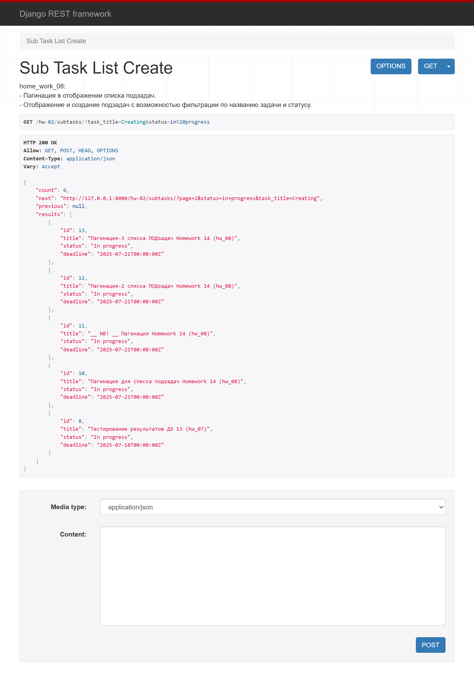  

<m id="img3.5" style="margin: 40px; color:#606060;">Fig. 3.5. Список из подзадач с одновременной фильтрацией 
по названию задачи и по статусу подзадачи.</m>


<div style="font: bold normal 110% sans-serif; color: #8A2BE2; white-space: pre; border-top: 2px dotted #008000; padding: 5px;"></div>  

## <m id="s5" style="color: #008000">5. GitHub</m>
- Запуште проект в Git-репозиторий и прикрепите как решение ссылку на него.

Ссылка на отчет по ДЗ <a>home_work_08.md</a> со скриншотами: .  

Ссылка на приложение по ДЗ <a>hw_02_task_manager</a>: https://github.com/odnabu/Django-Python-Advanced/tree/main/hw_02_task_manager.  

Ссылка на весь проект <a>DjangoProject</a>: https://github.com/odnabu/Django-Python-Advanced/tree/main.  


<div style="font: bold normal 110% sans-serif; color: #8A2BE2; white-space: pre; border-top: 2px dotted #8A2BE2; padding: 5px; margin: 40px 0 40px 0"></div>

[//]: # ([<font color="#696969">[1 - ▶  Video 22, 48:00]</font>]&#40;#v1&#41;)
[//]: # ([<font style="color: #606060;">[2, слайд 32]</font>]&#40;#p1&#41;)

[//]: # (<div style="margin: 40px 0 40px 0"></div>)

[//]: # (<m style="color: #8A2BE2; margin: 20px 40px; padding: 5px; background: #000000;">▣ ⚜️ ☑️ ✔️ 🟪 ■ ※ ⁂ ⁙ ⁘ ⨠  ■ ◲◳ ◆ ◇ ◈ ◀ ▶ ◁ ▷ ▹ ▼ ▲ ▽ △ ▢ ₪₪₪</m>   )  

[//]: # (<div style="font: small-caps 120% sans-serif; color: #8A2BE2; margin: 0 0 0 0px; padding: 0 15px 0 0;">▣ &nbsp;&nbsp; Выполните запросы:</div>  )
[//]: # (🔷🔹 🟩 ❇️♾️⚜️✳️❎✅☑️✔️🟪🔳🔲  )
[//]: # (■ ⁜ ※ ⁂ ⁙ ⁘ ⫷ ⫸ ⩕ ⨠ ⨝ ⋘ ⋙ ∵ ∴ ∶ ∷ ■ ◪ ◩ ◲ ◳ ◆ ◇ ◈ ▼ ▽ ◀ ▶ ◁ ▷ ▹ ▲ △ ▢ ₪₪₪  )


[//]: # (<div style="color: #F00000; margin: 40px 20px 20px 0;">)

[//]: # (<m style="border: 2px solid #6B0000; padding: 10px;"> NB ! </m>)

[//]: # (</div>)


[//]: # (&nbsp;&nbsp; spaces)
[//]: # (<div style="font: small-caps 120% sans-serif; color: #8A2BE2; padding: 0 15px 0 0;">▣ &nbsp;&nbsp; Выполните запросы:</div>  )

[//]: # (<div style="font: bold normal 110% sans-serif; color: #8A2BE2; white-space: pre; border-top: 2px dotted #008000; padding: 5px;"></div>)


[//]: # (== RegEx в PyCharm ==)

[//]: # (Как найти все тексты между тегами <a>...</a> в PyCharm)

[//]: # (1️⃣ Открой нужный файл в PyCharm.)

[//]: # (2️⃣ Нажми Ctrl + F — откроется строка поиска.)

[//]: # (3️⃣ Нажми на .∗ значок ".*", чтобы включить режим RegEx &#40;регулярных выражений&#41;.)

[//]: # (4️⃣ Введи такой шаблон:)

[//]: # (<a>&#40;.*?&#41;</a>)

[//]: # (📌 Что означает шаблон:)

[//]: # (- <a> и </a> — буквально ищем открывающий и закрывающий теги.)

[//]: # (- &#40;.*?&#41; — захватывает любой текст между ними, включая кириллицу, пробелы и спецсимволы.)

[//]: # (- ? — делает захват нежадным, чтобы не схватывало всё сразу до последнего </a>.)

[//]: # (✨ Хочешь выделить или заменить текст?)

[//]: # (Если ты нажмёшь Ctrl + Shift + R — откроется Поиск и замена по шаблону.)

[//]: # (Можно заменить на, например:)

[//]: # ([ссылка: \1])

[//]: # ( \1 — это то, что попало в скобки &#40;.*?&#41;.)

