Python Advanced - Django  
25.07.2025

## <div style="color: #9000F0">Домашнее задание 16 (10 in Django): <br> Проект "Менеджер задач" — Реализация CRUD для категорий с использованием ModelViewSet, мягкое удаление</div>    
Реализовать полный <b style="color: lime;">CRUD</b> для модели категорий <m style="color: #f08000">Category</m> 
с помощью `ModelViewSet`.  
Добавить кастомный метод для подсчета количества задач в каждой категории.  
Реализовать систему мягкого удаления для категорий.

###  Задание 1.  Реализация CRUD для категорий с использованием ModelViewSet  
Шаги для выполнения:
1. Создайте `CategoryViewSet`, используя `ModelViewSet` для CRUD операций. [<font color="#696969">[3 - p. 27, s. 17]</font>](#p1)
2. Добавьте маршрут для `CategoryViewSet`. [<font color="#696969">[3 - p. 27, s. 18]</font>](#p1)
3. Добавьте кастомный метод `count_tasks` используя декоратор `@action` для подсчета количества задач, 
связанных с каждой категорией. [<font color="#696969">[3 - p. 27, s. 38]</font>](#p1)  

###  Задание 2.  Реализация мягкого удаления категорий  
Шаги для выполнения:
1. Добавьте два новых поля в вашу модель <m style="color: #f08000">Category</m>, если таких ещё не было.
   - В модели Category добавьте поля `is_deleted(Boolean, default=False)` и 
   `deleted_at(DateTime, null=true)`.
   - Переопределите метод удаления, чтобы он обновлял новые поля к соответствующим значениям: 
   `is_deleted=True` и дата и время на момент удаления записи.
2. Переопределите менеджера модели Category.
   - В менеджере модели переопределите метод `get_queryset()`, чтобы он по умолчанию выдавал только те записи, 
   которые не удалены из базы.

###  Оформление ответа:
1. Предоставьте решение: 
   - Прикрепите ссылку на GIT.
2. Скриншоты тестирования: 
   - Приложите скриншоты из браузера или Postman, подтверждающие успешное:
     - создание, 
     - обновление, 
     - получение, 
     - удаление данных через API.

<div style="font: bold normal 110% sans-serif; color: #8A2BE2; white-space: pre; border-top: 2px dotted #008000; padding: 5px;"></div>  


### <m style="color: #008000">Источники</m>  
<m style="color: #606060">Видео - уроки от *\_.07.2025*</m>  [<font color="#696969">[1 - ▶  Video \_, \_:\_:\_]</font>](#v1).  
[1] ▶ Video \_ "\_" (\_:\_:\_), *\_.07.2025*: <m id="v1"></m>.  
[2] ▶ Video \_ "" (\_:\_:\_), *\_.07.2025*: <m id="v2">\_</m>.  
[3] Presentation 27 _"Основы работы с Django REST Framework. Часть 4"_.  <a id="p1">Les29-Django_27-REST-17_07.pdf</a>. 
<m style="color: #606060">——▷  ViewSets, Router, кастомные методы для ViewSet, RegEx для параметров URL.</m>   
[4] Conspectus 27 <a id="c1">Les29-Django_27---REST-17_07.pdf</a>.  
[5] Presentation 28 _"Основы работы с Django REST Framework. Часть 4"_ <a id="p2">Les29-Django_28-REST_p4-17_07.pdf</a>. 
<m style="color: #606060">——▷  Мягкое удаление (Soft Deletion), Ленивая загрузка в Django ORM, Транзакции.</m>  
[6] Conspectus 28 <a id="c2">Les29-Django_28---REST_p4-17_07.pdf</a>.  
[7] Приложение **home_work_09**: файл <m id="hw7">home_work_09.md</m>.  
[8] Руководство по оформлению Markdown файлов: https://gist.github.com/Jekins/2bf2d0638163f1294637.  
[9] Шпаргалка по Markdown: https://gist.github.com/fomvasss/8dd8cd7f88c67a4e3727f9d39224a84c.


<div style="font: bold normal 110% sans-serif; color: #8A2BE2; white-space: pre; border: 2px outset #8A2BE2; margin: 60px 0 40px 0; padding: 5px 0 5px 25px;">ОТЧЕТ</div>


### <m style="color: #008000">Миграции</m>  

<div style="margin: 40px 20px 20px 0;">
<m style="color: #F00000; border: 2px solid #6B0000; padding: 10px;"> NB ! </m> 
<b style="color: #F00000; border: 1px solid black; padding: 5px;">!!! ВСЕГДА</b> после изменения в моделях (НЕ в сериализаторе) выполнять и применят миграции.
</div>  

Запускать команды `python manage.py shell`, `migrate`, `runserver` — находясь в корне проекта, рядом с <a>manage.py</a>
  (см. [<font color="#696969">[8 - hw_10]</font>](#hw6)).

После изменений в МОДЕЛЯХ сделать и применить миграции [<font color="#696969">[1 - ▶  Video 20, 57:60]</font>](#v1):  
```bash
    python manage.py makemigrations hw_02_task_manager
    python manage.py migrate hw_02_task_manager
```
Запустить локальный сервер Django с помощью <a>manage.py</a> в терминале [<font color="#696969">[1 - ▶  Video 20, 57:60]</font>](#v1):  
```bash
   python manage.py runserver
```

---


## <m id="s1" style="color: #008000">1. Реализация CRUD для категорий с использованием ModelViewSet</m>  

<div style="margin: 20px 20px 20px 0;">
<b style="color: #F00000; border: 2px solid #6B0000; display: inline-block; padding: 10px; margin: 0 10px 0 0;"> NB ! </b> ВАЖНЫЕ ДЕТАЛИ:
<p style="margin: 0 0 0 65px;"><b style="color: red">1.</b> Смотри Video от <m style="color: red">27.07.2025</m>
с решением этой задачи для файла <a>les_18_shop/ views.py</a> в части с заданием:
<br> <m style="color: #606060"># 27.07.2025 - Pr 8: Задание 1: Представления и маршруты для модели Category</m>.

<p style="margin: 0 0 0 65px;"><b style="color: red">2.</b> Так как на лекции 23.07.2025 и практике 9 от 24.07.2025 
добавлены Аутентификация и Авторизация, для успешного окончания этой ДЗ необходимо выполнить такие действия:
<p style="margin: 0 0 0 80px;"><b style="color: red">ИЛИ </b> ОТКЛЮЧИТЬ АУТЕНТИФИКАЦИЮ в 
<m style="color: limegreen">config /</m> <a>settings.py</a> и в <m style="color: limegreen">config /</m> <a>urls.py</a>.
<p style="margin: 0 0 0 80px;"><b style="color: red">ИЛИ --> НЕ подходит, пока не пропишешь настройки в ПРЕДСТАВЛЕНИЯ!!!</b> 
в config-настройках <a>settings.py</a> в блоке REST_FRAMEWORK включить настройку БАЗОВОЙ АУТЕНТИФИКАЦИИ:
</div>

```python
'DEFAULT_AUTHENTICATION_CLASSES': [
    'rest_framework.authentication.BasicAuthentication',
]
```
Смотри решение для этой задачи здесь [ChatGPT](https://chatgpt.com/s/t_688629d3a2508191be637d7a499e3746).

---

### <m id="ss1.1" style="color: #008000">1.1. Сериалайзеры</m>  
Имеющийся `CategoryCreateSerializer` можно использовать для создания и обновления.  
Но для `ModelViewSet` лучше явно сделать сериалайзр для чтения, если нужно контролировать вывод 
(например, добавить количество задач).  
В <m style="color: #f08000">CategorySerializer</m> можно объединить Create и Read - так и сделаю.  
Поскольку ссылка на модель <m style="color: #f08000">Tasks</m> используется для подсчета кол-ва задач, 
то стоит проверить импорт этой модели в файле <a>views.py</a>.  
Ну и далее добавить код и документацию к сериалайзер <m style="color: #f08000">CategorySerializer</m> в <a>serializers.py</a>.

### <m id="ss1.2" style="color: #008000">1.2. ViewSet</m>  
Сперва добавить импорты:  
```python
#    Импорты библиотек и методов:
from rest_framework import viewsets, status
from rest_framework.decorators import action
# from rest_framework.response import Response      # Уже есть в файле с Представлениями.
#    Импорты из фалов приложения:
from hw_02_task_manager.models import Category
from hw_02_task_manager.serializers import CategorySerializer
```
После добавить код и документацию к Представлению <m style="color: #f08000">CategorySerializer</m>.

### <m id="ss1.3" style="color: #008000">1.3. Роутер</m>  
Смотри так же Практику 8 от _27.07.2025_ и реализацию в коде <a>les_18_shop / urls.py</a> для задачи: 
<m style="color: #696969"># 27.07.2025: Задание 1: Представления и маршруты для модели Category</m>.  
Еще лучше смотреть здесь: [app "library" from V. Bandylo on GitHub](https://github.com/viacheslav-bandylo/111124-projects/tree/main/library).  
Добавить код и документацию к Представлению.

---

### <m id="ss1.4" style="color: #008000">1.4. Результаты выполнения задания 1 в браузере</m>  

<div style="font: small-caps 120% sans-serif; color: #008000; padding: 0 15px 0 0;">▣ &nbsp;&nbsp; Результат:</div>  

- <m style="color: limegreen">GET</m> <a>/categories/</a> — список (исключая мягко удалённые).  
- <m style="color: limegreen">GET</m> <a>/categories/3/</a> — количество задач в конкретной категории.  
- Тестировать можно как через <m style="color: orange">Swagger</m>, так и через <m style="color: orange">Postman</m>.  

##### <b style="color: #008000; margin: 0 20px 0 0;">⋘ 1 ⋙ </b> Получение списка категорий
Зайти на домашнюю страницу и проверить вывод списка категорий: http://127.0.0.1:8000/hw-02/categories/.

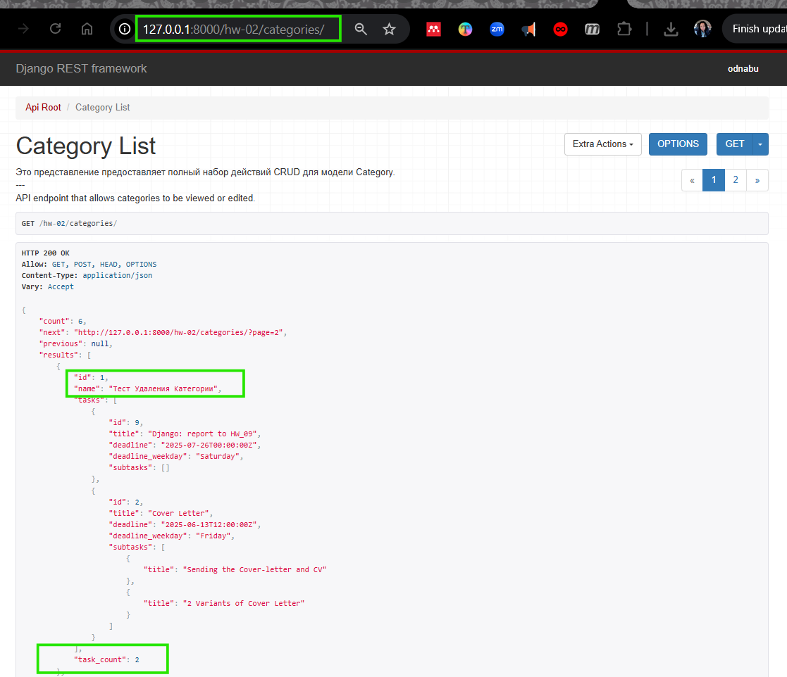<br>  

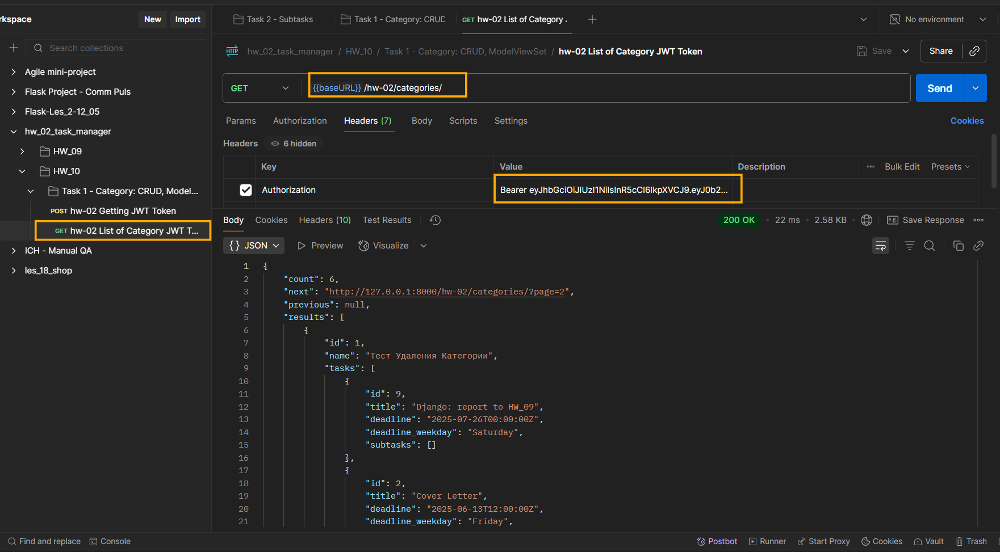<br>  

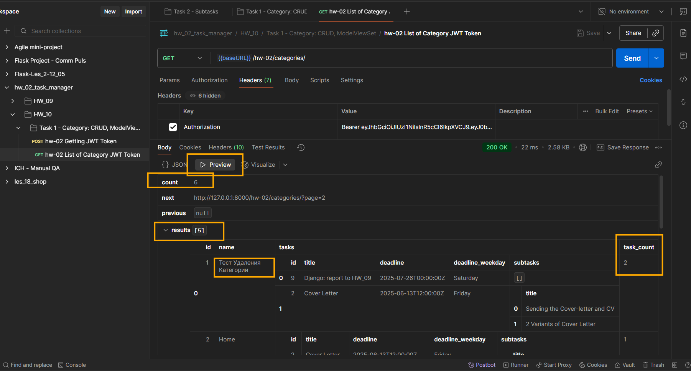  

<m id="img1.4.1" style="margin: 40px; color:#606060;">Fig. 1.4.1. Список из 5-ти категорий на странице,
отсортированный по умолчанию по ID категории с количеством задач в категории.</m>

---

##### <b style="color: #008000; margin: 0 20px 0 0;">⋘ 2 ⋙ </b> Статистика по категориям и задачам

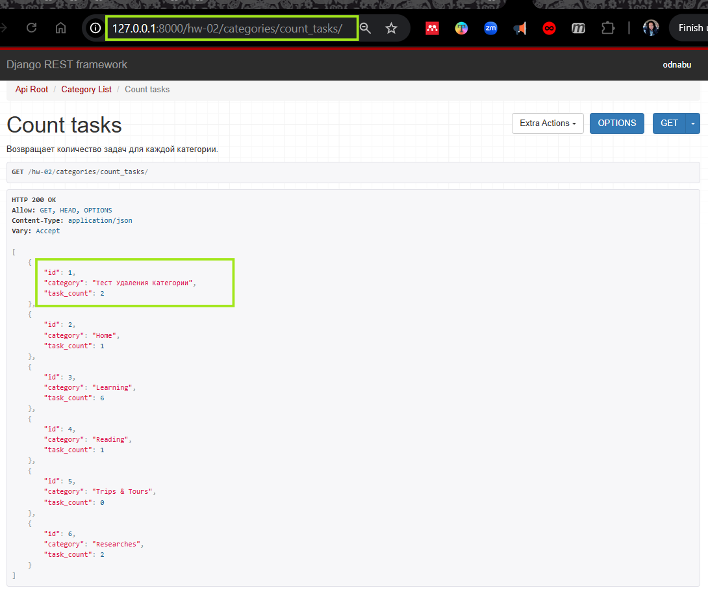<br>  

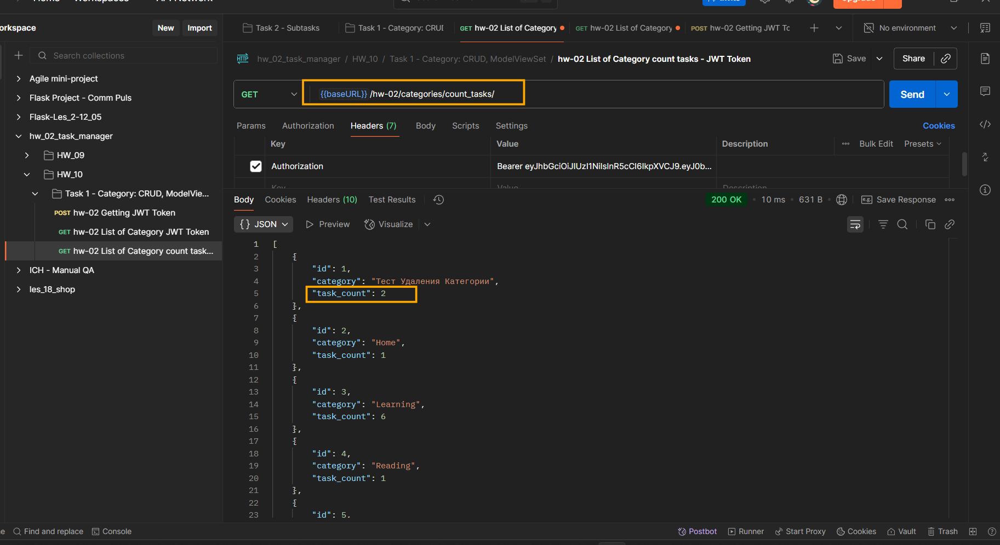<br>  


<m id="img1.2" style="margin: 40px; color:#606060;">Fig. 1.2. Страница с подсчетом задач для всех категорий по
эндпоинту: http://127.0.0.1:8000/hw-02/categories/count_tasks/.</m>

---

##### <b id="s1.5.3" style="color: #008000; margin: 0 20px 0 0;">⋘ 3 ⋙ </b> Детальная информация о категории  

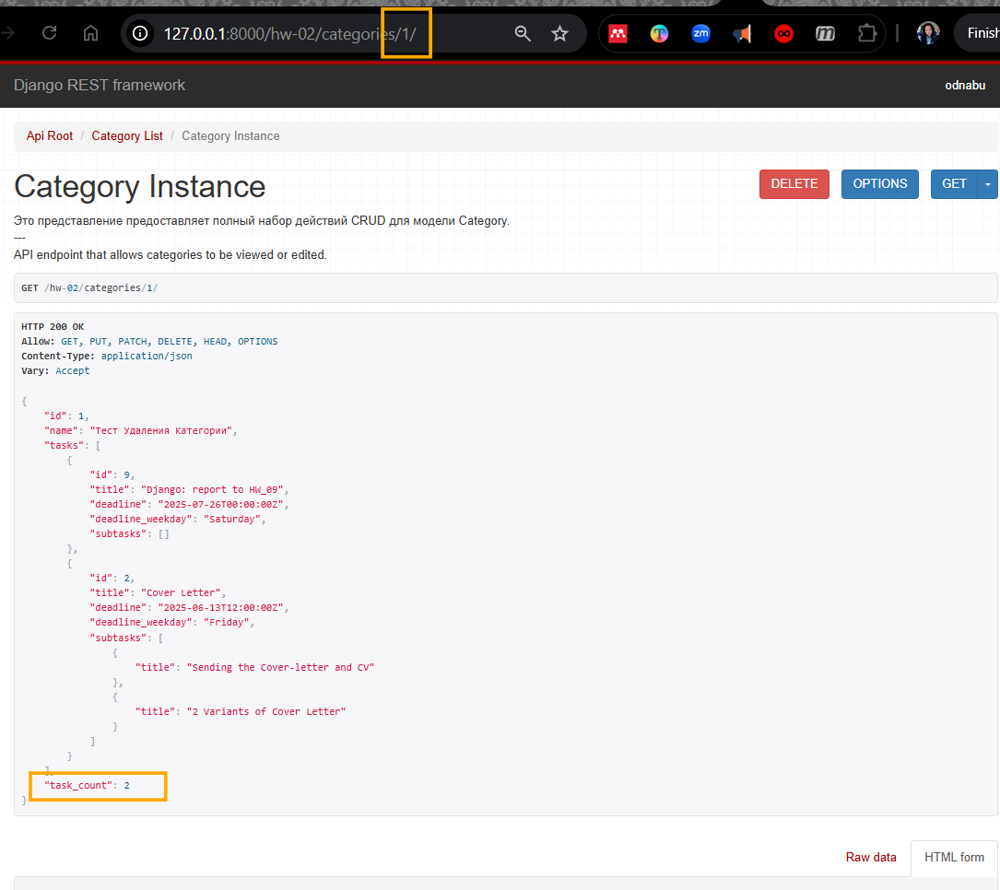<br>  

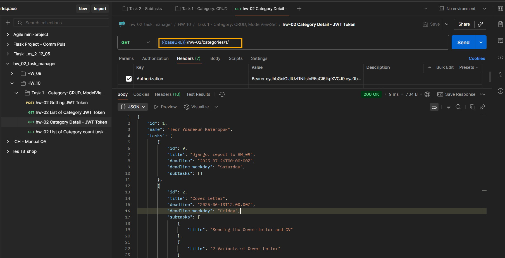<br>  

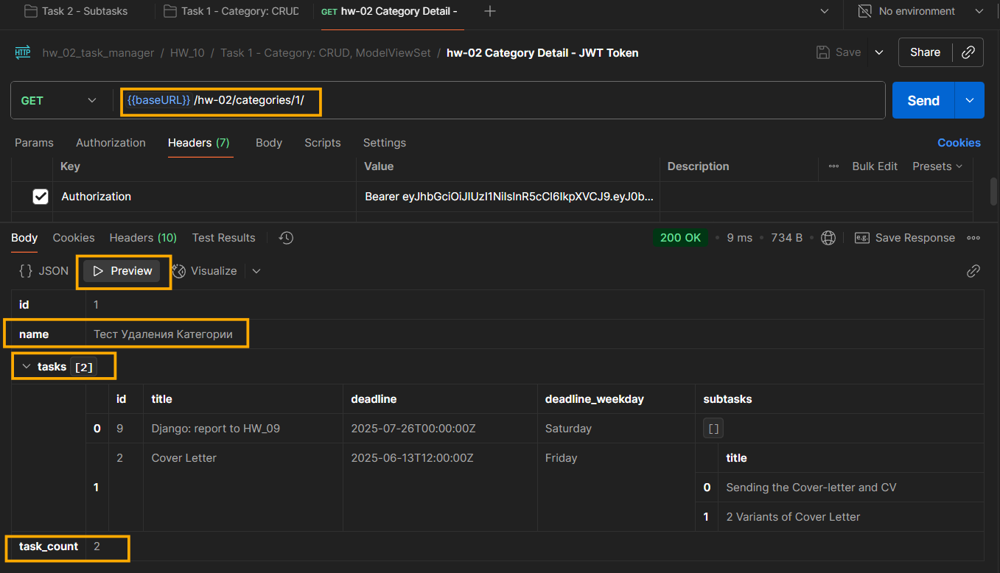

<m id="img1.2" style="margin: 40px; color:#606060;">Fig. 1.2. Страница с детальной информацией о категории по 
эндпоинту: http://127.0.0.1:8000/hw-02/categories/1/.</m>

<div style="font: bold normal 110% sans-serif; color: #8A2BE2; white-space: pre; border-top: 2px dotted #008000; padding: 5px;"></div>  


## <m id="s2" style="color: #008000">2. Реализация мягкого удаления категорий</m>  
Смотри решение для этой задачи все там же [ChatGPT](https://chatgpt.com/s/t_688629d3a2508191be637d7a499e3746).  

<div style="font: small-caps 120% sans-serif; color: #8A2BE2; padding: 0 15px 0 0;">▣ &nbsp;&nbsp; Мягкое удаление</div>

Мягкое удаление (___soft delete___) - подход, при котором записи не удаляются физически из базы данных, а 
помечаются как удаленные (см. [<font color="#696969">[5 - p. 28, s. 7]</font>](#p2)).  
Так же наглядно и по шагам о _мягком удалении_ см. [ChatGPT](https://chatgpt.com/s/t_6887adfb67c8819184bbbc26339c0122).

<div style="font: small-caps 120% sans-serif; color: #8A2BE2; padding: 0 15px 0 0;">▣ &nbsp;&nbsp; Менеджер модели</div> 

Это класс, который управляет запросами к модели. Менеджеры предоставляют интерфейс для взаимодействия с 
базой данных (см. [<font color="#696969">[5 - p. 28, s. 12]</font>](#p2)).


### <m id="s2.1" style="color: #008000">2.1. Два новых поля в модели </m> `Category`  
В файл <a>hw_02_task_manager / models.py</a> добавить поля для модели <m style="color: #f08000">Category</m>:
```python
    is_deleted = models.BooleanField(default=False)               # Поле для мягкого удаления.
    deleted_at = models.DateTimeField(null=True, blank=True)      # Дата удаления.
```
Для переопределения метода удаления добавить код с комментариями из примера [app "library" from V. Bandylo on GitHub](https://github.com/viacheslav-bandylo/111124-projects/tree/main/library).  

---

### <m id="s2.2" style="color: #008000">2.2. Переопределение менеджера модели Category</m>  
Для переопределения менеджера модели <m style="color: #f08000">Category</m> добавить код с комментариями 
для <a>managers.py</a> из примера [app "library" from V. Bandylo on GitHub](https://github.com/viacheslav-bandylo/111124-projects/tree/main/library).  

---

### <m id="s2.3" style="color: #008000">2.3. Как по шагам проверить работу мягкого удаления в браузере</m>  

##### <b style="color: #008000; margin: 0 20px 0 0;">⋘ 1 ⋙ </b> Создать категорию через Swagger или Postman
Эндпоинт (POST):
```
POST http://127.0.0.1:8000/hw-02/categories/
```

Пример тела запроса:
```json
{
  "name": "Studying"
}
```

##### <b style="color: #008000; margin: 0 20px 0 0;">⋘ 2 ⋙ </b> Убедиться, что категория появилась
Эндпоинт:
```
GET http://127.0.0.1:8000/hw-02/categories/
```

##### <b style="color: #008000; margin: 0 20px 0 0;">⋘ 3 ⋙ </b> Удалить категорию
Эндпоинт:
```
DELETE http://127.0.0.1:8000/hw-02/categories/<id>/
```
Например:
```
DELETE http://127.0.0.1:8000/hw-02/categories/3/
```
После нажатия на кнопку __"Delete"__:
- `is_deleted = True`
- `deleted_at = now()`
- но категория **в базе остаётся**.

##### <b style="color: #008000; margin: 0 20px 0 0;">⋘ 4 ⋙ </b> Проверить, что категория НЕ отображается
Снова перейти по ендпоинту, чтобы выполнился запрос на получение списка категорий:
```
GET http://127.0.0.1:8000/hw-02/categories/
```
Эта категория больше не будет выводиться в браузере, потому что она скрыта через `CategoryManager`.

---

### <m id="s2.4" style="color: #008000">2.4. Как увидеть удалённые категории</m>  
По умолчанию, `Category.objects.all()` возвращает только **НЕудалённые** категории.
Но можно временно обойти это и посмотреть всё, если нужно отладить.  

#### Способ 1: В Django shell
Запустить `shell` или сразу перейти в консоль:
```bash
python manage.py shell
```
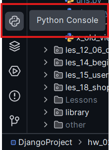

Выполнить скрипт в консоли:
```python
from hw_02_task_manager.models import Category
for i in Category.objects.all():  # Только живые
    print(f"\t\033[33m{i}\033[m")
for d in Category._base_manager.all():  # Все, включая удалённые
    print(f"\t  \033[34m{d}\033[m")
```

#### Способ 2: Добавить отдельный ViewSet с полным queryset
Смотри тут [ChatGPT](https://chatgpt.com/s/t_6887adfb67c8819184bbbc26339c0122).

---

### <m id="s2.5" style="color: #008000">2.5. Как удалить мягко удалённые категории из БД</m>  
См. тут [ChatGPT](https://chatgpt.com/s/t_6887b57a39588191b87db6217a05692a) как удалить "мягко удалённые" 
категории __окончательно__ (то есть физически удалить из БД).

##### <b style="color: #008000; margin: 0 20px 0 0;">⋘ Способ 1 ⋙ </b> Через Django shell
Открыть терминал или консоль в Pycharm, как описано в предыдущем п. 2.4 и выполнить скрипт:
```python
from your_app.models import Category
# Получение ВСЕХ категорий, включая удалённые:
all_categories = Category._base_manager.all()
# Фильтрация только мягко удалённых:
deleted_categories = all_categories.filter(is_deleted=True)
# Удалить их навсегда:
deleted_categories.delete()
```
`Category._base_manager` — это обходной путь, который обходит менеджер `objects`, скрывающий удалённые.


##### <b style="color: #008000; margin: 0 20px 0 0;">⋘ Способ 2 ⋙ </b> Вручную через админку
Зайти в `/admin/`, найти удалённую категорию и нажать **DELETE**.

##### <b style="color: #008000; margin: 0 20px 0 0;">⋘ Способ 3 ⋙ </b> Создать спец-эндпоинт "очистки"
Смотри всё там же в ответе [ChatGPT](https://chatgpt.com/s/t_6887b57a39588191b87db6217a05692a).

---

### <m id="s2.3" style="color: #008000">2.3. Результаты выполнения задания 2</m>  

<div style="font: small-caps 120% sans-serif; color: #008000; padding: 0 15px 0 0;">▣ &nbsp;&nbsp; Результат:</div>  

- <m style="color: limegreen">DELETE</m> <a>/categories/3/</a> — помечает как удалённую.  
- Тестировать можно как через <m style="color: orange">Swagger</m>, так и через <m style="color: orange">Postman</m>.  

##### <b style="color: #008000; margin: 0 20px 0 0;">⋘ 1 ⋙ </b> Создание категории для проверки мягкого удаления

Перейти по эндпоинту: http://127.0.0.1:8000/hw-02/categories/.

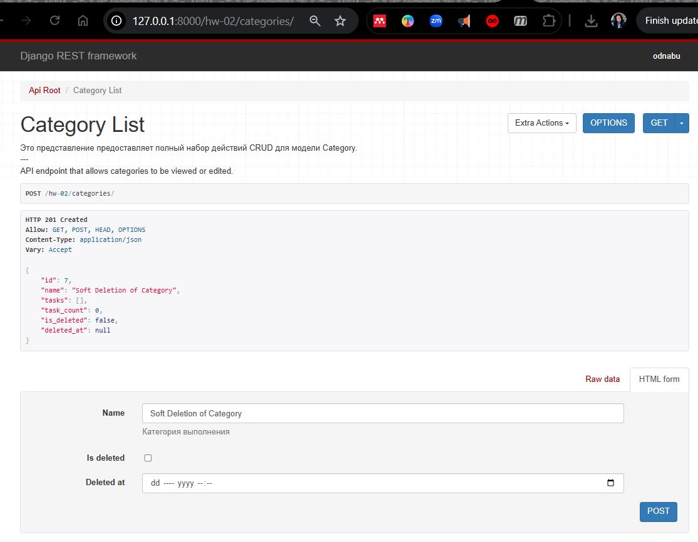<br>

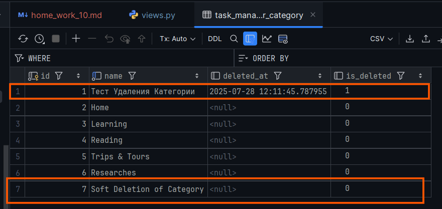

<m id="img1" style="margin: 40px; color:#606060;">Fig. 2.1. Результат создания новой категории 
"Soft Deletion of Category" в браузере и БД по эндпоинту: http://127.0.0.1:8000/hw-02/categories/</m>


##### <b style="color: #008000; margin: 0 20px 0 0;">⋘ 2 ⋙ </b> Удаление категории

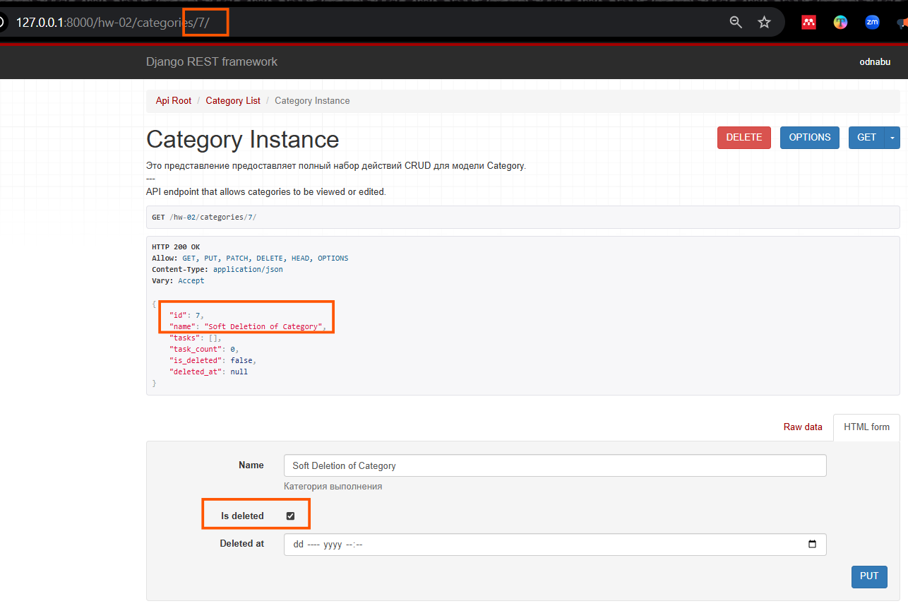  

<m id="img2.2" style="margin: 40px; color:#606060;">Fig. 2.2. Процесс удаления категории "Soft Deletion of Category" 
по ID: http://127.0.0.1:8000/hw-02/categories/7/.</m>

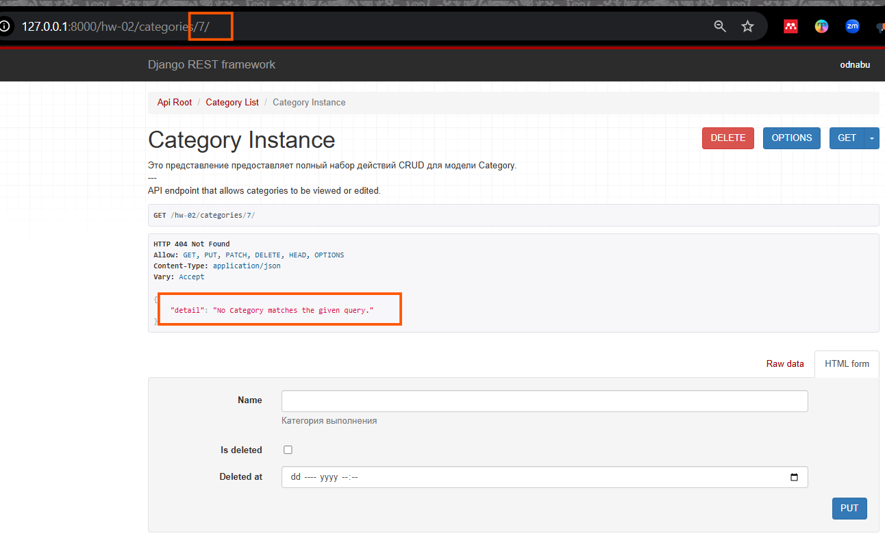<br>  

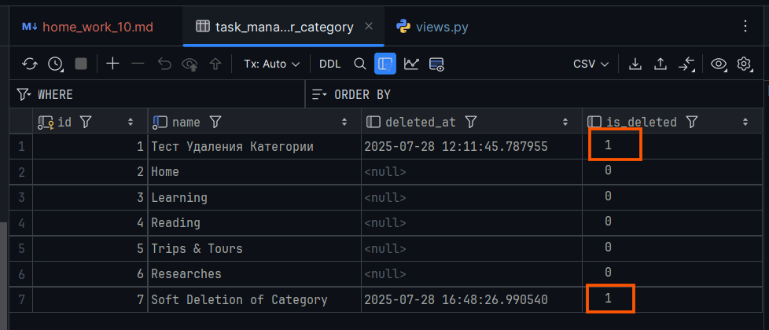<br>  

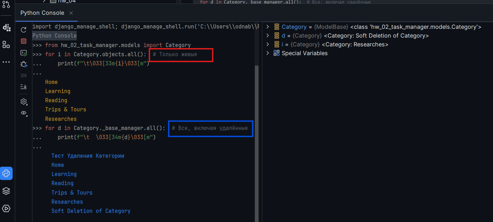

<m id="img2.3" style="margin: 40px; color:#606060;">Fig. 2.3. Проверка результата мягкого удаления категории в браузере и в БД.</m>

<div style="font: bold normal 110% sans-serif; color: #8A2BE2; white-space: pre; border-top: 2px dotted #008000; padding: 5px;"></div>  


## <m id="s4" style="color: #008000">4. GitHub</m>
- Запуште проект в Git-репозиторий и прикрепите как решение ссылку на него.

Ссылка на отчет по ДЗ <a>home_work_09.md</a> со скриншотами: https://github.com/odnabu/Django-Python-Advanced/blob/main/hw_02_task_manager/home_work_10.md.  

Ссылка на приложение по ДЗ <a>hw_02_task_manager</a>: https://github.com/odnabu/Django-Python-Advanced/tree/main/hw_02_task_manager.  

Ссылка на весь проект <a>DjangoProject</a>: https://github.com/odnabu/Django-Python-Advanced/tree/main.  


<div style="font: bold normal 110% sans-serif; color: #8A2BE2; white-space: pre; border-top: 2px dotted #8A2BE2; padding: 5px; margin: 40px 0 40px 0"></div>

[//]: # ([<font color="#696969">[1 - ▶  Video 22, 48:00]</font>]&#40;#v1&#41;)
[//]: # ([<font style="color: #606060;">[2, слайд 32]</font>]&#40;#p1&#41;)

[//]: # (<div style="margin: 40px 0 40px 0"></div>)

[//]: # (<m style="color: #8A2BE2; margin: 20px 40px; padding: 5px; background: #000000;">▣ ⚜️ ☑️ ✔️ 🟪 ■ ※ ⁂ ⁙ ⁘ ⨠  ■ ◲◳ ◆ ◇ ◈ ◀ ▶ ◁ ▷ ▹ ▼ ▲ ▽ △ ▢ ₪₪₪</m>   )  

[//]: # (<div style="font: small-caps 120% sans-serif; color: #8A2BE2; margin: 0 0 0 0px; padding: 0 15px 0 0;">▣ &nbsp;&nbsp; Выполните запросы:</div>  )
[//]: # (🔷🔹 🟩 ❇️♾️⚜️✳️❎✅☑️✔️🟪🔳🔲  )
[//]: # (■ ⁜ ※ ⁂ ⁙ ⁘ ⫷ ⫸ ⩕ ⨠ ⨝ ⋘ ⋙ ∵ ∴ ∶ ∷ ■ ◪ ◩ ◲ ◳ ◆ ◇ ◈ ▼ ▽ ◀ ▶ ◁ ▷ ▹ ▲ △ ▢ ₪₪₪  )


[//]: # (<div style="color: #F00000; margin: 40px 20px 20px 0;">)

[//]: # (<m style="border: 2px solid #6B0000; padding: 10px;"> NB ! </m>)

[//]: # (</div>)


[//]: # (&nbsp;&nbsp; spaces)
[//]: # (<div style="font: small-caps 120% sans-serif; color: #8A2BE2; padding: 0 15px 0 0;">▣ &nbsp;&nbsp; Выполните запросы:</div>  )

[//]: # (<div style="font: bold normal 110% sans-serif; color: #8A2BE2; white-space: pre; border-top: 2px dotted #008000; padding: 5px;"></div>)


[//]: # (== RegEx в PyCharm ==)

[//]: # (Как найти все тексты между тегами <a>...</a> в PyCharm)

[//]: # (1️⃣ Открой нужный файл в PyCharm.)

[//]: # (2️⃣ Нажми Ctrl + F — откроется строка поиска.)

[//]: # (3️⃣ Нажми на .∗ значок ".*", чтобы включить режим RegEx &#40;регулярных выражений&#41;.)

[//]: # (4️⃣ Введи такой шаблон:)

[//]: # (<a>&#40;.*?&#41;</a>)

[//]: # (📌 Что означает шаблон:)

[//]: # (- <a> и </a> — буквально ищем открывающий и закрывающий теги.)

[//]: # (- &#40;.*?&#41; — захватывает любой текст между ними, включая кириллицу, пробелы и спецсимволы.)

[//]: # (- ? — делает захват нежадным, чтобы не схватывало всё сразу до последнего </a>.)

[//]: # (✨ Хочешь выделить или заменить текст?)

[//]: # (Если ты нажмёшь Ctrl + Shift + R — откроется Поиск и замена по шаблону.)

[//]: # (Можно заменить на, например:)

[//]: # ([ссылка: \1])

[//]: # ( \1 — это то, что попало в скобки &#40;.*?&#41;.)


