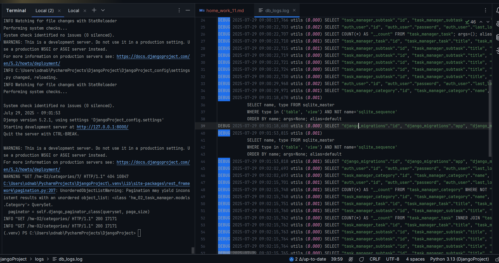
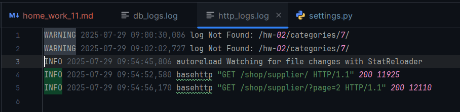

Python Advanced - Django  
28.07.2025

## <div style="color: #9000F0">Домашнее задание 17 (11 in Django): <br> Проект "Менеджер задач" — Пагинация и Логирование работы сервера</div>    

###  Задание 1.  Пагинация
Подумать, какой из видов пагинации более безопасный, чтобы не “светить” явно параметры в запросе. 
Выбрав нужный класс пагинации подключить глобальную пагинацию в проект. 
На одной странице должно располагаться не более 6 объектов. [<font color="#696969">[3, p. 26], [4, s. 11]</font>](#p1)

###  Задание 2.  Логирование работы сервера
Подключить систему логирования работы включенного сервера в проект для отслеживания логов работы приложения.  
Логи должны загружаться следующим образом:  
- Отдельно логи работы включенного сервера с выводом в консоль.
- Отдельно логи HTTP запросов и их статусов в отдельную папку logs в корне проекта  в файл http_logs.log.
- Отдельно логи запросов в базу данных в отдельную папку logs в корне проекта в файл db_logs.log

<div style="font: bold normal 110% sans-serif; color: #8A2BE2; white-space: pre; border-top: 2px dotted #008000; padding: 5px;"></div>  


### <m style="color: #008000">Источники</m>  
<m style="color: #606060">Видео - уроки от *21.07.2025*</m>  [<font color="#696969">[1 - ▶  Video \_, \_:\_:\_]</font>](#v1).  
[1] ▶ Video \_ "\_" (\_:\_:\_), *21.07.2025*: <m id="v1"></m>.  
[2] ▶ Video \_ "" (\_:\_:\_), *\_.07.2025*: <m id="v2">\_</m>.  
[3] Presentation PythAdv-29 _"Атрибут pagination_class. Глобальная Пагинация. Логгирование проекта"_.  
<a id="p1">Les31-Python Adv_29-Global_Pagination_Logging-21-07.pdf</a>. 
<m style="color: #606060">——▷  Атрибут pagination_class. Глобальная настройка пагинации. Логирования запросов в базу данных в Django</m>   
[4] Conspectus PythAdv-29 <a id="c1">Les31-Python Adv_29---Global_Pagination_Logging-21-07.pdf</a>.  
[5] Приложение **home_work_10**: файл <m id="hw7">home_work_10.md</m>.  
[6] Руководство по оформлению Markdown файлов: https://gist.github.com/Jekins/2bf2d0638163f1294637.  
[7] Шпаргалка по Markdown: https://gist.github.com/fomvasss/8dd8cd7f88c67a4e3727f9d39224a84c.


<div style="font: bold normal 110% sans-serif; color: #8A2BE2; white-space: pre; border: 2px outset #8A2BE2; margin: 60px 0 40px 0; padding: 5px 0 5px 25px;">ОТЧЕТ</div>


### <m style="color: #008000">Миграции</m>  

<div style="margin: 40px 20px 20px 0;">
<m style="color: #F00000; border: 2px solid #6B0000; padding: 10px;"> NB ! </m> 
<b style="color: #F00000; border: 1px solid black; padding: 5px;">!!! ВСЕГДА</b> после изменения в моделях (НЕ в сериализаторе) выполнять и применять миграции.
<p style="margin: 0 0 0 55px;"><b style="color: #F00000; border: 1px solid black; padding: 5px;">ПРИМЕНЯТЬ</b> миграции так же нужно в ситуациях:
<p style="margin: 0 0 0 70px;">1. Склонирован/получен проект с миграциями.
<p style="margin: 0 0 0 70px;">2. Применения уже готовых .py-файлы миграций.
<p style="margin: 0 0 0 70px;">3. На сервере (или в другом окружении).
<p style="margin: 0 0 0 70px;">4. После восстановления базы данных нужно применить все миграции.
<p style="margin: 0 0 0 70px;"><b style="color: #F00000;">5.</b> После изменения настроек БД или установки приложения.
</div>  

Детально, когда нужно выполнять `python manage.py migrate` БЕЗ `makemigrations` см. тут [ChatGPT](https://chatgpt.com/s/t_6887c91d9ad481919a0d65104ad52b99).

Запускать команды `python manage.py shell`, `migrate`, `runserver` — находясь в корне проекта, рядом с <a>manage.py</a>
  (см. [<font color="#696969">[8 - hw_10]</font>](#hw6)).

После изменений в МОДЕЛЯХ сделать и применить миграции [<font color="#696969">[1 - ▶  Video 20, 57:60]</font>](#v1):  
```bash
    python manage.py makemigrations hw_02_task_manager
    python manage.py migrate hw_02_task_manager
```
Запустить локальный сервер Django с помощью <a>manage.py</a> в терминале [<font color="#696969">[1 - ▶  Video 20, 57:60]</font>](#v1):  
```bash
   python manage.py runserver
```

---


## <m id="s1" style="color: #008000">1. Пагинация</m>  

<div style="margin: 20px 20px 20px 0;">
<b style="color: #F00000; border: 2px solid #6B0000; display: inline-block; padding: 10px; margin: 0 10px 0 0;"> NB ! </b> ВАЖНЫЕ ДЕТАЛИ:
<p style="margin: 0 0 0 65px;"><b style="color: red">1.</b> Я хочу <m style="color: red">оставить</m>
свои настройки пагинации (по 5 элементов на страницу в браузере/Postman), которые реализовала еще 
в ДЗ <a>home_work_06.md</a> в пункте <m style="color: #008000">"5.1. Пагинация в Django REST Framework (DRF)"</m>>.

<p style="margin: 0 0 0 65px;"><b style="color: red">2.</b> Так как на консультации 1 от 28.07.2025 пофиксили проблемы с обновлением токена 
для Аутентификации и Авторизации для всего проекта благодаря решению Макса Полякова, то теперь в настройках
<m style="color: limegreen">config /</m> <a>settings.py</a> и в <m style="color: limegreen">config /</m> <a>urls.py</a>
можно ничего не отключать опцию, связанную с Аутентификацией.
</div>


### <m id="ss1.1" style="color: #008000">1.1. Какой из видов пагинации более безопасный</m>  
Ниже отвечаю на вопрос так, как ответил [ChatGPT](https://chatgpt.com/s/t_6887cdd900388191b0f3de147cba1c47). 

Когда речь идёт о **более безопасной пагинации**, чтобы **не "светить" параметры (например, page=1)** 
в URL-запросе, стоит предпочесть **Cursor Pagination (пагинация по курсору)**, которая считается 
наиболее безопасной и эффективной по нескольким причинам:  
1. Не показывает внутренние идентификаторы или номера страниц.  
   Вместо `?page=3` или `?offset=20`, будет параметр вроде `?cursor=cD0yMDI1LTA3LTI3KzIwJTNBMzAlM0EwMC4wMDBa`, 
    который не содержит явной логики и сложно предугадать или подделать.

2. Сложно угадать следующий запрос.  
   Курсор кодируется и представляет собой уникальную ссылку на следующую или предыдущую "порцию" данных, 
   что делает атаки на URL сложнее.

3. Более устойчива при изменении данных.
   Если в базе происходят изменения (новые записи, удаление и т.п.), `CursorPagination` меньше страдает от 
   "скачков" в данных, чем `PageNumberPagination` или `LimitOffsetPagination`.

#### Сравнение с другими типами пагинации в DRF:

| Тип пагинации           | URL-параметры         | Безопасность | Подходит для больших данных? |
| ----------------------- | --------------------- | ------------ | --------------------------- |
| `PageNumberPagination`  | `?page=3`             | ❌ низкая     | средне                    |
| `LimitOffsetPagination` | `?limit=10&offset=30` | ❌ низкая     | норм                     |
| `CursorPagination`      | `?cursor=...`         | ✅ высокая    | ✅ да                        |

#### Как подключить `CursorPagination` в DRF:
В <a>settings.py</a> добавить строку с настройкой:
```python
REST_FRAMEWORK = {
    'DEFAULT_PAGINATION_CLASS': 'rest_framework.pagination.CursorPagination',
    'PAGE_SIZE': 10,
}
```
В представлении в файле <a>views.py</a> (если нужно указать явно, хотя можно и в специально созданном файле <a>paginators.py</a>, 
как в примере [Viacheslav Bandylo](https://github.com/viacheslav-bandylo/111124-projects/blob/main/config/paginations.py)
для <a>config</a>):

```python
from rest_framework.pagination import CursorPagination

class CustomCursorPagination(CursorPagination):
    page_size = 10
    ordering = '-created_at'  # обязательно указать поле для сортировки

class YourView(ListAPIView):
    queryset = <YourModel>.objects.all()
    serializer_class = <YourSerializer>
    pagination_class = CustomCursorPagination
```
Итог:
Для публичных API или если беспокоит конфиденциальность запроса — лучше использовать `CursorPagination`.
Она защищает структуру данных и сложна для обхода извне.

---

### <m id="ss1.2" style="color: #008000">1.2. Реализация в приложении ДЗ</m>  
в своём приложении я реализовала `PageNumberPagination` [<font color="#696969">[3, p. 9], [4, s. 2]</font>](#p1), 
поскольку приложение учебное и для меня сейчас главное усвоить базовый функционал на простом уровне.

---

### <m id="ss1.3" style="color: #008000">1.3. Результаты выполнения задания 1 в браузере</m>  
Результаты Глобальной настройки пагинации можно увидеть на скринах в отчетах по ДЗ:
- <a>home_work_06.md</a> на [GitHub - hw_06](https://github.com/odnabu/Django-Python-Advanced/blob/main/hw_02_task_manager/home_work_06.md).
- <a>home_work_09.md</a> на [GitHub - hw_06](https://github.com/odnabu/Django-Python-Advanced/blob/main/hw_02_task_manager/home_work_09.md).
- <a>home_work_10.md</a> на [GitHub - hw_06](https://github.com/odnabu/Django-Python-Advanced/blob/main/hw_02_task_manager/home_work_10.md).

<div style="font: bold normal 110% sans-serif; color: #8A2BE2; white-space: pre; border-top: 2px dotted #008000; padding: 5px;"></div>  


## <m id="s2" style="color: #008000">2. </m>  Логирования работы включенного сервера  
Подключить систему логирования работы включенного сервера в проект для отслеживания логов работы приложения можно,
ориентируясь на шаги в:  
1. тексте презентации и конспекте [<font color="#696969">[3, s. 40], [4, p. 15]</font>](#p1)
2. решении для этой задачи от [ChatGPT](https://chatgpt.com/s/t_688864d219688191ac7ffed0372feff5).  
3. примере реализации [settings.py from V. Bandylo on GitHub](https://github.com/viacheslav-bandylo/111124-projects/blob/main/config/settings.py). 

Для настройки __Системы Логирования__ всего проекта в `settings.py` нужно добавить вызов встроенных в Django методов.  
Результат таких настроек логирования будет:
1. Показывать логи сервера в консоли.
2. Записывать HTTP-запросы и статусы в `logs/http_logs.log`.
3. Записывать SQL-запросы в `logs/db_logs.log`.

---

### <m id="s2.1" style="color: #008000">2.1. Настройки логирования</m> 
В файл <a>DjangoProject_config / settings.py</a> добавить настройки по примерам в источниках выше.  
При этом сделать сведения кода для оптимизации его работы.  

<div style="font: small-caps 120% sans-serif; color: #008000; padding: 0 15px 0 0;">▣ &nbsp;&nbsp; Шаги для реализации логирования по заданию</div>

##### <b style="color: #008000; margin: 0 20px 0 0;">⋘ Шаг 1 ⋙ </b> Создание папки `logs` в корне проекта
Рядом с <a>manage.py</a> создать папку:
```bash
mkdir logs
```

##### <b style="color: #008000; margin: 0 20px 0 0;">⋘ Шаг 2 ⋙ </b> Добавить настройку логов в `settings.py`
В <a>settings.py</a> в самый низ добавить или заменить существующую настройку `LOGGING` (см. [ChatGPT](https://chatgpt.com/s/t_688864d219688191ac7ffed0372feff5)):
```python
import os

LOGGING = {
    'version': 1,
    'disable_existing_loggers': False,

    'formatters': {
        'verbose': {
            'format': '{levelname} {asctime} {module} {message}',
            'style': '{',
        },
        'simple': {
            'format': '{levelname} {message}',
            'style': '{',
        },
    },

    'handlers': {
        'console': {  # Логирование сервера в консоль
            'class': 'logging.StreamHandler',
            'formatter': 'simple',
        },

        'http_file': {  # Логирование HTTP-запросов
            'class': 'logging.FileHandler',
            'filename': os.path.join(BASE_DIR, 'logs', 'http_logs.log'),
            'formatter': 'verbose',
            'level': 'INFO',
        },

        'db_file': {  # Логирование SQL-запросов
            'class': 'logging.FileHandler',
            'filename': os.path.join(BASE_DIR, 'logs', 'db_logs.log'),
            'formatter': 'verbose',
            'level': 'DEBUG',
        },
    },

    'loggers': {
        'django': {  # Основные логи Django, в консоль
            'handlers': ['console'],
            'level': 'INFO',
        },

        'django.server': {  # Сервер (runserver)
            'handlers': ['console'],
            'level': 'INFO',
            'propagate': False,
        },

        'django.request': {  # HTTP-запросы
            'handlers': ['http_file'],
            'level': 'INFO',
            'propagate': False,
        },

        'django.db.backends': {  # SQL-запросы
            'handlers': ['db_file'],
            'level': 'DEBUG',
            'propagate': False,
        },
    }
}
```
В настройках выше:  
- Параметр `propagate` в логгере означает: должны ли логи, обработанные этим логгером, 
"прокатываться вверх" к родительским логгерам [ChatGPT](https://chatgpt.com/s/t_68886eaee2448191b01a262eb5369cad).


Перед запуском сервера проверить, что в `BASE_DIR` указан путь к корню проекта:

```python
BASE_DIR = Path(__file__).resolve().parent.parent
```

Затем внести дополнительные настройки по примеру [settings.py from V. Bandylo on GitHub](https://github.com/viacheslav-bandylo/111124-projects/blob/main/config/settings.py).


##### <b style="color: #008000; margin: 0 20px 0 0;">⋘ Шаг 3 ⋙ </b> Перезапустить сервер
```bash
python manage.py runserver
```

##### <b style="color: #008000; margin: 0 20px 0 0;">⋘ Шаг 4 ⋙ </b> Проверить логи
После переходов по страницам:
- `logs/http_logs.log` — появятся записи HTTP-запросов;
- `logs/db_logs.log` — SQL-запросы (если что-то берётся из базы);
- консоль покажет базовую активность.

<div style="font: small-caps 120% sans-serif; color: #8A2BE2; padding: 0 15px 0 0;">▣ &nbsp;&nbsp; HTTP-запрос</div>

HTTP-запрос — это сообщение от клиента (обычно браузера или API-инструмента, как Postman), 
отправленное на сервер, чтобы:  
- получить данные (например, задачи, подзадачи, категории),
- отправить данные (создать новую задачу),
- обновить, удалить и т.д.

__Примеры__ HTTP-запросов в приложении:  
1. <m style="color: limegreen">GET</m> <a>/hw-02/tasks/</a>  →  Запрос на получение списка задач.  
2. <m style="color: limegreen">POST</m> <a>/hw-02/subtasks/</a>  →  Создание новой подзадачи.  
3. <m style="color: limegreen">DELETE</m> <a>/hw-02/categories/3/</a>  →  Удаление категории с ID = 3.

---

### <m id="s2.2" style="color: #008000">2.2. Результаты выполнения задания 2</m>  



<m id="img1" style="margin: 40px; color:#606060;">Fig. 2.1. Результат логирования GET-запросов в <a>db_logs.log</a></m>



<m id="img1" style="margin: 40px; color:#606060;">Fig. 2.1. Результат логирования GET-запросов в <a>http_logs.log</a></m>

<div style="font: bold normal 110% sans-serif; color: #8A2BE2; white-space: pre; border-top: 2px dotted #008000; padding: 5px;"></div>  


## <m id="s3" style="color: #008000">3. GitHub</m>
- Запуште проект в Git-репозиторий и прикрепите как решение ссылку на него.

Ссылка на отчет по ДЗ <a>home_work_11.md</a> со скриншотами: https://github.com/odnabu/Django-Python-Advanced/blob/main/hw_02_task_manager/home_work_11.md.  

Ссылка на приложение по ДЗ <a>hw_02_task_manager</a>: https://github.com/odnabu/Django-Python-Advanced/tree/main/hw_02_task_manager.  

Ссылка на весь проект <a>DjangoProject</a>: https://github.com/odnabu/Django-Python-Advanced/tree/main.  


<div style="font: bold normal 110% sans-serif; color: #8A2BE2; white-space: pre; border-top: 2px dotted #8A2BE2; padding: 5px; margin: 40px 0 40px 0"></div>

[//]: # ([<font color="#696969">[1 - ▶  Video 22, 48:00]</font>]&#40;#v1&#41;)
[//]: # ([<font style="color: #606060;">[2, слайд 32]</font>]&#40;#p1&#41;)

[//]: # (<div style="margin: 40px 0 40px 0"></div>)

[//]: # (<m style="color: #8A2BE2; margin: 20px 40px; padding: 5px; background: #000000;">▣ ⚜️ ☑️ ✔️ 🟪 ■ ※ ⁂ ⁙ ⁘ ⨠  ■ ◲◳ ◆ ◇ ◈ ◀ ▶ ◁ ▷ ▹ ▼ ▲ ▽ △ ▢ ₪₪₪</m>   )  

[//]: # (<div style="font: small-caps 120% sans-serif; color: #8A2BE2; margin: 0 0 0 0px; padding: 0 15px 0 0;">▣ &nbsp;&nbsp; Выполните запросы:</div>  )
[//]: # (🔷🔹 🟩 ❇️♾️⚜️✳️❎✅☑️✔️🟪🔳🔲  )
[//]: # (■ ⁜ ※ ⁂ ⁙ ⁘ ⫷ ⫸ ⩕ ⨠ ⨝ ⋘ ⋙ ∵ ∴ ∶ ∷ ■ ◪ ◩ ◲ ◳ ◆ ◇ ◈ ▼ ▽ ◀ ▶ ◁ ▷ ▹ ▲ △ ▢ ₪₪₪  )


[//]: # (<div style="color: #F00000; margin: 40px 20px 20px 0;">)

[//]: # (<m style="border: 2px solid #6B0000; padding: 10px;"> NB ! </m>)

[//]: # (</div>)


[//]: # (&nbsp;&nbsp; spaces)
[//]: # (<div style="font: small-caps 120% sans-serif; color: #8A2BE2; padding: 0 15px 0 0;">▣ &nbsp;&nbsp; Выполните запросы:</div>  )

[//]: # (<div style="font: bold normal 110% sans-serif; color: #8A2BE2; white-space: pre; border-top: 2px dotted #008000; padding: 5px;"></div>)


[//]: # (== RegEx в PyCharm ==)

[//]: # (Как найти все тексты между тегами <a>...</a> в PyCharm)

[//]: # (1️⃣ Открой нужный файл в PyCharm.)

[//]: # (2️⃣ Нажми Ctrl + F — откроется строка поиска.)

[//]: # (3️⃣ Нажми на .∗ значок ".*", чтобы включить режим RegEx &#40;регулярных выражений&#41;.)

[//]: # (4️⃣ Введи такой шаблон:)

[//]: # (<a>&#40;.*?&#41;</a>)

[//]: # (📌 Что означает шаблон:)

[//]: # (- <a> и </a> — буквально ищем открывающий и закрывающий теги.)

[//]: # (- &#40;.*?&#41; — захватывает любой текст между ними, включая кириллицу, пробелы и спецсимволы.)

[//]: # (- ? — делает захват нежадным, чтобы не схватывало всё сразу до последнего </a>.)

[//]: # (✨ Хочешь выделить или заменить текст?)

[//]: # (Если ты нажмёшь Ctrl + Shift + R — откроется Поиск и замена по шаблону.)

[//]: # (Можно заменить на, например:)

[//]: # ([ссылка: \1])

[//]: # ( \1 — это то, что попало в скобки &#40;.*?&#41;.)


