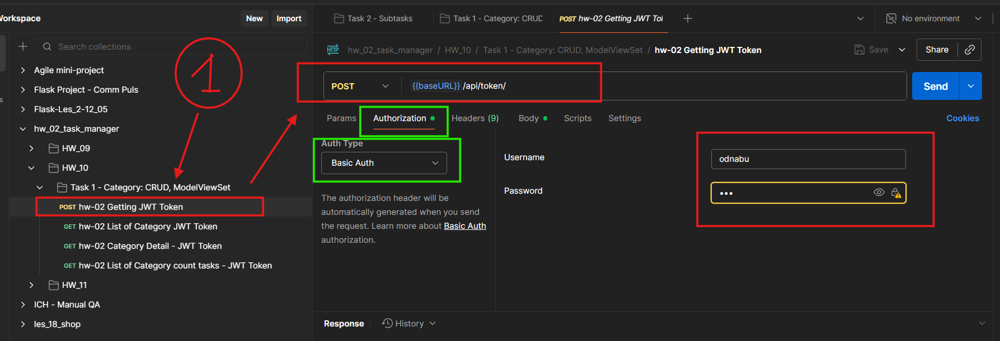
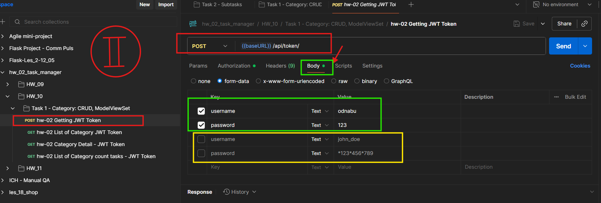
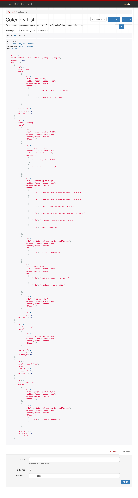
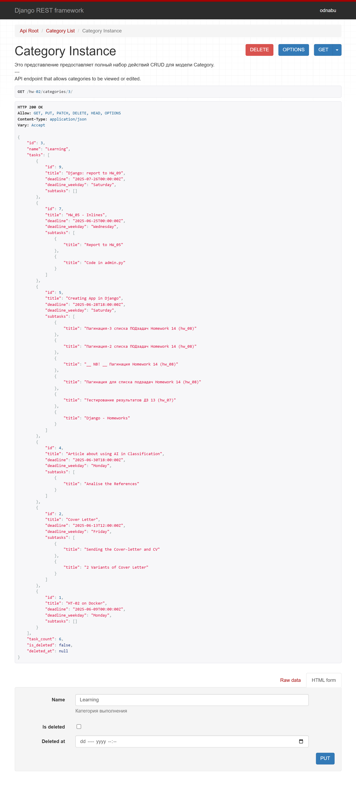
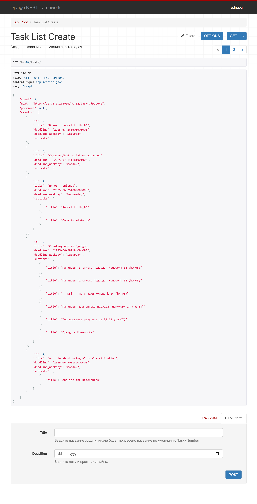
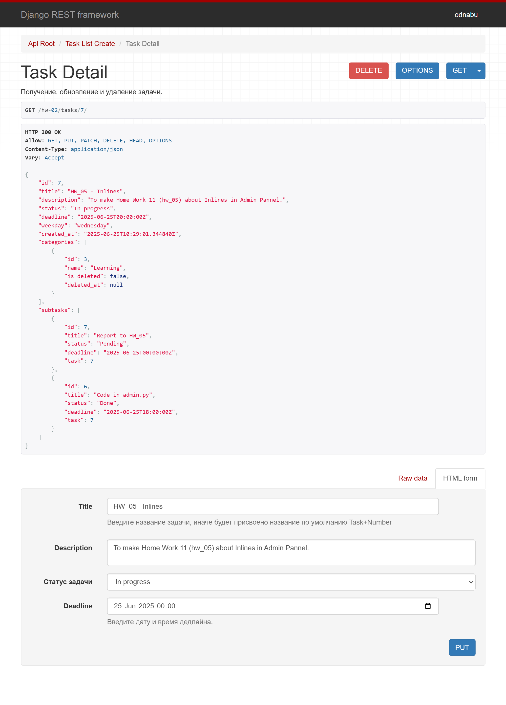

Python Advanced - Django  
29.07.2025

## <div style="color: #9000F0">Домашнее задание 18 (12 in Django): <br> Проект "Менеджер задач" — Реализация аутентификации JWT и пермишенов. Глобальная пагинация.</div>    
__Цель:__  
Настроить JWT (JSON Web Token) аутентификацию с использованием SimpleJWT и реализовать пермишены для защиты API.  
Убедитесь, что только авторизованные пользователи могут выполнять определённые действия.

###  Задание 1. Настройка JWT аутентификации
Шаги для выполнения (см. начало [<font color="#696969">[3, p. 77]</font>](#p1), [<font color="#696969">[4, s. 22]</font>](#c1)):
1. Установите djangorestframework-simplejwt.  
   - Убедитесь, что библиотека djangorestframework-simplejwt установлена.
2. Настройте аутентификацию в settings.py.  
   - Добавьте конфигурации SimpleJWT в settings.py.
3. Добавьте маршруты для получения и обновления JWT токенов.
   - Настройте маршруты для получения и обновления JWT токенов.
4. Проверьте что эндпоинты работают.
   - Проверьте что маршруты для получения и обновления JWT токенов работают.

###  Задание 2. Реализация пермишенов для API  
Шаги для выполнения:
1. Продумайте пермишены.
   - Продумайте какие пермишены должны быть на представлениях.
2. Примените пермишены к API представлениям.
   - Добавьте пермишены ко всем представлениям.
3. Проверьте что пермишены работают.
   - Проверьте что пермишены работают согласно их настройкам.  

###  Задание 3. Настройка глобальной пагинации в проекте  
??????????? Вроде бы уже сделали в ДЗ 11, задание 1.
1. Обновить настройки проекта:
   - Подключить в настройках проекта Django REST framework глобальную пагинацию, выбрав класс пагинации 
   из тех, что рассматривались на занятиях.
2. Протестировать эндпоинты:
   - Установить для пагинации возврат 5-ти элементов по умолчанию.
   - Проверить работу эндпоинтов с добавлением пагинации.

###  Оформление ответа:
1. Предоставьте решение: Прикрепите ссылку на гит.
2. Скриншоты тестирования: 
   - Приложите скриншоты из Postman, подтверждающие: 
     - успешное использование JWT токенов и соблюдение пермишенов при работе с задачами, 
     - пагинацию страниц при HTTP GET ответах.

<div style="font: bold normal 110% sans-serif; color: #8A2BE2; white-space: pre; border-top: 2px dotted #008000; padding: 5px;"></div>  


### <m style="color: #008000">Источники</m>  
<m style="color: #606060">Видео - уроки от *23.07.2025*</m>  [<font color="#696969">[1 - ▶  Video 33, c 1:52:35]</font>](#v1).  
[1] ▶ Video 33 "Python Adv 33: Введение в аутентификацию и авторизацию" (3:24:04), *23.07.2025* начиная 
<m style="color: red">c 1:52:35</m>: <m id="v1">https://player.vimeo.com/video/1103751018?h=423485f3b8</m>.  
[2] ▶ Video 34 "Python Adv 34: Практикум 9" (1:43:09), *23.07.2025* начиная 
<m style="color: red">c 20:40</m>: <m id="v2">https://player.vimeo.com/video/1103770268?h=6dfd40072f</m>.  
[3] Presentation 29 _"Введение в аутентификацию и авторизацию-1"_.  
<a id="p1">Les33-Django_29-Les 33-Authent_Author-23_07.pdf</a>. 
<m style="color: #606060">——▷  Аутентификация (в DRF) и авторизация. BasicAuthentication. Токен- и JWT-аутентификация</m>   
[4] Conspectus 29 <a id="c1">Les33-Django_29---Les 33-Authent_Author-23_07.pdf</a>.  
[5] Presentation 30 _"Введение в аутентификацию и авторизацию-2"_.  
<a id="p2">Les33-Django_30---Les 33-JWT_Authent_Author-23_07.pdf</a>. 
<m style="color: #606060">——▷  JWT-аутентификация. Использование встроенных классов разрешений</m>.   
[6] Conspectus 30 <a id="c2">Les33-Django_30---Les 33-JWT_Authent_Author-23_07.pdf</a>.  
[7] Приложение **home_work_11**: файл <m id="hw7">home_work_11.md</m>.  
[8] Руководство по оформлению Markdown файлов: https://gist.github.com/Jekins/2bf2d0638163f1294637.  
[9] Шпаргалка по Markdown: https://gist.github.com/fomvasss/8dd8cd7f88c67a4e3727f9d39224a84c.


<div style="font: bold normal 110% sans-serif; color: #8A2BE2; white-space: pre; border: 2px outset #8A2BE2; margin: 60px 0 40px 0; padding: 5px 0 5px 25px;">ОТЧЕТ</div>


### <m style="color: #008000">Миграции</m>  

<div style="margin: 40px 20px 20px 0;">
<m style="color: #F00000; border: 2px solid #6B0000; padding: 10px;"> NB ! </m> 
<b style="color: #F00000; border: 1px solid black; padding: 5px;">!!! ВСЕГДА</b> после изменения в моделях (НЕ в сериализаторе) выполнять и применять миграции.
<p style="margin: 0 0 0 55px;"><b style="color: #F00000; border: 1px solid black; padding: 5px;">ПРИМЕНЯТЬ</b> миграции так же нужно в ситуациях:
<p style="margin: 0 0 0 70px;">1. Склонирован/получен проект с миграциями.
<p style="margin: 0 0 0 70px;">2. Применения уже готовых .py-файлы миграций.
<p style="margin: 0 0 0 70px;">3. На сервере (или в другом окружении).
<p style="margin: 0 0 0 70px;">4. После восстановления базы данных нужно применить все миграции.
<p style="margin: 0 0 0 70px;"><b style="color: #F00000;">5.</b> После изменения настроек БД или установки приложения. 
Например, добавления в файл настроек нового приложения, предоставляющего токен. 
</div>  

Детально, когда нужно выполнять `python manage.py migrate` БЕЗ `makemigrations` см. тут [ChatGPT](https://chatgpt.com/s/t_6887c91d9ad481919a0d65104ad52b99).

Запускать команды `python manage.py shell`, `migrate`, `runserver` — находясь в корне проекта, рядом с <a>manage.py</a>
  (см. [<font color="#696969">[8 - hw_10]</font>](#hw6)).

После изменений в МОДЕЛЯХ сделать и применить миграции [<font color="#696969">[1 - ▶  Video 20, 57:60]</font>](#v1):  
```bash
    python manage.py makemigrations hw_02_task_manager
    python manage.py migrate hw_02_task_manager
```
Запустить локальный сервер Django с помощью <a>manage.py</a> в терминале [<font color="#696969">[1 - ▶  Video 20, 57:60]</font>](#v1):  
```bash
   python manage.py runserver
```

---


## <m id="s1" style="color: #008000">1. Настройка JWT аутентификации</m>  

<div style="margin: 20px 20px 20px 0;">
<b style="color: #F00000; border: 2px solid #6B0000; display: inline-block; padding: 10px; margin: 0 10px 0 0;"> NB ! </b>Так как на консультации 1 от 28.07.2025 пофиксили проблемы с обновлением токена 
для Аутентификации и Авторизации для всего проекта благодаря решению Макса Полякова, то теперь в настройках
<m style="color: limegreen">config /</m> <a>settings.py</a> и в <m style="color: limegreen">config /</m> <a>urls.py</a>
можно ничего не отключать опцию, связанную с Аутентификацией.
</div>

Описание реализации настройки JWT-аутентификации по шагам смотри в:  
1. записи урока [<font color="#696969">[1 - ▶  Video 33]</font>](#v1) начиная <m style="color: red">c 1:52:35</m>.
2. записи урока [<font color="#696969">[2 - ▶  Video 34]</font>](#v2) начиная <m style="color: red">c 20:40</m>.
3. тексте презентации и конспекте (начало) [<font color="#696969">[3, s. 40], [4, p. 15]</font>](#p1).
4. тексте презентации и конспекте (продолжение) [<font color="#696969">[5, s. 7], [6, p. 2]</font>](#p2)
5. решении для этой задачи от [ChatGPT](https://chatgpt.com/s/t_688899135da88191bddc291ff171104b).  
6. примере реализации [settings.py from V. Bandylo on GitHub](https://github.com/viacheslav-bandylo/111124-projects/blob/main/config/settings.py). 


<div style="font: small-caps 120% sans-serif; color: #9000F0; padding: 0 15px 0 0;">▣ &nbsp;&nbsp; ТЕОРИЯ</div>

<m style="color: #9000F0">Аутентификация</m> - <m style="color: red">КТО</m> - процесс проверки подлинности 
пользователя или устройства, запрашивающего доступ к ресурсу [<font color="#696969">[1 - ▶  Video 33, 1:54:50]</font>](#v1).  
По-сути __проверка ПРАВ пользователя__ [<font color="#696969">[1 - ▶  Video 33, 1:54:25]</font>](#v1).    
В контексте DRF _означает_ __установление личности пользователя__.  

<m style="color: #9000F0">Авторизация</m> - <m style="color: red">ЧТО разрешено</m> - процесс определения, имеет ли 
аутентифицированный пользователь право доступа к конкретным ресурсам или действиям [<font color="#696969">[1 - ▶  Video 33, 1:55:20]</font>](#v1).  
Можно сказать, что программа решает, в какие места пользователю открыт доступ, после того как личность уже 
установлена [<font color="#696969">[1 - ▶  Video 33, 1:54:25]</font>](#v1).  
В DRF это _осуществляется_ с помощью __разрешений, прав и других критериев__.  

<m style="color: #9000F0">JWT (JSON Web Token)</m> - компактный, URL-безопасный способ передачи утверждений 
между двумя сторонами. Используется для аутентификации пользователей в API.  
<m style="color: #9000F0">Структура JWT:</m>  
1. Заголовок (header): Содержит метаданные, такие как тип токена и алгоритм шифрования.
2. Полезная нагрузка (payload): Содержит утверждения и другую информацию о пользователе.
3. Подпись (signature): Подписывает токен, чтобы убедиться, что он не был изменен.

### <m id="ss1.1" style="color: #008000">1.1. Настройки для JWT в config</m>  
В файле настроек <a>settings.py</a> проверить наличие кода (после всех лекций и практик) для:    
- REST_FRAMEWORK,
- SIMPLE_JWT.

---

### <m id="ss1.2" style="color: #008000">1.2. Настройка URL-ов в </m> <a>urls.py</a>  
Проверить маршруты для получения и обновления токенов в <a>DjangoProject_config / urls.py</a>.  

---

### <m id="ss1.3" style="color: #008000">1.3. Проверка токенов через Postman или браузер:</m>  
Поскольку я уже сгенерировала refresh-токен в <a>home_work_10.md</a> и он будет валиден еще как минимум неделю (сегодня 29.07.2025),
а access-токен обновляется через <a>DjangoProject_config / middleware.py</a> автоматически, пока валиден refresh-токен (10 дней), 
признаться, мне не хочется сейчас тратить драгоценное время на повторение тех же действий с генерацией токенов в
Postman и размещением скриншотов в отчете к этой ДЗ. При желании результаты генерации токенов можно еще раз увидеть 
в <a>home_work_10.md</a> начиная с п. "1.4. Результаты выполнения задания 1 в браузере". 

##### <b style="color: #008000; margin: 0 20px 0 0;">⋘ 1 ⋙ </b> Получение JWT  
<m style="color: limegreen">POST</m> <a>/api/token/</a> с телом (см. [<font color="#696969">[3, s. 86-91]</font>](#p1), 
[ChatGPT](https://chatgpt.com/s/t_688899135da88191bddc291ff171104b)): 
```
{
  "username": "odnabu",
  "password": "123"
}
```
<m style="color: limegreen">POST</m> <a>/api/token/refresh/</a> с телом: 
```
{
  "refresh": "мой_refresh_токен"
}
```

В общем, процедура получения JWT-токена через Postman для пользователей разного уровня доступа (admin, common user)
выглядит так [<font color="#696969">[3, s. 86-87]</font>](#p1):  
1. во вкладке "Authorization" ввести логин и пароль для доступа на стороне сервера,  
2. во вкладке "Body" в поле for"m-data" ввести логин и пароль на стороне клиента (admin или другой common user),  
3. Нажать Send. В ответе появится JSON-объект с JWT.  

Процедура использования JWT-токена через Postman и в браузере для пользователей разного уровня доступа продемонстрирована 
на слайдах в <a>home_work_10.md</a>.

<br>  



<m id="img1.1" style="margin: 40px; color:#606060;">Fig. 1.1. Выполнение POST-запроса в Postman для получения JWT-токена.</m>


<div style="font: bold normal 110% sans-serif; color: #8A2BE2; white-space: pre; border-top: 2px dotted #008000; padding: 5px;"></div>  


## <m id="s2" style="color: #008000">2. Реализация пермишенов для API</m>    
Описание реализации разрешений (Permissions) по шагам смотри:  
1. в записи урока [<font color="#696969">[1 - ▶  Video 33]</font>](#v1) <m style="color: red">c 2:40:25</m>.
2. <b style="color: #F00000; border: 2px solid #6B0000; display: inline-block; padding: 10px; margin: 0 10px 0 0;"> NB ! </b> в записи урока "Python Adv 34: Практикум 9" от 23.07.2025 <m style="color: red">c 1:09:20</m> <font color="#696969">[1 - ▶  Video 34]</font>.<br> <m style="color: lime">Именно в этом видео начинаются PERMISSIONS</m>.
3. в тексте презентации и конспекте (продолжение) [<font color="#696969">[5, s. 32]</font>](#p2)
4. в решении для этой задачи от [ChatGPT](https://chatgpt.com/s/t_688899135da88191bddc291ff171104b).  
5. в примере реализации ["library" from V. Bandylo on GitHub](https://github.com/viacheslav-bandylo/111124-projects/blob/main/config/settings.py). 


<b style="color: #F00000; border: 2px solid #6B0000; display: inline-block; padding: 10px; margin: 0 10px 0 0;"> NB ! </b> Непосредственно код для <m style="color: #9000F0">Представлений</m> по примеру на видео: 

- [<font color="#696969">[1 - ▶  Video 33]</font>](#v1) <m style="color: red">c 2:40:25</m>, 
- в коде файла <a>views.py</a> [views.py to "library" from V. Bandylo on GitHub](https://github.com/viacheslav-bandylo/111124-projects/blob/main/library/views.py).


<div style="font: small-caps 120% sans-serif; color: #9000F0; padding: 0 15px 0 0;">▣ &nbsp;&nbsp; ТЕОРИЯ</div>

<m style="color: #9000F0">Permissions</m> - разрешения в DRF определяют, какие пользователи 
имеют доступ к различным ресурсам API.

### <m id="s2.1" style="color: #008000">2.1. Выбор стратегии</m> 
Например:  
- Все пользователи могут смотреть список задач.
- Только автор задачи может её изменять или удалять.  

### <m id="s2.2" style="color: #008000">2.2. Стандартные Permissions для всех представлений и маршруты</m>  

Далее прописать <m style="color: limegreen">СТАНДАРТНЫЕ пермишены</m> из DRF - DjangoModelPermissions 
для всех Представлений приложения. Например:
```python
class TaskListCreateView(ListCreateAPIView):
...
    # _____ home_work_12:  2:  Добавление пермишенов:
    permission_classes = [IsAuthenticatedOrReadOnly]

class TaskDetailView(RetrieveUpdateDestroyAPIView):
...
    # _____ home_work_12:  2:  Добавление пермишенов:
    permission_classes = [IsAdminUser]
```

Хотя, по умолчанию УЖЕ назначен `IsAuthenticated` в настройках проекта, ВСЁ РАВНО нужно ПРОПИСЫВАТЬ настройки.
Связывать СТАНДАРТНЫЕ разрешения (Permissions) представлений с url в файле <a>hw_02_task_manager / urls.py</a>
НЕ нужно, так как все работает "из коробки" `rest_framework.permissions`. Только для учебных представлений, 
которые были добавлены во <a>hw_02_task_manager / views.py</a> в демонстрационных целях, 
см. [<font color="#696969">[1 - ▶  Video 33, 2:44:40]</font>](#v1).

---

### <m id="s2.3" style="color: #008000">2.3. Результаты назначения разрешений (Permissions) для представлений</m> 

##### <b style="color: #008000; margin: 0 20px 0 0;">⋘ 1 ⋙ </b> Для `Category`
Для `CategoryViewSet` как по url: http://127.0.0.1:8000/hw-02/categories/, так и 
по url: http://127.0.0.1:8000/hw-02/categories/3/ прописан `permission_classes = [IsAuthenticatedOrReadOnly]`.  



<m id="img2.1" style="margin: 40px; color:#606060;">Fig. 2.1. Кнопка __DELETE__ отсутствует.</m>



<m id="img2.2" style="margin: 40px; color:#606060;">Fig. 2.2. Кнопка __DELETE__ появляется.</m>

##### <b style="color: #008000; margin: 0 20px 0 0;">⋘ 2 ⋙ </b>  Для `Tasks`  
Для `TaskListCreateView` как по url: http://127.0.0.1:8000/hw-02/tasks/, так и 
по url: http://127.0.0.1:8000/hw-02/taskss/7/ прописан `permission_classes = [IsAuthenticatedOrReadOnly]`. 



<m id="img2.3" style="margin: 40px; color:#606060;">Fig. 2.3. Кнопка __DELETE__ отсутствует.</m>



<m id="img2.4" style="margin: 40px; color:#606060;">Fig. 2.4. Кнопка __DELETE__ появляется.</m>


---


<div style="font: bold normal 110% sans-serif; color: #8A2BE2; white-space: pre; border-top: 2px dotted #008000; padding: 5px;"></div>  


## <m id="s3" style="color: #008000">3. GitHub</m>
- Запуште проект в Git-репозиторий и прикрепите как решение ссылку на него.

Ссылка на отчет по ДЗ <a>home_work_12.md</a> со скриншотами: .  

Ссылка на приложение по ДЗ <a>hw_02_task_manager</a>: https://github.com/odnabu/Django-Python-Advanced/tree/main/hw_02_task_manager.  

Ссылка на весь проект <a>DjangoProject</a>: https://github.com/odnabu/Django-Python-Advanced/tree/main.  


<div style="font: bold normal 110% sans-serif; color: #8A2BE2; white-space: pre; border-top: 2px dotted #8A2BE2; padding: 5px; margin: 40px 0 40px 0"></div>

[//]: # ([<font color="#696969">[1 - ▶  Video 22, 48:00]</font>]&#40;#v1&#41;)
[//]: # ([<font style="color: #606060;">[2, слайд 32]</font>]&#40;#p1&#41;)

[//]: # (<div style="margin: 40px 0 40px 0"></div>)

[//]: # (<m style="color: #8A2BE2; margin: 20px 40px; padding: 5px; background: #000000;">▣ ⚜️ ☑️ ✔️ 🟪 ■ ※ ⁂ ⁙ ⁘ ⨠  ■ ◲◳ ◆ ◇ ◈ ◀ ▶ ◁ ▷ ▹ ▼ ▲ ▽ △ ▢ ₪₪₪</m>   )  

[//]: # (<div style="font: small-caps 120% sans-serif; color: #8A2BE2; margin: 0 0 0 0px; padding: 0 15px 0 0;">▣ &nbsp;&nbsp; Выполните запросы:</div>  )
[//]: # (🔷🔹 🟩 ❇️♾️⚜️✳️❎✅☑️✔️🟪🔳🔲  )
[//]: # (■ ⁜ ※ ⁂ ⁙ ⁘ ⫷ ⫸ ⩕ ⨠ ⨝ ⋘ ⋙ ∵ ∴ ∶ ∷ ■ ◪ ◩ ◲ ◳ ◆ ◇ ◈ ▼ ▽ ◀ ▶ ◁ ▷ ▹ ▲ △ ▢ ₪₪₪  )


[//]: # (<div style="color: #F00000; margin: 40px 20px 20px 0;">)

[//]: # (<m style="border: 2px solid #6B0000; padding: 10px;"> NB ! </m>)

[//]: # (</div>)


[//]: # (&nbsp;&nbsp; spaces)
[//]: # (<div style="font: small-caps 120% sans-serif; color: #8A2BE2; padding: 0 15px 0 0;">▣ &nbsp;&nbsp; Выполните запросы:</div>  )

[//]: # (<div style="font: bold normal 110% sans-serif; color: #8A2BE2; white-space: pre; border-top: 2px dotted #008000; padding: 5px;"></div>)


[//]: # (== RegEx в PyCharm ==)

[//]: # (Как найти все тексты между тегами <a>...</a> в PyCharm)

[//]: # (1️⃣ Открой нужный файл в PyCharm.)

[//]: # (2️⃣ Нажми Ctrl + F — откроется строка поиска.)

[//]: # (3️⃣ Нажми на .∗ значок ".*", чтобы включить режим RegEx &#40;регулярных выражений&#41;.)

[//]: # (4️⃣ Введи такой шаблон:)

[//]: # (<a>&#40;.*?&#41;</a>)

[//]: # (📌 Что означает шаблон:)

[//]: # (- <a> и </a> — буквально ищем открывающий и закрывающий теги.)

[//]: # (- &#40;.*?&#41; — захватывает любой текст между ними, включая кириллицу, пробелы и спецсимволы.)

[//]: # (- ? — делает захват нежадным, чтобы не схватывало всё сразу до последнего </a>.)

[//]: # (✨ Хочешь выделить или заменить текст?)

[//]: # (Если ты нажмёшь Ctrl + Shift + R — откроется Поиск и замена по шаблону.)

[//]: # (Можно заменить на, например:)

[//]: # ([ссылка: \1])

[//]: # ( \1 — это то, что попало в скобки &#40;.*?&#41;.)


