Python Advanced - Django  
30.07.2025

## <div style="color: #9000F0">Домашнее задание 19 (13 in Django): <br> Проект "Менеджер задач" — <br> Реализация JWT (SimpleJWT) аутентификации и пермишенов.</div>    
__Цель:__  
Реализовать авторизацию с извлечением текущего пользователя из запроса и применение разрешений на уровне объектов.   
Настроить и интегрировать Swagger для автоматической генерации документации API.  

###  Задание 1. Извлечение текущего пользователя из запроса  
Шаги для выполнения (см. начало [<font color="#696969">[3, p. 77]</font>](#p1), [<font color="#696969">[4, s. 22]</font>](#c1)):
1. Обновите модели, чтобы включить поле owner. 
   - Обновите модели Task и SubTask для включения поля owner. 
2. Измените сериализаторы. 
   - Измените сериализаторы для моделей Task и SubTask для работы с новым полем. 
3. Переопределите метод perform_create в представлениях. 
   - Обновите представления для автоматического добавления владельца объекта.
4. Создайте представления для получения задач текущего пользователя.
   - Реализуйте представление для получения задач, принадлежащих текущему пользователю.

###  Задание 2.  Реализация пермишенов для API  
Шаги для выполнения:
1. Создайте пользовательские пермишены.
   - Реализуйте пользовательский пермишен для проверки, что пользователь является автором задачи или подзадачи.
2. Примените пермишены к API представлениям.
   - Добавьте пермишены к представлениям для задач и подзадач, чтобы только владельцы могли их изменять или удалять.

###  Задание 3.  Swagger  
Шаги для выполнения:
1. Установите drf-yasg.
2. Добавьте drf_yasg в settings.
3. Настройте маршруты для Swagger в urls.py.
4. Просмотр документации.
   - Перейдите по URL /swagger/ или /redoc/, чтобы увидеть документацию для вашего API.


###  Оформление ответа:
1. Предоставьте решение: Прикрепите ссылку на гит.
2. Скриншоты тестирования: 
   - Приложите скриншоты из консоли из Postman, подтверждающие: 
     - успешное извлечение текущего пользователя из запроса, 
     - соблюдение пермишенов при работе с задачами, 
     - реализованную документацию.

<div style="font: bold normal 110% sans-serif; color: #8A2BE2; white-space: pre; border-top: 2px dotted #008000; padding: 5px;"></div>  


### <m style="color: #008000">Источники</m>  
<m style="color: #606060">Видео - уроки от *24.07.2025*</m>  [<font color="#696969">[1 - ▶  Video 35, c \_:\_:\_]</font>](#v1).  
[1] ▶ Video 35 "Python Adv 35: Виды разрешений, сигналы" (3:15:05), *24.07.2025* начиная 
<m style="color: red">c 1:49:40</m>: <m id="v1">https://player.vimeo.com/video/1104102562?h=2ad6195fdc</m>.  
[2] ▶ Video \_ "" (\_:\_:\_), *\_.07.2025* начиная 
<m style="color: red">c \_:\_</m>: <m id="v2"></m>.  
[3] Presentation 31 _"Авторизация"_. <a id="p1">Les35-Django_31-AuTHORisation-24_07.pdf</a>. 
<m style="color: #606060">——▷  Получение пользователя из request. Разрешения на уровне объектов в 
Django REST Framework. Разрешения моделей. Использование разрешений моделей в представлениях</m>   
[4] Conspectus 31 "Урок 31. Авторизация" <a id="c1">Les35-Django_31---AuTHORisation-24_07.pdf</a>.  
[5] Presentation \_ _""_.  
<a id="p2"></a>. 
<m style="color: #606060">——▷  </m>.   
[6] Conspectus \_ <a id="c2"></a>.  
[7] Приложение **home_work_12**: файл <m id="hw7">home_work_12.md</m>.  
[8] Руководство по оформлению Markdown файлов: https://gist.github.com/Jekins/2bf2d0638163f1294637.  
[9] Шпаргалка по Markdown: https://gist.github.com/fomvasss/8dd8cd7f88c67a4e3727f9d39224a84c.


Python Adv 35: Виды разрешений, сигналы	Python Advanced	Bandylo Viacheslav	24.07.2025

<div style="font: bold normal 110% sans-serif; color: #8A2BE2; white-space: pre; border: 2px outset #8A2BE2; margin: 60px 0 40px 0; padding: 5px 0 5px 25px;">ОТЧЕТ</div>


### <m style="color: #008000">Миграции</m>  

<div style="margin: 40px 20px 20px 0;">
<m style="color: #F00000; border: 2px solid #6B0000; padding: 10px;"> NB ! </m> 
<b style="color: #F00000; border: 1px solid black; padding: 5px;">!!! ВСЕГДА</b> после изменения в моделях (НЕ в сериализаторе) выполнять и применять миграции.
<p style="margin: 0 0 0 55px;"><b style="color: #F00000; border: 1px solid black; padding: 5px;">ПРИМЕНЯТЬ</b> миграции так же нужно в ситуациях:
<p style="margin: 0 0 0 70px;">1. Склонирован/получен проект с миграциями.
<p style="margin: 0 0 0 70px;">2. Применения уже готовых .py-файлы миграций.
<p style="margin: 0 0 0 70px;">3. На сервере (или в другом окружении).
<p style="margin: 0 0 0 70px;">4. После восстановления базы данных нужно применить все миграции.
<p style="margin: 0 0 0 70px;"><b style="color: #F00000;">5.</b> После изменения настроек БД или установки приложения. 
Например, добавления в файл настроек нового приложения, предоставляющего токен. 
</div>  

Детально, когда нужно выполнять `python manage.py migrate` БЕЗ `makemigrations` см. тут [ChatGPT](https://chatgpt.com/s/t_6887c91d9ad481919a0d65104ad52b99).

Запускать команды `python manage.py shell`, `migrate`, `runserver` — находясь в корне проекта, рядом с <a>manage.py</a>
  (см. [<font color="#696969">[8 - hw_10]</font>](#hw6)).

После изменений в МОДЕЛЯХ сделать и применить миграции [<font color="#696969">[1 - ▶  Video 20, 57:60]</font>](#v1):  
```bash
    python manage.py makemigrations hw_02_task_manager
    python manage.py migrate hw_02_task_manager
```
Запустить локальный сервер Django с помощью <a>manage.py</a> в терминале [<font color="#696969">[1 - ▶  Video 20, 57:60]</font>](#v1):  
```bash
   python manage.py runserver
```

---


## <m id="s1" style="color: #008000">1. Извлечение текущего пользователя из запроса</m>  

<div style="margin: 20px 20px 20px 0;">
<b style="color: #F00000; border: 2px solid #6B0000; display: inline-block; padding: 10px; margin: 0 10px 0 0;"> NB ! </b>Так как на консультации 1 от 28.07.2025 пофиксили проблемы с обновлением токена 
для Аутентификации и Авторизации для всего проекта благодаря решению Макса Полякова, то теперь в настройках
<m style="color: limegreen">config /</m> <a>settings.py</a> и в <m style="color: limegreen">config /</m> <a>urls.py</a>
можно не отключать опцию, связанную с Аутентификацией.
</div>

Описание реализации этого задания по шагам смотри в:  
1. записи урока [<font color="#696969">[1 - ▶  Video 35]</font>](#v1) начиная <m style="color: red">c 1:53:10</m>.
2. тексте презентации и конспекте (начало) [<font color="#696969">[3, s. 7]</font>](#p1), 
[<font color="#696969">[4, p. 2]</font>](#c1).
4. решении для этой задачи от [ChatGPT](https://chatgpt.com/s/t_688b1e85716c8191a973ec91ebba4eb1).  
5. примере реализации для [models.py, views.py etc. to "library" from V. Bandylo on GitHub](https://github.com/viacheslav-bandylo/111124-projects/blob/main/library/models.py). 


<div style="font: small-caps 120% sans-serif; color: #9000F0; padding: 0 15px 0 0;">▣ &nbsp;&nbsp; ТЕОРИЯ</div>

<m style="color: #9000F0">Аутентификация</m> - <m style="color: red">КТО</m> - процесс проверки подлинности 
пользователя или устройства, запрашивающего доступ к ресурсу [<font color="#696969">[▶  Video 33, 1:54:50]</font>](#v1).  
По-сути __проверка ПРАВ пользователя__ [<font color="#696969">[▶  Video 33, 1:54:25]</font>](#v1).    
В контексте DRF _означает_ __установление личности пользователя__.  

<m style="color: #9000F0">Авторизация</m> - <m style="color: red">ЧТО разрешено</m> - процесс определения, имеет ли 
аутентифицированный пользователь право доступа к конкретным ресурсам или действиям [<font color="#696969">[▶  Video 33, 1:55:20]</font>](#v1).  
Можно сказать, что программа решает, в какие места пользователю открыт доступ, после того как личность уже 
установлена [<font color="#696969">[▶  Video 33, 1:54:25]</font>](#v1).  
В DRF это _осуществляется_ с помощью __разрешений, прав и других критериев__.  

<m style="color: #9000F0">JWT (JSON Web Token)</m> - компактный, URL-безопасный способ передачи утверждений 
между двумя сторонами. Используется для аутентификации пользователей в API.  
<m style="color: #9000F0">Структура JWT:</m>  
1. Заголовок (`header`): Содержит метаданные, такие как тип токена и алгоритм шифрования.
2. Полезная нагрузка (`payload`): Содержит утверждения и другую информацию о пользователе.
3. Подпись (`signature`): Подписывает токен, чтобы убедиться, что он не был изменен.

<div style="font: small-caps 120% sans-serif; color: #008000; padding: 0 15px 0 0;">▣ &nbsp;&nbsp; Цели в ходе реализации задания 1:</div>  

- добавление поля `owner`;
- автоматическое сохранение текущего пользователя как владельца;
- получение задач текущего пользователя;
- пермишен, разрешающий доступ только владельцу.

---

### <m id="ss1.1" style="color: #008000">1.1. Обновление моделей `Task` и `SubTask`</m>  
В файле с Моделями <a>models.py</a> вставить код для добавления __Владельца задачи / подзадачи__ (см.так же 
[<font color="#696969">[1 - ▶  Video 35, 1:53:50]</font>](#v1)).  

Внутри моего проекта возник _конфликт_ между МОДЕЛЯМИ 2-х приложений (`project` и `hw_02_task_manager`).
А именно, в приложении `project` для такой же модели `Task` уже используется `related_name='tasks'`:
```python
# Relation to User:
assignee = models.ForeignKey(User, on_delete=models.SET_NULL, related_name='tasks', null=True, blank=True)
```

Поэтому, после доработки кода по примеру видео урока 35 и подсказки Чата, для вызова ___встроенной Django модели___ 
`User` для таблицы с информацией о пользователях, __НУЖНО__ добавить в приложении `hw_02_task_manager` 
связь (`отношение Relation`) между моделью `Task` и моделью `User` с __ДРУГИМ__ `related_name`, 
например, `related_name=owned_tasks` [ChatGPT](https://chatgpt.com/s/t_688b2ad1c5b0819194b69d847b00dce5).  
Решить конфликт импортом моделей из конкретного приложения нельзя, потому что так работает  Django [ChatGPT](https://chatgpt.com/s/t_688b2fd18b288191b737548d109c6650).
Т.е. изменить `related_name` конфликтующих связей через импорты нельзя. Импорты просто указывают, 
откуда брать классы и функции, но __НЕ влияют__ на имена связей или поведение ORM (Object-Relational Mapping) в Django.
Поэтому единственный верный способ — изменить `related_name`. Так Django создает обратные связи между моделями.  

Для удобства отличия аналогично и в модели `SubTask` имя для связи будет содержать приставку 
"owned_": `related_name='owned_subtasks'`.

Код для внесения изменений в модели приложения `hw_02_task_manager`:  
```python
# models.py

from django.contrib.auth.models import User  # или get_user_model()
from django.db import models

class Task(models.Model):
    title = models.CharField(max_length=255)
    ...
    # Так как внутри моего проекта возник конфликт между МОДЕЛЯМИ приложений (project и hw_02_task_manager), 
    # доработанная строка кода для Владельца (создателя) задачи будет выглядеть так:
    owner = models.ForeignKey(User, on_delete=models.SET_NULL, verbose_name="Owner", null=True, related_name='owned_tasks')  # 👈 Владелец задачи

class SubTask(models.Model):
    title = models.CharField(max_length=255)
    task = models.ForeignKey(Task, on_delete=models.CASCADE, related_name='subtasks')
    ...
    # Так как внутри моего проекта возник конфликт между МОДЕЛЯМИ приложений (project и hw_02_task_manager), 
    # доработанная строка кода для Владельца (создателя) ПОДзадачи будет с related_name=owned_SUBtasks:
    owner = models.ForeignKey(User, on_delete=models.SET_NULL, verbose_name="Owner", null=True, related_name='owned_subtasks')  # 👈 Владелец подзадачи
```

Затем выполнить миграции:  
```bash
python manage.py makemigrations
python manage.py migrate
```

<br>  

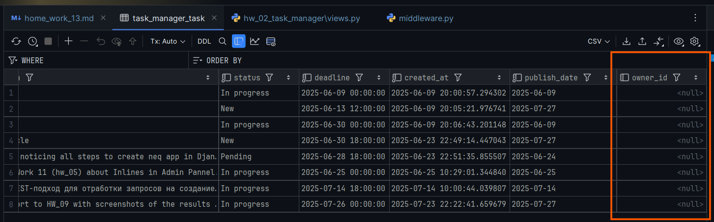

<m id="img1.A" style="margin: 40px; color:#606060;">Fig. 1.A. Результат выполнения миграций после изменения в моделях.</m>

---

### <m id="ss1.2" style="color: #008000">1.2. Обновление сериализаторов</a>  
В файле <a>serializers.py</a> с Сериалайзерами `TaskSerializer`, `SubTaskSerializer` добавить код для их обновления 
[<font color="#696969">[1 - ▶  Video 35, 1:55:35]</font>](#v1).  

Чтобы в поле `owner` НЕ ожидались данные запроса на создание и обновление (т.е. к `POST`-, `PUT`- и 
`PATCH`-методам НЕ будет владельца, мы ___заполним их сами___ на сервере) [<font color="#696969">[1 - ▶  Video 35, 1:56:15]</font>](#v1), 
указывать его в `read_only_fields` в `Meta` [пример Bandylo](https://github.com/viacheslav-bandylo/111124-projects/blob/main/library/serializers.py), а НЕ так, как предложил сделать Чат в своем решении.
```python
# serializers.py
class TaskSerializer(serializers.ModelSerializer):
    class Meta:
        model = Task
        fields = '__all__'
        read_only_fields = ['owner'] # Делаем поле 'owner' только для чтения


class SubTaskSerializer(serializers.ModelSerializer):
    class Meta:
        model = SubTask
        fields = '__all__'
        read_only_fields = ['owner'] # Делаем поле 'owner' только для чтения
```

---

### <m id="ss1.3" style="color: #008000">1.3. Переопределение метода</m> `perform_create`  
Чтобы производилось ___автоматическое___ внесение в поле `'owner'` ЮЗЕРА, который посылает запрос 
на создание задачи или подзадачи НУЖНО в файле <a>views.py</a> с представлениями `TaskListCreateView` 
и `SubTaskListCreateView` добавить еще один метод `perform_create` (ДО метода `create` в [пример Bandylo](https://github.com/viacheslav-bandylo/111124-projects/blob/main/library/serializers.py))
[<font color="#696969">[1 - ▶  Video 35, 1:56:50]</font>](#v1), [<font color="#696969">[3, p. 8,9]</font>](#p1).
```python
# views.py
class TaskListCreateView(ListCreateAPIView):
    queryset = Task.objects.all()
    serializer_class = TaskSerializer
    ...

    def perform_create(self, serializer):
        serializer.save(owner=self.request.user)  # 👈 Сохраняем текущего пользователя как владельца. То, что
                                                  # передается здесь, будет добавлено к данным перед сохранением.


class SubTaskListCreateView(ListCreateAPIView):
    queryset = SubTask.objects.all()
    serializer_class = SubTaskSerializer
    ...

    def perform_create(self, serializer):
        serializer.save(owner=self.request.user)  # 👈 Аналогично
```
Метод `perform_create` вызывается внутри `ViewSet` в момент, когда нужно создать НОВЫЙ объект в БД. 
Причем вызывается после успешной валидации данных.

---
<div style="border-top: 2px solid #a00000; padding: 5px;"></div>  

<b style="color: yellow; background: darkred; padding: 10px; ">ВООБЩЕ черт знает что творится!.....</b>   

ВОПРОСЫ  
1. <b style="color: red;">NB!</b> Почему нет всех полей на создание задачи на Fig 1.B ????????????????
2. Можно ли в middleware.py так добавлять маршруты:
```python
if request.path_info in ['/les_18_shop/login/', '/les_18_shop/registration/', '/les_18_shop/logout/',
                                 '/hw_02_task_manager/login/', '/hw_02_task_manager/registration/', '/hw_02_task_manager/logout/']:
```
3. 

<div style="border-top: 2px solid #a00000; padding: 5px;"></div>  

---

### <m id="ss1.5" style="color: #008000">1.5. Проверка работы кода из пп. 1.1-1.3</m>
Результат с проверкой Аутентификации в браузере [<font color="#696969">[1 - ▶  Video 35, 2:03:20]</font>](#v1)
в МОЕМ случае НЕ получится, т.к. `refresh`-токен все еще валиден. А мне его пересоздавать как-то не очень хочется,
потому что я на этом еще пару часов потеряю. А я уже хочу начать финальный проект...

В общем, метод `POST` будет работать в браузере как для создания задачи, так и для создания подзадачи из-за 
валидности `refresh`-токена и кода для обновления `access`-токена.

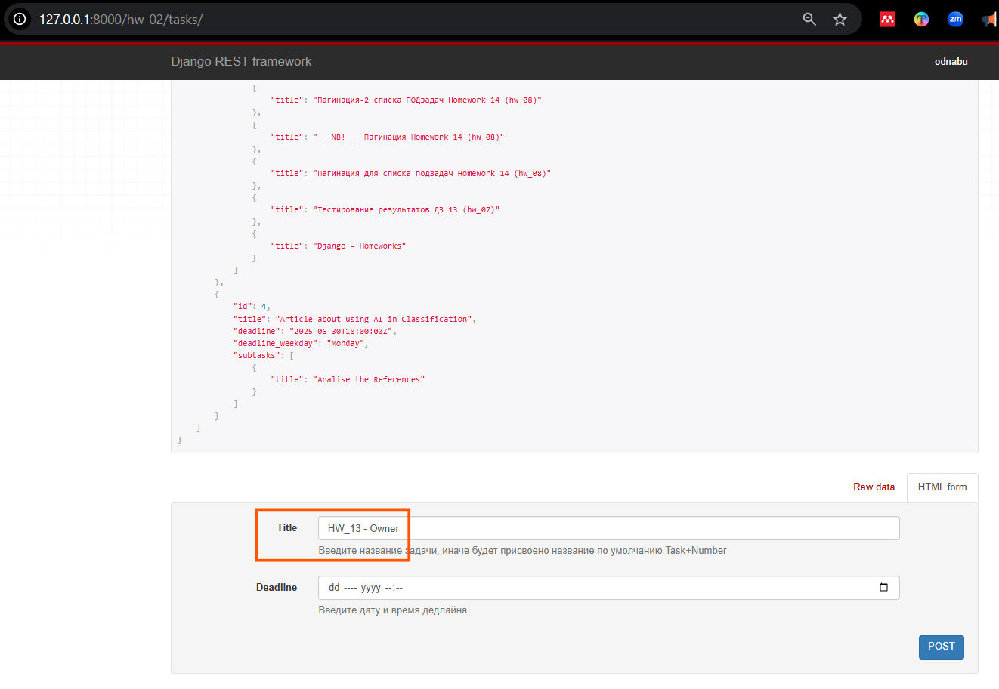<br>  

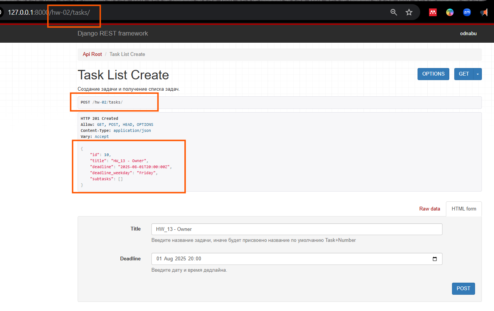<br>  

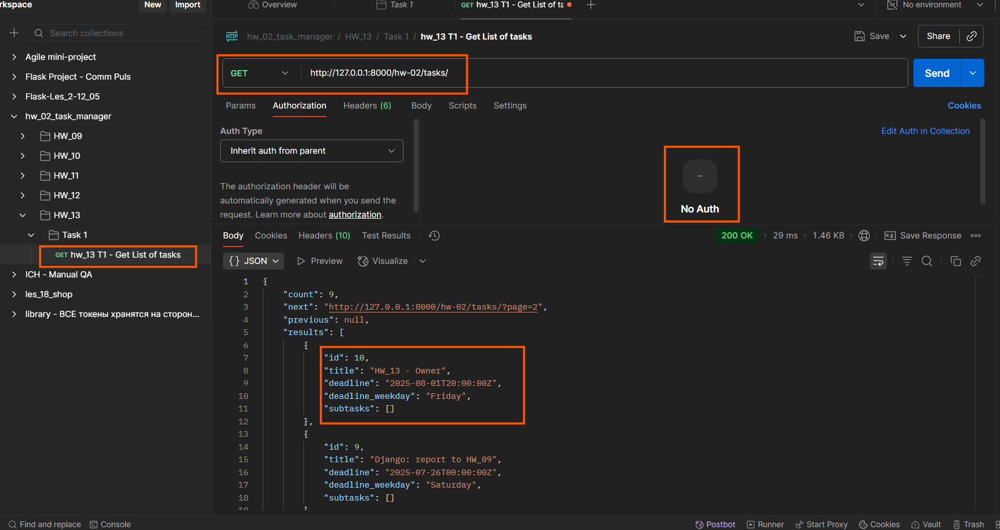

<m id="img1.B" style="margin: 40px; color:#606060;">Fig. 1.B. Добавление новой задачи в браузере с проверкой аутентификации 
при валидном `refresh`-токене.</m>

---
А вот в Postmann сработала проверка аутентификации!  

<b style="color: #F00000; border: 2px solid #6B0000; display: inline-block; padding: 10px; margin: 0 10px 0 0;"> NB ! </b> СНАЧАЛА нужно сгенерировать новый `access`-токен (по запросу 
"hw_11 - 1 Getting JWT Token" из HW_11), иначе не сработает метод `POST`.  

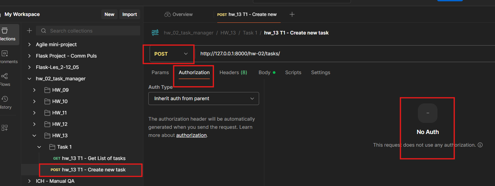<br>  

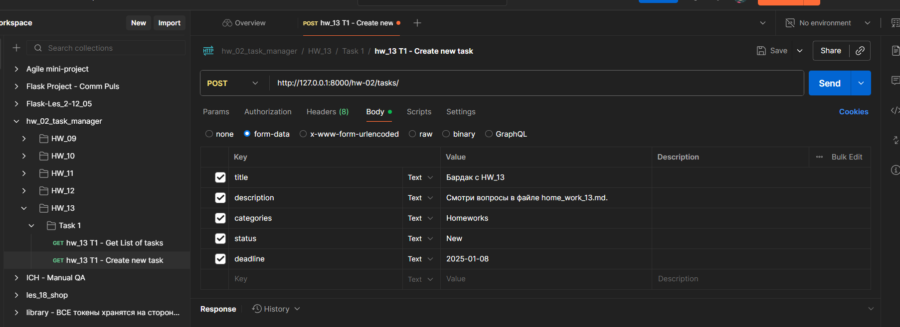<br>  

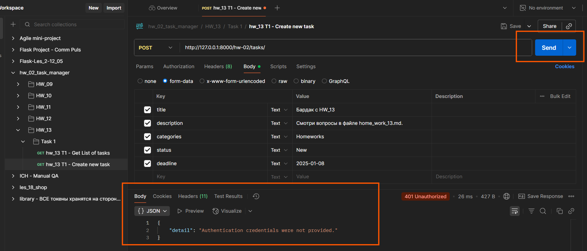

<m id="img1.C" style="margin: 40px; color:#606060;">Fig. 1.C. Добавление новой задачи в Postmann с проверкой аутентификации 
при валидном `refresh`-токене.</m>

---

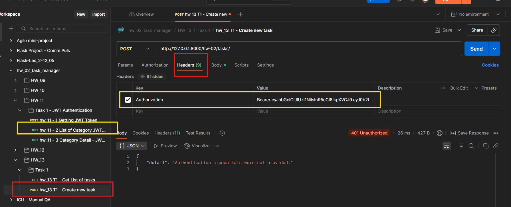<br>  

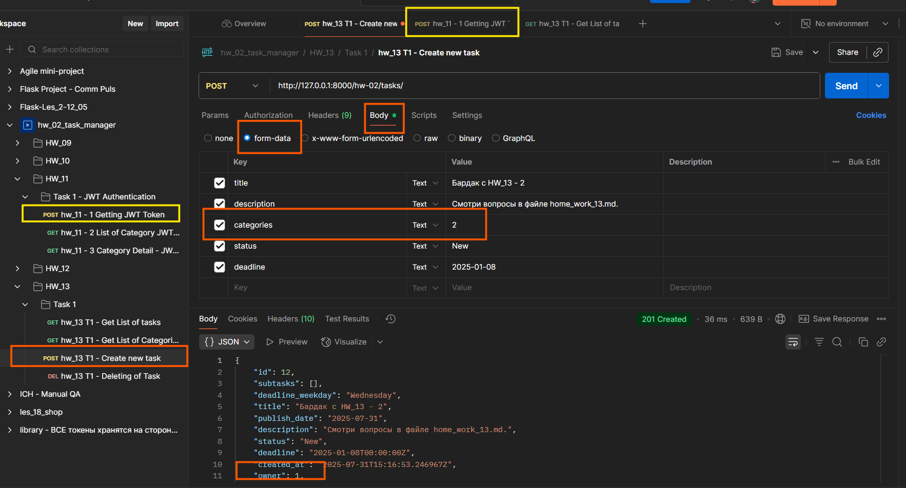<br>  

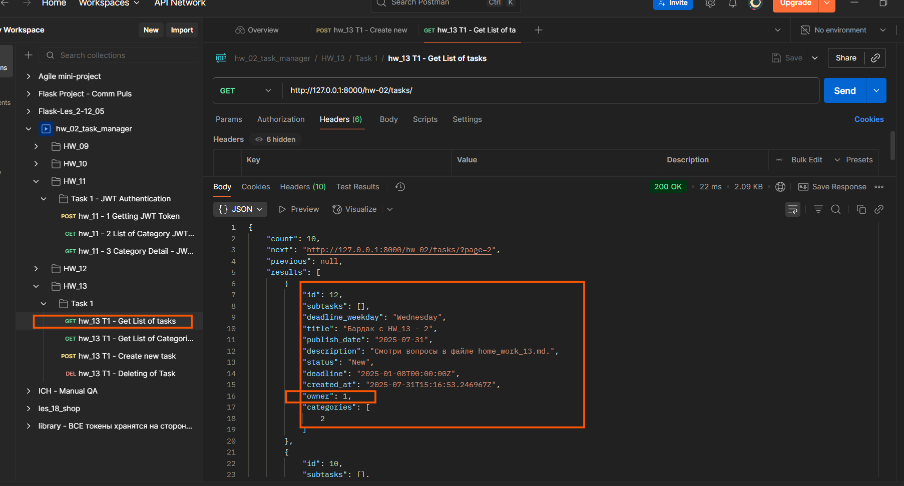

<m id="img1.D" style="margin: 40px; color:#606060;">Fig. 1.D. Добавление новой задачи в Postmann с проверкой аутентификации 
при валидном `refresh`-токене, НО обновленном `access`-токене.</m>

---

<br>  

<br>  


<m id="img1.E" style="margin: 40px; color:#606060;">Fig. 1.E. Результат в БД добавления новой задачи через Postmann 
с проверкой аутентификации, как на Fig 1.C, D .</m>


---

### <m id="ss1.6" style="color: #008000">1.6. Представление задач текущего пользователя</m>  
Для реализации этой задачи смотри пример [<font color="#696969">[1 - ▶  Video 35, 2:10:10]</font>](#v1), 
[<font color="#696969">[3, p. 9]</font>](#p1).  
Добавить представление в <a>views.py</a>:  
```python
# views.py
class MyTaskListView(ListAPIView):
    serializer_class = TaskSerializer
    permission_classes = [IsAuthenticated]

    def get_queryset(self):
        return Task.objects.filter(owner=self.request.user)  # 👈 Только свои задачи
```
При этом в файл <a>urls.py</a> добавить маршрут для выведения задач текущего пользователя:  
```python
# urls.py
path('tasks/my/', MyTaskListView.as_view(), name='my-tasks'),
```

---

### <m id="ss1.7" style="color: #008000">1.7. Результат п. 1.6 через Postman и браузер:</m>  
<b style="color: #F00000; border: 2px solid #6B0000; display: inline-block; padding: 10px; margin: 0 10px 0 0;"> NB ! </b> Как и в п. 1.5 СНАЧАЛА сгенерировать новый `access`-токен (по запросу "hw_11 - 1 Getting JWT Token" из HW_11), 
иначе не сработает ни один метод, в данном случае `GET`.

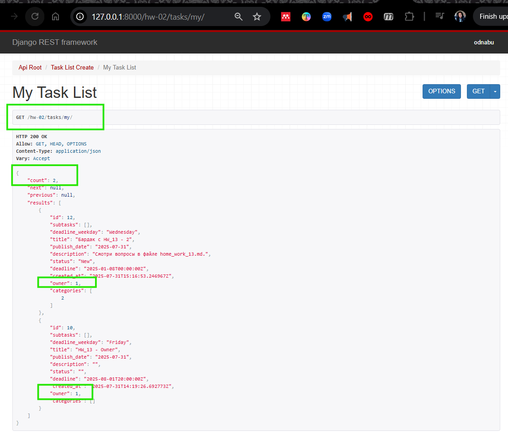<br>  

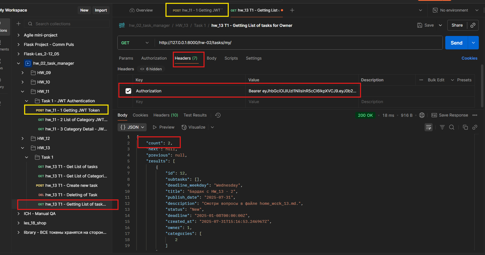

<m id="img1.1" style="margin: 40px; color:#606060;">Fig. 1.1. Выполнение POST-запроса в Postman для получения JWT-токена.</m>

<div style="font: bold normal 110% sans-serif; color: #8A2BE2; white-space: pre; border-top: 2px dotted #008000; padding: 5px;"></div>  


## <m id="s2" style="color: #008000">2. Реализация пермишенов для API</m>    
Описание реализации кастомных разрешений (Permissions) по шагам смотри:  
1. в записи урока [<font color="#696969">[1 - ▶  Video 35]</font>](#v1) <m style="color: red">c 2:20:10</m>.
2. в тексте презентации и конспекте [<font color="#696969">[3, s. 15]</font>](#p1).
3. в решении для этой задачи от [ChatGPT](https://chatgpt.com/s/t_688b1e85716c8191a973ec91ebba4eb1).  
4. в примере реализации ["library" from V. Bandylo on GitHub](https://github.com/viacheslav-bandylo/111124-projects/blob/main/library/permissions.py).

<div style="font: small-caps 120% sans-serif; color: #9000F0; padding: 0 15px 0 0;">▣ &nbsp;&nbsp; ТЕОРИЯ</div>

<m style="color: #9000F0">Permissions</m> - разрешения в DRF определяют, какие пользователи 
имеют доступ к различным ресурсам API.

---

### <m id="ss2.1" style="color: #008000">2.1. Кастомный permission</m>  

- Создать файл <a>permissions.py</a> в приложении <a>hw_02_task_manager/</a>.  
- Далее либо добавить в него код:
  - ИЛИ из [permissions.py to "library" from V. Bandylo on GitHub](https://github.com/viacheslav-bandylo/111124-projects/blob/main/library/permissions.py) 
  - ИЛИ код из решения [ChatGPT](https://chatgpt.com/s/t_688899135da88191bddc291ff171104b), предварительно доработав:
```python
# permissions.py
from rest_framework.permissions import BasePermission, SAFE_METHODS

class IsOwner(BasePermission):
    """
    Доступ разрешён только владельцу объекта.
    """
    def has_object_permission(self, request, view, obj):
        # return obj.owner == request.user
        if request.method in SAFE_METHODS:
            return True
```

---

### <m id="ss2.2" style="color: #008000">2.2. Применение кастомного пермишена к представлениям</m>  
В представления, требующие прав создателя / владельца задачи, добавить код:  
```python
# views.py
class TaskDetailView(RetrieveUpdateDestroyAPIView):
    queryset = Task.objects.all()
    serializer_class = TaskSerializer
    permission_classes = [IsOwnerOrReadOnly]  # 👈 Только владелец

class SubTaskDetailView(RetrieveUpdateDestroyAPIView):
    queryset = SubTask.objects.all()
    serializer_class = SubTaskSerializer
    permission_classes = [IsOwnerOrReadOnly]
```

---

### <m id="ss2.3" style="color: #008000">2.3. Проверка применения кастомного пермишена</m>  

<b style="color: #F00000; border: 2px solid #6B0000; display: inline-block; padding: 10px; margin: 0 10px 0 0;"> NB ! </b> Как и в п. 1.5 СНАЧАЛА сгенерировать новый `access`-токен 
(по запросу "hw_11 - 1 Getting JWT Token" из HW_11), иначе не сработает ни один метод, в данном случае `GET`.

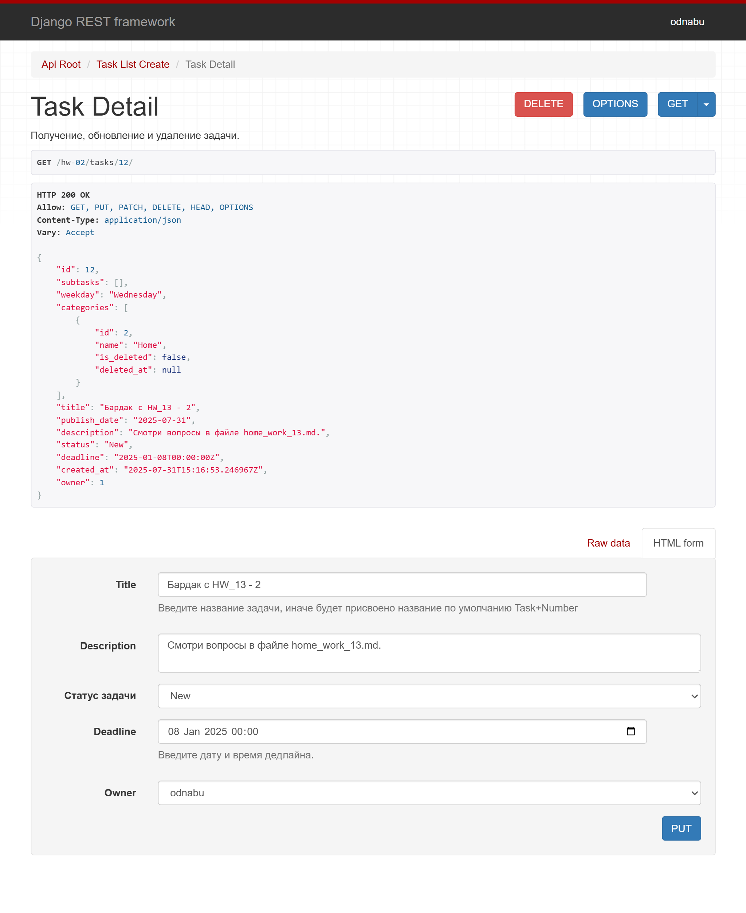<br>  

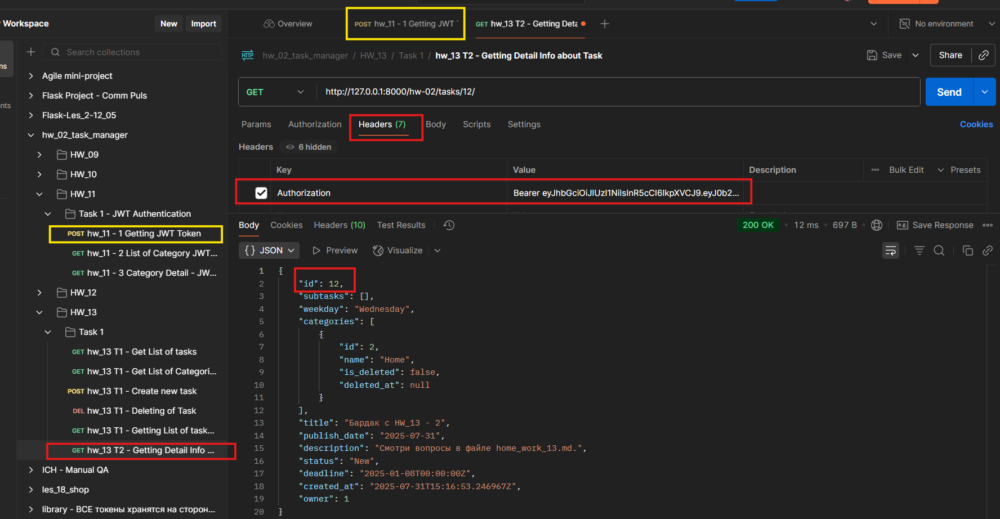

<m id="img2.1" style="margin: 40px; color:#606060;">Fig. 2.1. Выполнение POST-запроса в Postman для получения JWT-токена.</m>

<div style="font: bold normal 110% sans-serif; color: #8A2BE2; white-space: pre; border-top: 2px dotted #008000; padding: 5px;"></div>  


## <m id="s3" style="color: #008000">3. Swagger & Redoc</m>  

Все Permissions для документации прописывается в <a>DjangoProject_config / urls.py</a>. 
Если обновление страницы выдает "401 Unauthorized", просто проверить в браузере в режиме "ИНКОГНИТО": 
если в этом режиме открывается страница со Swagger, значит все в порядке (см. [документацию](http://drf-spectacular.readthedocs.io/en/latest/settings.html) по библиотеке).  
URLS:  
- http://127.0.0.1:8000/swagger/.
- http://127.0.0.1:8000/redoc/.

<div style="font: bold normal 110% sans-serif; color: #8A2BE2; white-space: pre; border-top: 2px dotted #008000; padding: 5px;"></div>  


## <m id="s4" style="color: #008000">4. ИТОГ</m>    
По результатам выполнения заданий:  
- Все новые задачи и подзадачи сохраняют текущего пользователя.
- Пользователь может видеть только свои задачи в `/tasks/my/`.
- Только владелец может редактировать и удалять свои задачи и подзадачи.
- Все запросы защищены JWT-аутентификацией.

<div style="font: bold normal 110% sans-serif; color: #8A2BE2; white-space: pre; border-top: 2px dotted #008000; padding: 5px;"></div>  


## <m id="s4" style="color: #008000">4. GitHub</m>
- Запуште проект в Git-репозиторий и прикрепите как решение ссылку на него.

Ссылка на отчет по ДЗ <a>home_work_12.md</a> со скриншотами: .  

Ссылка на приложение по ДЗ <a>hw_02_task_manager</a>: https://github.com/odnabu/Django-Python-Advanced/tree/main/hw_02_task_manager.  

Ссылка на весь проект <a>DjangoProject</a>: https://github.com/odnabu/Django-Python-Advanced/tree/main.  


<div style="font: bold normal 110% sans-serif; color: #8A2BE2; white-space: pre; border-top: 2px dotted #8A2BE2; padding: 5px; margin: 40px 0 40px 0"></div>

[//]: # ([<font color="#696969">[1 - ▶  Video 22, 48:00]</font>]&#40;#v1&#41;)
[//]: # ([<font style="color: #606060;">[2, слайд 32]</font>]&#40;#p1&#41;)

[//]: # (<div style="margin: 40px 0 40px 0"></div>)

[//]: # (<m style="color: #8A2BE2; margin: 20px 40px; padding: 5px; background: #000000;">▣ ⚜️ ☑️ ✔️ 🟪 ■ ※ ⁂ ⁙ ⁘ ⨠  ■ ◲◳ ◆ ◇ ◈ ◀ ▶ ◁ ▷ ▹ ▼ ▲ ▽ △ ▢ ₪₪₪</m>   )  

[//]: # (<div style="font: small-caps 120% sans-serif; color: #8A2BE2; margin: 0 0 0 0px; padding: 0 15px 0 0;">▣ &nbsp;&nbsp; Выполните запросы:</div>  )
[//]: # (🔷🔹 🟩 ❇️♾️⚜️✳️❎✅☑️✔️🟪🔳🔲  )
[//]: # (■ ⁜ ※ ⁂ ⁙ ⁘ ⫷ ⫸ ⩕ ⨠ ⨝ ⋘ ⋙ ∵ ∴ ∶ ∷ ■ ◪ ◩ ◲ ◳ ◆ ◇ ◈ ▼ ▽ ◀ ▶ ◁ ▷ ▹ ▲ △ ▢ ₪₪₪  )


[//]: # (<div style="color: #F00000; margin: 40px 20px 20px 0;">)

[//]: # (<m style="border: 2px solid #6B0000; padding: 10px;"> NB ! </m>)

[//]: # (</div>)


[//]: # (&nbsp;&nbsp; spaces)
[//]: # (<div style="font: small-caps 120% sans-serif; color: #8A2BE2; padding: 0 15px 0 0;">▣ &nbsp;&nbsp; Выполните запросы:</div>  )

[//]: # (<div style="font: bold normal 110% sans-serif; color: #8A2BE2; white-space: pre; border-top: 2px dotted #008000; padding: 5px;"></div>)


[//]: # (== RegEx в PyCharm ==)

[//]: # (Как найти все тексты между тегами <a>...</a> в PyCharm)

[//]: # (1️⃣ Открой нужный файл в PyCharm.)

[//]: # (2️⃣ Нажми Ctrl + F — откроется строка поиска.)

[//]: # (3️⃣ Нажми на .∗ значок ".*", чтобы включить режим RegEx &#40;регулярных выражений&#41;.)

[//]: # (4️⃣ Введи такой шаблон:)

[//]: # (<a>&#40;.*?&#41;</a>)

[//]: # (📌 Что означает шаблон:)

[//]: # (- <a> и </a> — буквально ищем открывающий и закрывающий теги.)

[//]: # (- &#40;.*?&#41; — захватывает любой текст между ними, включая кириллицу, пробелы и спецсимволы.)

[//]: # (- ? — делает захват нежадным, чтобы не схватывало всё сразу до последнего </a>.)

[//]: # (✨ Хочешь выделить или заменить текст?)

[//]: # (Если ты нажмёшь Ctrl + Shift + R — откроется Поиск и замена по шаблону.)

[//]: # (Можно заменить на, например:)

[//]: # ([ссылка: \1])

[//]: # ( \1 — это то, что попало в скобки &#40;.*?&#41;.)


