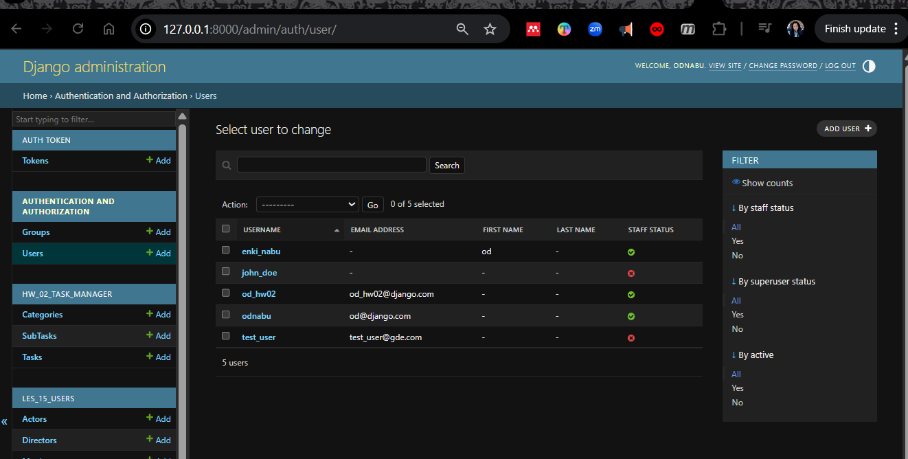
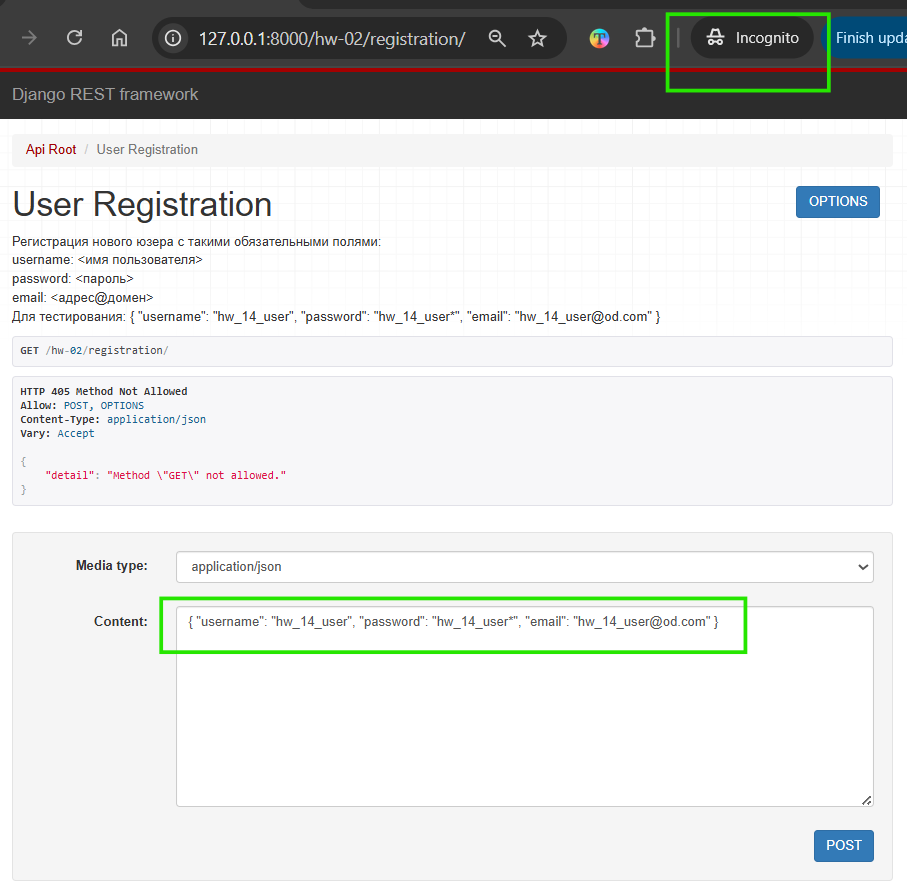
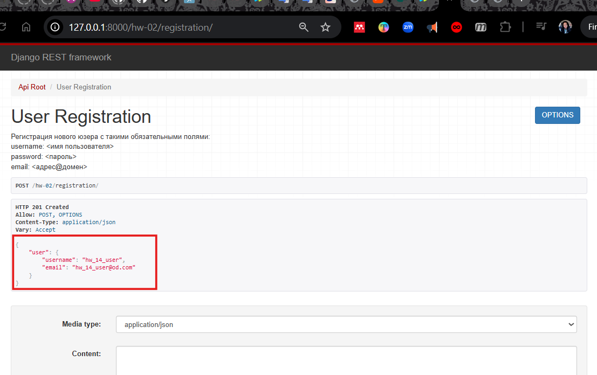
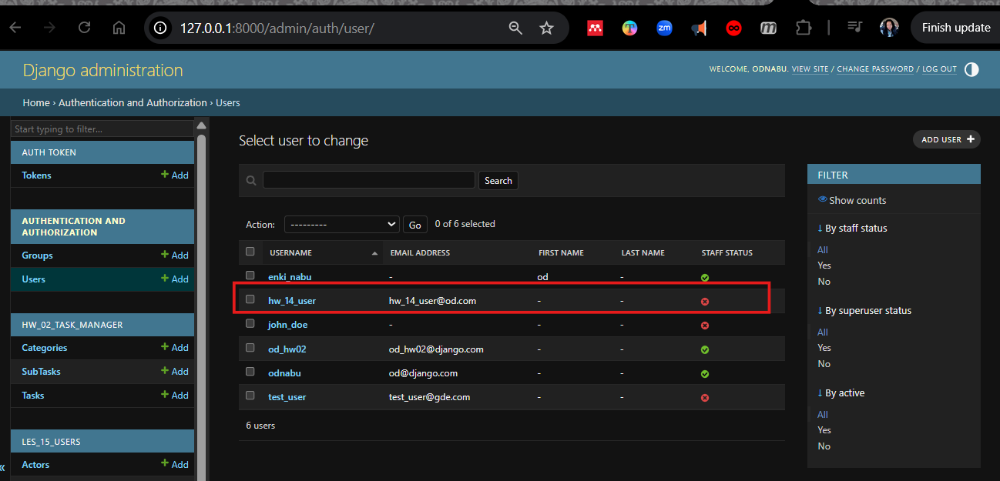
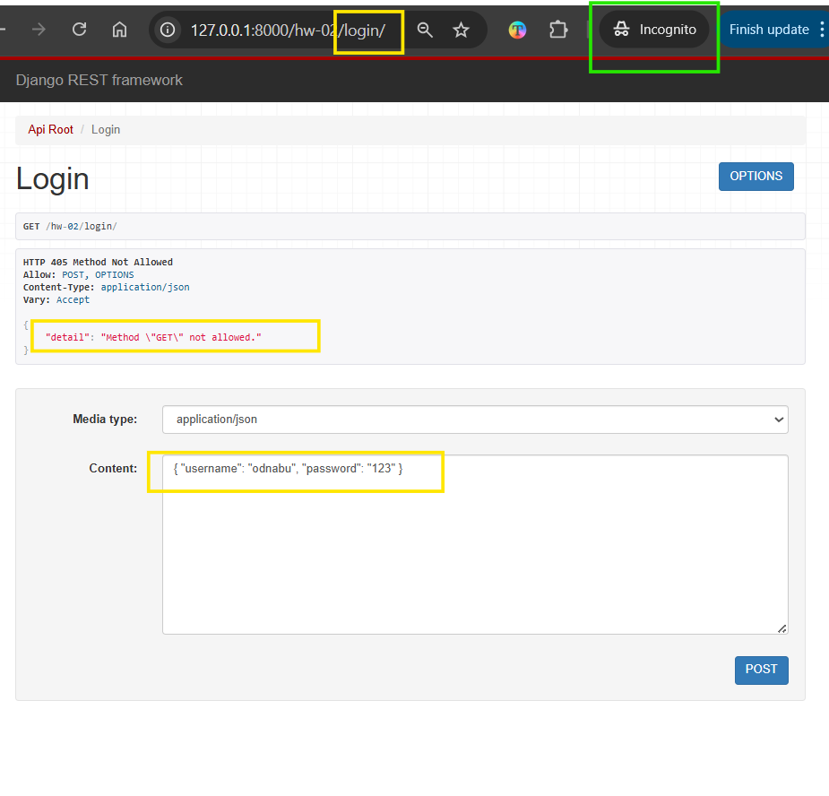
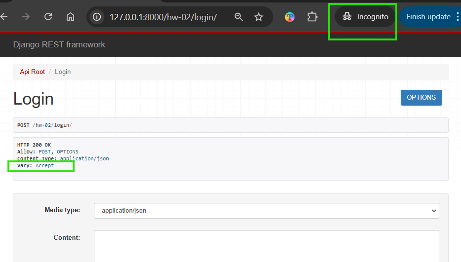
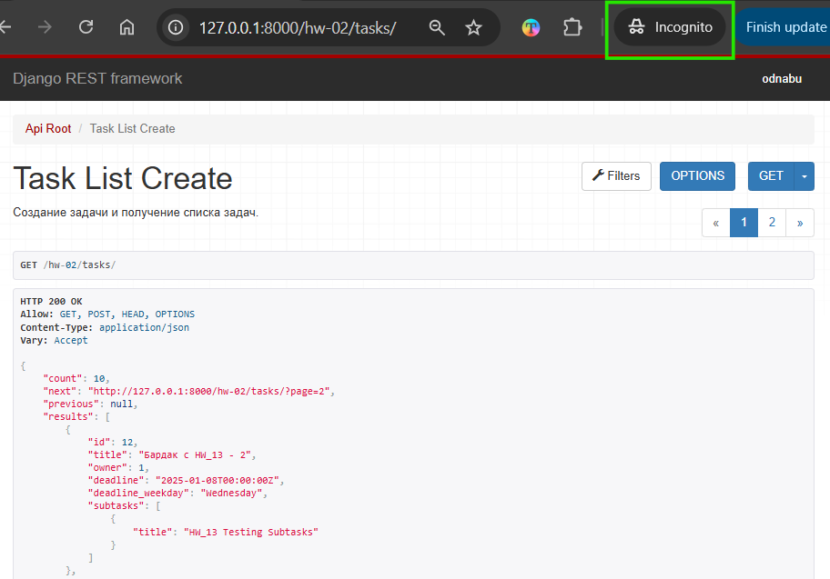
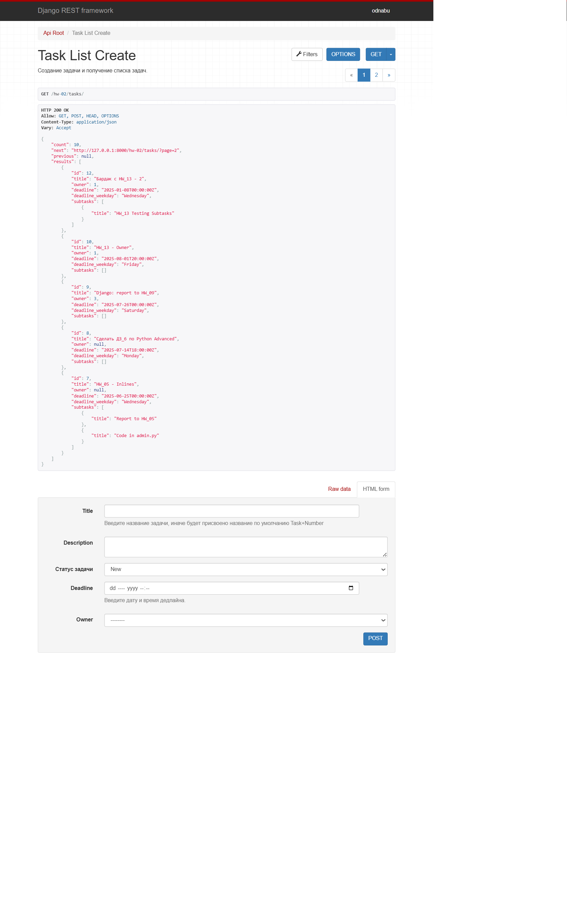
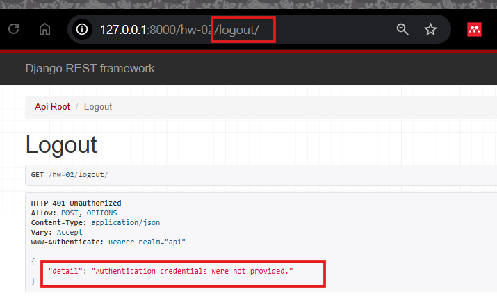
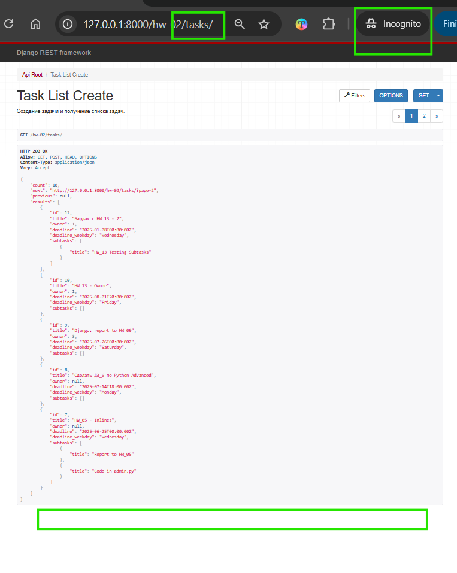

VIDEO - Python Adv 36: Практикум 10	Python Advanced	Bandylo Viacheslav	24.07.2025, 2:00:24.
---

Python Advanced - Django  
31.07.2025

## <div style="color: #9000F0">Домашнее задание 20 (14 in Django): <br> Проект "Менеджер задач" — <br> Работа с логином и регистрацией.</div>    
  

###  Задание 1.  Регистрация пользователя  
Реализовать механизм регистрации пользователя в системе, учесть:  
- Обязательная валидация полей (проверка наличия, формат, уникальность email/логина).  
- Реализация минимальных требований к сложности пароля.  
- Хэширование и сохранение пароля в БД.  

###  Задание 2. Вход в аккаунт   
Реализовать механизм входа в аккаунт. Проверять правильность вводимых данных и наличие пользователя.  
Если пользователь присутствует и данные входа валидны - возвращать JWT access и refresh токены.  

В функционале должно быть учтено:  
- Проверка корректности вводимых данных и существования пользователя.
- При успешной аутентификации – возвращение JWT access и refresh токенов.
- Безопасное хранение токенов на клиенте (`httpOnly cookies`) и механизм обновления `access`-токена 
через `refresh`-токен, с возможностью аннулирования.

###  Задание 3.  Выход из аккаунта  
Реализовать механизм выхода из аккаунта. При выходе из текущего аккаунта токены должны 
помещаться в `blacklist` и удаляться.

<div style="font: bold normal 110% sans-serif; color: #8A2BE2; white-space: pre; border-top: 2px dotted #008000; padding: 5px;"></div>  


### <m style="color: #008000">Источники</m>  
<m style="color: #606060">ОСНОВНОЕ Видео - урок от *25.07.2025*</m>  [<font color="#696969">[2 - ▶  Video 38, c 17:30]</font>](#v1).  
[1] ▶ Video 36 _"Python Adv 36: Практикум 10"_ (2:00:24), *24.07.2025* начиная 
<m style="color: red">c 19:30</m>: <m id="v1">https://player.vimeo.com/video/1104118811?h=0528f86959</m>.  
[2] ▶ Video 38 _"Python Adv 38: Сигналы в Django. Настройка параметров электронной почты)"_ (1:37:49), *25.07.2025* начиная 
<m style="color: red">c 17:30</m>: <m id="v2">https://player.vimeo.com/video/1104431422?h=837d17d86d</m>.  
[3] Presentation 33 _"Автоматическое использование JWT. Логин и регистрция с JWT"_. 
<a id="p1">Les37-Python Adv_33-Register_User-JWT-25_07.pdf</a>. 
<m style="color: #606060">——▷  Автоматическое использование JWT токенов. Регистрация пользователя с использованием JWT</m>.   
[4] Conspectus 33 "Урок 33. Автоматическое использование JWT. Логин и регистрция с JWT" <a id="c1">Les37-Python Adv_33---Register_User-JWT-25_07.pdf</a>.  
[5] Приложение **home_work_13**: файл <m id="hw7">home_work_13.md</m>.  
[6] Руководство по оформлению Markdown файлов: https://gist.github.com/Jekins/2bf2d0638163f1294637.  
[7] Шпаргалка по Markdown: https://gist.github.com/fomvasss/8dd8cd7f88c67a4e3727f9d39224a84c.


<div style="font: bold normal 110% sans-serif; color: #8A2BE2; white-space: pre; border: 2px outset #8A2BE2; margin: 60px 0 40px 0; padding: 5px 0 5px 25px;">ОТЧЕТ</div>


### <m style="color: #008000">Миграции</m>  

<div style="margin: 40px 20px 20px 0;">
<m style="color: #F00000; border: 2px solid #6B0000; padding: 10px;"> NB ! </m> 
<b style="color: #F00000; padding: 5px;">!!! ВСЕГДА</b> после изменения в моделях (НЕ в сериализаторе) выполнять и применять миграции.
<p style="margin: 0 0 0 55px;"><b style="color: #F00000; padding: 5px;">ПРИМЕНЯТЬ</b> миграции так же нужно в ситуациях:
<p style="margin: 0 0 0 70px;">1. Склонирован/получен проект с миграциями.
<p style="margin: 0 0 0 70px;">2. Применения уже готовых .py-файлы миграций.
<p style="margin: 0 0 0 70px;">3. На сервере (или в другом окружении).
<p style="margin: 0 0 0 70px;">4. После восстановления базы данных нужно применить все миграции.
<p style="margin: 0 0 0 70px;"><b style="color: #F00000;">5.</b> После изменения настроек БД или установки приложения. 
Например, добавления в файл настроек нового приложения, предоставляющего токен. 
</div>  

Детально, когда нужно выполнять `python manage.py migrate` БЕЗ `makemigrations` см. тут [ChatGPT](https://chatgpt.com/s/t_6887c91d9ad481919a0d65104ad52b99).

Запускать команды `python manage.py shell`, `migrate`, `runserver` — находясь в корне проекта, рядом с <a>manage.py</a>
  (см. [<font color="#696969">[8 - hw_10]</font>](#hw6)).

После изменений в МОДЕЛЯХ сделать и применить миграции [<font color="#696969">[1 - ▶  Video 20, 57:60]</font>](#v1):  
```bash
    python manage.py makemigrations hw_02_task_manager
    python manage.py migrate hw_02_task_manager
```
Запустить локальный сервер Django с помощью <a>manage.py</a> в терминале [<font color="#696969">[1 - ▶  Video 20, 57:60]</font>](#v1):  
```bash
   python manage.py runserver
```

<div style="font: bold normal 110% sans-serif; color: #8A2BE2; white-space: pre; border-top: 2px dotted #008000; padding: 5px;"></div>  


### <span style="font: small-caps 110% sans-serif; color: #008000; padding: 0 15px 0 0;">▣ &nbsp;&nbsp;Цели в ходе реализации заданий:</span>  
Реализация логики регистрации, логина и выхода пользователя на JWT-аутентификации с использованием SimpleJWT.  
Как пример реализации см. приложение <a>les_18_shop</a>.

- [x] проверить актуальность библиотеки`djangorestframework-simplejwt`, если нет - установить;
- [x] проверить подключение встроенной модели пользователя `User` из Django в моделях приложения (см. <a>home_work_13.md</a>)
для регистрации пользователя;
- [X] добавить код Сериализатора `UserRegisterSerializer` для регистрации пользователя;
- [x] добавить код представления `UserRegistrationView` регистрации пользователя;
- [x] добавить код представления `LoginView` для логина, установка токенов в `httpOnly`-cookies;
- [x] проверить подключение `Blacklist` в `INSTALLED_APPS` в <a>DjangoProject_config / settings.py</a>;
- [x] выполнить миграции;
- [x] добавить код представления `LogoutView` выхода из логина;
- [x] добавить роутинги (маршруты) для регистрации, логина и выхода из логина в <a>hw_02_task_manager / urls.py</a>.

<div style="font: bold normal 110% sans-serif; color: #8A2BE2; white-space: pre; border-top: 2px dotted #008000; padding: 5px;"></div>  


## <m id="s1" style="color: #008000">1. Регистрация пользователя</m>  

<div style="margin: 20px 20px 20px 0;">
<b style="color: #F00000; border: 2px solid #6B0000; display: inline-block; padding: 10px; margin: 0 10px 0 0;"> NB ! </b>Так как на консультации 1 от 28.07.2025 пофиксили проблемы с обновлением токена 
в <a>DjangoProject_config / middleware.py</a> для Аутентификации и Авторизации для всего проекта благодаря 
решению Макса Полякова, то теперь в настройках <m style="color: limegreen">config /</m> <a>settings.py</a> 
и в <m style="color: limegreen">config /</m> <a>urls.py</a> можно не отключать опцию, связанную с Аутентификацией.
</div>

Описание реализации этого задания по шагам смотри в:  
1. записи урока [<font color="#696969">[1 - ▶  Video 36]</font>](#v1) начиная <m style="color: red">c 19:30</m>.
2. тексте презентации и конспекте (начало) [<font color="#696969">[3, s. 7]</font>](#p1), 
[<font color="#696969">[4, p. 2]</font>](#c1).
3. решении для этой задачи от [ChatGPT](https://chatgpt.com/s/t_688c3fb668bc8191972add52dbee516e).  
4. примере реализации для [models.py, views.py etc. to "library" from V. Bandylo on GitHub](https://github.com/viacheslav-bandylo/111124-projects/blob/main/library/models.py). 


<div style="font: small-caps 120% sans-serif; color: #9000F0; padding: 0 15px 0 0;">▣ &nbsp;&nbsp; ТЕОРИЯ</div>

<m style="color: #9000F0">Пользовательские Permissions</m> - позволяют определить уникальные разрешения, 
которые могут быть специфичны для требований приложения [<font color="#696969">[4, p. 2]</font>](#c1). 
Эти разрешения могут быть добавлены к моделям и использоваться для контроля доступа к определенным действиям, 
которые не покрываются стандартными разрешениями (view, add, change, delete).  
Для добавления пользовательских permissions к модели, необходимо использовать атрибут `Meta` в классе модели.  

<m style="color: #9000F0">JWT (JSON Web Token)</m> - компактный, URL-безопасный способ передачи утверждений 
между двумя сторонами. Используется для аутентификации пользователей в API.  
<m style="color: #9000F0">Структура JWT:</m>  
1. Заголовок (`header`): Содержит метаданные, такие как тип токена и алгоритм шифрования.
2. Полезная нагрузка (`payload`): Содержит утверждения и другую информацию о пользователе.
3. Подпись (`signature`): Подписывает токен, чтобы убедиться, что он не был изменен.

---

### <m id="ss1.1" style="color: #008000">1.1. Сериализатор для регистрации пользователя</m>  
Смотри пример <a>les_18_shop / serializers.py</a>  "24.07.2025 - Video "Python Adv 36: Практикум 10", 
Les 38, Lec 33: Регистрация пользователя с JWT" (см.так же [<font color="#696969">[1 - ▶  Video 36, \_:\_]</font>](#v1)).  

Поскольку в моделях уже было обращение к встроенной модели User в <a>home_work_13.md</a>, то можно сразу 
переходит к коду Сериализатора для регистрации пользователя:
```python
class UserRegisterSerializer(serializers.ModelSerializer):
    ...
```

---

### <m id="ss1.2" style="color: #008000">1.2. Представление для регистрации пользователя</a>
После добавить код представления регистрации пользователя:
```python
class UserRegistrationView(APIView):
    """
    Регистрация нового юзера с такими обязательными полями:
    username: <имя пользователя>
    password: <пароль>
    email: <адрес@домен>
    Для тестирования: { "username": "hw_14_user", "password": "hw_14_user*", "email": "hw_14_user@od.com" }
    """
    ...
```

---

### <m id="ss1.3" style="color: #008000">1.3. Роутинг для регистрации</m>   

```python
urlpatterns += [
    # les_18_shop/urls.py --> 24.07.2025 - Les 38 (Les 37 in the list of Module), Lec 33: Регистрация пользователя с JWT
    # { "username": "hw_14_user", "password": "hw_14_user*", "email": "hw_14_user@od.com" }
    path('registration/', UserRegistrationView.as_view(), name='task-project-registration'),
]
```
---

### <m id="ss1.4" style="color: #008000">1.4. Проверка работы кода для регистрации пользователя</m>

<br>  

<br>  

<br>  

  

<m id="img1.1" style="margin: 40px; color:#606060;">Fig. 1.1. Регистрация нового пользователя в браузере 
в режиме "ИНКОГНИТО" по url: http://127.0.0.1:8000/hw-02/registration/.</m>

<div style="font: bold normal 110% sans-serif; color: #8A2BE2; white-space: pre; border-top: 2px dotted #008000; padding: 5px;"></div>  


## <m id="s2" style="color: #008000">2. Вход в аккаунт</m>    

### <m id="ss2.1" style="color: #008000">2.1. Реализация логирования в коде</m>  
Смотри п. 1, там все ссылки на примеры реализации. По факту нужно лишь добавить код для представления:
```python
class LoginView(APIView):
    """
    Ввод username и password.
    Для тестирования: { "username": "odnabu", "password": "123" }
    """
    ...
```

А после прописать маршрут:
```python
urlpatterns += [
    # les_18_shop/urls.py --> 24.07.2025 - Les 37, Lec 33: Автосохранение и автоиспользование JWT токенов
    # Реализация логина с сохранением токенов в куки:  { "username": "odnabu", "password": "123" }
    path('login/', LoginView.as_view(), name='task-project-login'),
]
```
---

### <m id="ss2.2" style="color: #008000">2.2.  Проверка работы кода для залогинивания</m>  

<br>  

<br>  

<br>  



<m id="img2.1" style="margin: 40px; color:#606060;">Fig. 2.1. Залогинивание в приложении по url: http://127.0.0.1:8000/hw-02/login/.</m>

<div style="font: bold normal 110% sans-serif; color: #8A2BE2; white-space: pre; border-top: 2px dotted #008000; padding: 5px;"></div>  


## <m id="s3" style="color: #008000">3. Выход из аккаунта</m>  

<br>  



<m id="img2.2" style="margin: 40px; color:#606060;">Fig. 2.2. Выход из логина по url: http://127.0.0.1:8000/hw-02/logout/.</m>

<div style="font: bold normal 110% sans-serif; color: #8A2BE2; white-space: pre; border-top: 2px dotted #008000; padding: 5px;"></div>  


## <m id="s4" style="color: #008000">4. GitHub</m>
- Запуште проект в Git-репозиторий и прикрепите как решение ссылку на него.

Ссылка на отчет по ДЗ <a>home_work_14.md</a> со скриншотами: https://github.com/odnabu/Django-Python-Advanced/blob/main/hw_02_task_manager/home_work_14.md.  

Ссылка на приложение по ДЗ <a>hw_02_task_manager</a>: https://github.com/odnabu/Django-Python-Advanced/tree/main/hw_02_task_manager.  

Ссылка на весь проект <a>DjangoProject</a>: https://github.com/odnabu/Django-Python-Advanced/tree/main.  


<div style="font: bold normal 110% sans-serif; color: #8A2BE2; white-space: pre; border-top: 2px dotted #8A2BE2; padding: 5px; margin: 40px 0 40px 0"></div>

[//]: # ([<font color="#696969">[1 - ▶  Video 22, 48:00]</font>]&#40;#v1&#41;)
[//]: # ([<font style="color: #606060;">[2, слайд 32]</font>]&#40;#p1&#41;)

[//]: # (<div style="margin: 40px 0 40px 0"></div>)

[//]: # (<m style="color: #8A2BE2; margin: 20px 40px; padding: 5px; background: #000000;">▣ ⚜️ ☑️ ✔️ 🟪 ■ ※ ⁂ ⁙ ⁘ ⨠  ■ ◲◳ ◆ ◇ ◈ ◀ ▶ ◁ ▷ ▹ ▼ ▲ ▽ △ ▢ ₪₪₪</m>   )  

[//]: # (<div style="font: small-caps 120% sans-serif; color: #8A2BE2; margin: 0 0 0 0px; padding: 0 15px 0 0;">▣ &nbsp;&nbsp; Выполните запросы:</div>  )
[//]: # (🔷🔹 🟩 ❇️♾️⚜️✳️❎✅☑️✔️🟪🔳🔲  )
[//]: # (■ ⁜ ※ ⁂ ⁙ ⁘ ⫷ ⫸ ⩕ ⨠ ⨝ ⋘ ⋙ ∵ ∴ ∶ ∷ ■ ◪ ◩ ◲ ◳ ◆ ◇ ◈ ▼ ▽ ◀ ▶ ◁ ▷ ▹ ▲ △ ▢ ₪₪₪  )


[//]: # (<div style="color: #F00000; margin: 40px 20px 20px 0;">)

[//]: # (<m style="border: 2px solid #6B0000; padding: 10px;"> NB ! </m>)

[//]: # (</div>)


[//]: # (&nbsp;&nbsp; spaces)
[//]: # (<div style="font: small-caps 120% sans-serif; color: #8A2BE2; padding: 0 15px 0 0;">▣ &nbsp;&nbsp; Выполните запросы:</div>  )

[//]: # (<div style="font: bold normal 110% sans-serif; color: #8A2BE2; white-space: pre; border-top: 2px dotted #008000; padding: 5px;"></div>)


[//]: # (== RegEx в PyCharm ==)

[//]: # (Как найти все тексты между тегами <a>...</a> в PyCharm)

[//]: # (1️⃣ Открой нужный файл в PyCharm.)

[//]: # (2️⃣ Нажми Ctrl + F — откроется строка поиска.)

[//]: # (3️⃣ Нажми на .∗ значок ".*", чтобы включить режим RegEx &#40;регулярных выражений&#41;.)

[//]: # (4️⃣ Введи такой шаблон:)

[//]: # (<a>&#40;.*?&#41;</a>)

[//]: # (📌 Что означает шаблон:)

[//]: # (- <a> и </a> — буквально ищем открывающий и закрывающий теги.)

[//]: # (- &#40;.*?&#41; — захватывает любой текст между ними, включая кириллицу, пробелы и спецсимволы.)

[//]: # (- ? — делает захват нежадным, чтобы не схватывало всё сразу до последнего </a>.)

[//]: # (✨ Хочешь выделить или заменить текст?)

[//]: # (Если ты нажмёшь Ctrl + Shift + R — откроется Поиск и замена по шаблону.)

[//]: # (Можно заменить на, например:)

[//]: # ([ссылка: \1])

[//]: # ( \1 — это то, что попало в скобки &#40;.*?&#41;.)


