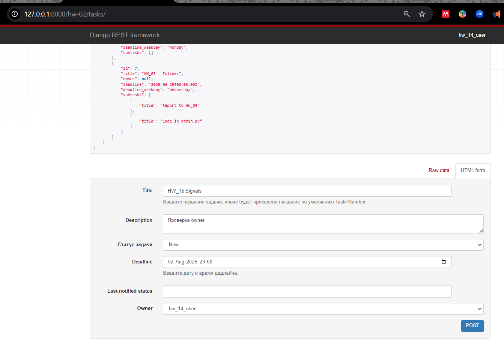
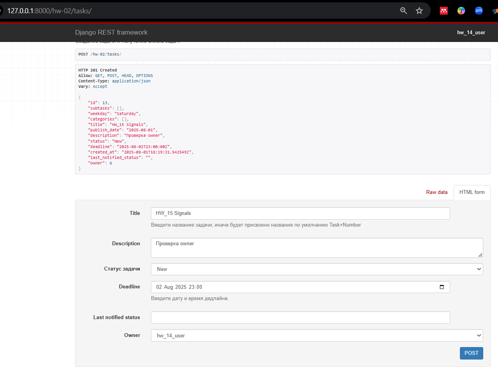
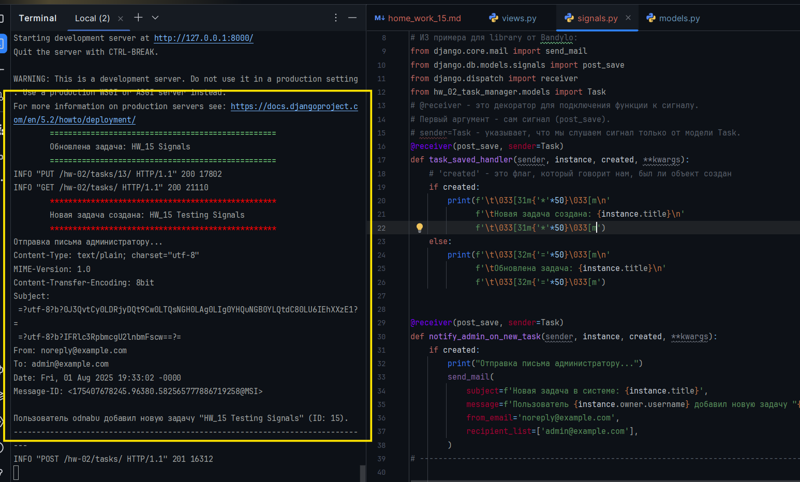

Python Advanced - Django  
1.08.2025

## <div style="color: #9000F0">Домашнее задание 21 (15 in Django): <br> Проект "Менеджер задач" — Сигналы.</div>    
  

###  Задание 1.  Реализуйте сигналы на закрытие и перевода статусов у главных задач  
Если задача переходит в новый статус, или закрывается - тот, кому принадлежит эта задача должен 
получать Email уведомление на свою почту.  
Используйте Базовый тестовый Django сервер, который будет выводить шаблон сообщения в консоль.  
Добавить проверку, чтобы уведомление не отправлялось повторно при последовательных изменения статуса, 
если это нежелательно.  

<div style="font: bold normal 110% sans-serif; color: #8A2BE2; white-space: pre; border-top: 2px dotted #008000; padding: 5px;"></div>  


### <m style="color: #008000">Источники</m>  
<m style="color: #606060">Видео - урок от *25.07.2025*</m>  [<font color="#696969">[1 - ▶  Video 39, c 1:04:20]</font>](#v1).  
[1] ▶ Video 39 _"Python Adv 39: Summary session 8"_ (2:12:20), *25.07.2025* начиная 
<m style="color: red">c 1:04:20</m>: <m id="v1"></m>.  
[2] Presentation 34 _"Сигналы. Параметры электронной почты"_. <a id="p1">Les38-Python Adv_34-Сигналы в Django-25_07.pdf</a>. 
<m style="color: #606060">——▷  Основные и Встроенные сигналы. Обработчики сигналов. Прием сигналов. 
Декоратор `@receiver` или метод `connect`. Настройка параметров электронной почты.</m>.   
[3] Conspectus 34 _"Сигналы. Параметры электронной почты"_ <a id="c1">Les38-Python Adv_34---Сигналы в Django-25_07.pdf</a>.  
[5] Приложение **home_work_14**: файл <m id="hw7">home_work_14.md</m>.  
[5] Руководство по оформлению Markdown файлов: https://gist.github.com/Jekins/2bf2d0638163f1294637.  
[6] Шпаргалка по Markdown: https://gist.github.com/fomvasss/8dd8cd7f88c67a4e3727f9d39224a84c.

<div style="font: bold normal 110% sans-serif; color: #8A2BE2; white-space: pre; border: 2px outset #8A2BE2; margin: 60px 0 40px 0; padding: 5px 0 5px 25px;">ОТЧЕТ</div>

### <span style="font: small-caps 110% sans-serif; color: #008000; padding: 0 15px 0 0;">▣ &nbsp;&nbsp;Цели в ходе реализации заданий:</span>  
Как пример реализации сигналов см. приложение [signals.py in "library" by Bandylo](https://github.com/viacheslav-bandylo/111124-projects/tree/main/library).  
Когда статус задачи меняется (например, с "New" на "In Progress", или "Done"), 
отправить владельцу задачи email-уведомление. При этом:
- [] Использование сигнала `post_save`.
- [] Проверка, изменился ли статус.
- [] Проверка, не отправлялось ли уведомление на тот же статус ранее.
- [] Отправление email с помощью тестового SMTP-сервера (в консоль).

<div style="font: bold normal 110% sans-serif; color: #8A2BE2; white-space: pre; border-top: 2px dotted #008000; padding: 5px;"></div>  


## <m id="s1" style="color: #008000">1. Настройка email-конфигурации в </m> <a>settings.py</a>  

<div style="margin: 20px 20px 20px 0;">
<b style="color: #F00000; border: 2px solid #6B0000; display: inline-block; padding: 10px; margin: 0 10px 0 0;"> NB ! </b>Так как на консультации 1 от 28.07.2025 пофиксили проблемы с обновлением токена 
в <a>DjangoProject_config / middleware.py</a> для Аутентификации и Авторизации для всего проекта благодаря 
решению Макса Полякова, то теперь в настройках <m style="color: limegreen">config /</m> <a>settings.py</a> 
и в <m style="color: limegreen">config /</m> <a>urls.py</a> можно не отключать опцию, связанную с Аутентификацией.
</div>

Описание реализации этого задания по шагам смотри в:  
1. записи урока [<font color="#696969">[1 - ▶  Video 39]</font>](#v1) начиная <m style="color: red">c 1:04:20</m>.
2. тексте презентации и конспекте (начало) [<font color="#696969">[3, s. 7]</font>](#p1), 
[<font color="#696969">[4, p. 2]</font>](#c1).
3. решении для этой задачи от [ChatGPT](https://chatgpt.com/s/t_688cfcfde3788191bb5883dc9032f040).  
4. примере реализации для [models.py, views.py etc. to "library" from V. Bandylo on GitHub](https://github.com/viacheslav-bandylo/111124-projects/blob/main/library/models.py). 

В файл настроек <a>settings.py</a> добавить переменные:
```python
EMAIL_BACKEND = 'django.core.mail.backends.console.EmailBackend'  # email выводится в консоль
EMAIL_HOST_USER = 'noreply@taskmanager.local'  # От кого отправлять письма
```

<div style="font: bold normal 110% sans-serif; color: #8A2BE2; white-space: pre; border-top: 2px dotted #008000; padding: 5px;"></div>  


## <m id="s2" style="color: #008000">2. Добавление поля `last_notified_status` в модель `Task`</m>    
В <a>models.py</a> в модель `Task` добавить код:
```python
class Task(models.Model):
    ...
    status = models.CharField(max_length=20, choices=STATUS_CHOICES, default='New')
    owner = models.ForeignKey(User, on_delete=models.SET_NULL, null=True, related_name='owned_tasks')

    # Новое поле для хранения последнего уведомленного статуса
    last_notified_status = models.CharField(max_length=20, blank=True, null=True)
```
<b style="color: #F00000; border: 2px solid #6B0000; display: inline-block; padding: 10px; margin: 0 10px 0 0;"> NB ! </b> Выполнить и применить МИГРАЦИИ!
<p>

<div style="font: bold normal 110% sans-serif; color: #8A2BE2; white-space: pre; border-top: 2px dotted #008000; padding: 5px;"></div>  


## <m id="s3" style="color: #008000">3. Файл <a>signals.py</a> и подключение сигнала</m>
Добавить код в файл.

Прописать в <a>hw_02_task_manager/apps.py</a> команду:
```python
from django.apps import AppConfig

class Hw02TaskManagerConfig(AppConfig):
    default_auto_field = 'django.db.models.BigAutoField'
    name = 'hw_02_task_manager'

    # Этот метод вызывается, когда Django полностью загрузит приложение
    def ready(self):
        import hw_02_task_manager.signals  # Импортируем наш модуль с сигналами
```

В файл <a>hw_02_task_manager / views.py</a> добавить представления для возможности редактирования задач 
как для владельцев `owner`, так и для администраторов `admin`:
```python
from rest_framework.permissions import BasePermission, SAFE_METHODS

class IsOwnerOrAdmin(BasePermission):
    """
    Разрешение на редактирование объекта владельцу или админу.
    """
    def has_object_permission(self, request, view, obj):
        # Разрешаем безопасные методы всем
        if request.method in SAFE_METHODS:
            return True
        # Разрешаем редактирование владельцу или админу
        return obj.owner == request.user or request.user.is_staff
```

<div style="font: bold normal 110% sans-serif; color: #8A2BE2; white-space: pre; border-top: 2px dotted #008000; padding: 5px;"></div>  


## <m id="s4" style="color: #008000">4. Проверка в браузере и в консоли</m>

1. Создать задачу (`POST`-запрос в `/tasks/`), указать owner с email.
2. Обновить статус задачи на другой ( `PUT` или `PATCH`-запрос в  `/tasks/<id>/`).
3. В консоли появится email с уведомлением.
4. Обновить статус повторно на тот же — письмо не должно отправиться.

<br>  

<br>  



<m id="img1" style="margin: 40px; color:#606060;">Fig. 1. Результат подключения сигналов в приложение.</m>

<div style="font: bold normal 110% sans-serif; color: #8A2BE2; white-space: pre; border-top: 2px dotted #008000; padding: 5px;"></div>  


## <m id="s5" style="color: #008000">5. GitHub</m>
- Запуште проект в Git-репозиторий и прикрепите как решение ссылку на него.

Ссылка на отчет по ДЗ <a>home_work_15.md</a> со скриншотами: .  

Ссылка на приложение по ДЗ <a>hw_02_task_manager</a>: https://github.com/odnabu/Django-Python-Advanced/tree/main/hw_02_task_manager.  

Ссылка на весь проект <a>DjangoProject</a>: https://github.com/odnabu/Django-Python-Advanced/tree/main.  


<div style="font: bold normal 110% sans-serif; color: #8A2BE2; white-space: pre; border-top: 2px dotted #8A2BE2; padding: 5px; margin: 40px 0 40px 0"></div>

[//]: # ([<font color="#696969">[1 - ▶  Video 22, 48:00]</font>]&#40;#v1&#41;)
[//]: # ([<font style="color: #606060;">[2, слайд 32]</font>]&#40;#p1&#41;)

[//]: # (<div style="margin: 40px 0 40px 0"></div>)

[//]: # (<m style="color: #8A2BE2; margin: 20px 40px; padding: 5px; background: #000000;">▣ ⚜️ ☑️ ✔️ 🟪 ■ ※ ⁂ ⁙ ⁘ ⨠  ■ ◲◳ ◆ ◇ ◈ ◀ ▶ ◁ ▷ ▹ ▼ ▲ ▽ △ ▢ ₪₪₪</m>   )  

[//]: # (<div style="font: small-caps 120% sans-serif; color: #8A2BE2; margin: 0 0 0 0px; padding: 0 15px 0 0;">▣ &nbsp;&nbsp; Выполните запросы:</div>  )
[//]: # (🔷🔹 🟩 ❇️♾️⚜️✳️❎✅☑️✔️🟪🔳🔲  )
[//]: # (■ ⁜ ※ ⁂ ⁙ ⁘ ⫷ ⫸ ⩕ ⨠ ⨝ ⋘ ⋙ ∵ ∴ ∶ ∷ ■ ◪ ◩ ◲ ◳ ◆ ◇ ◈ ▼ ▽ ◀ ▶ ◁ ▷ ▹ ▲ △ ▢ ₪₪₪  )


[//]: # (<div style="color: #F00000; margin: 40px 20px 20px 0;">)

[//]: # (<m style="border: 2px solid #6B0000; padding: 10px;"> NB ! </m>)

[//]: # (</div>)


[//]: # (&nbsp;&nbsp; spaces)
[//]: # (<div style="font: small-caps 120% sans-serif; color: #8A2BE2; padding: 0 15px 0 0;">▣ &nbsp;&nbsp; Выполните запросы:</div>  )

[//]: # (<div style="font: bold normal 110% sans-serif; color: #8A2BE2; white-space: pre; border-top: 2px dotted #008000; padding: 5px;"></div>)


[//]: # (== RegEx в PyCharm ==)

[//]: # (Как найти все тексты между тегами <a>...</a> в PyCharm)

[//]: # (1️⃣ Открой нужный файл в PyCharm.)

[//]: # (2️⃣ Нажми Ctrl + F — откроется строка поиска.)

[//]: # (3️⃣ Нажми на .∗ значок ".*", чтобы включить режим RegEx &#40;регулярных выражений&#41;.)

[//]: # (4️⃣ Введи такой шаблон:)

[//]: # (<a>&#40;.*?&#41;</a>)

[//]: # (📌 Что означает шаблон:)

[//]: # (- <a> и </a> — буквально ищем открывающий и закрывающий теги.)

[//]: # (- &#40;.*?&#41; — захватывает любой текст между ними, включая кириллицу, пробелы и спецсимволы.)

[//]: # (- ? — делает захват нежадным, чтобы не схватывало всё сразу до последнего </a>.)

[//]: # (✨ Хочешь выделить или заменить текст?)

[//]: # (Если ты нажмёшь Ctrl + Shift + R — откроется Поиск и замена по шаблону.)

[//]: # (Можно заменить на, например:)

[//]: # ([ссылка: \1])

[//]: # ( \1 — это то, что попало в скобки &#40;.*?&#41;.)


