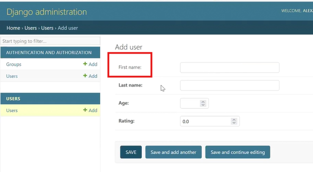

03.06.2025 
## Работа с моделями Django - 1

### Список Источников:  

1. Video 15.1, 9:20 (от 03.06.2025). Link: https://player.vimeo.com/video/1090076209?h=56080a1f80.
2. Презентация: \_ Python Advanced _\Les15-Django_15-Models-1.pdf.
3. Конспект: \_ Python Advanced _\Les15-Django_15---Models-1.pdf.


---

Создание приложения **users**:  
```
python .\manage.py startapp les_15_users
```

Создание 1-ой Модели:
1. В файле les_15_users/models.py добавить новый класс: 
```python
class User(models.Model):
```
2. ...

и т.д и т.п. по видео...


После внесения изменений в Модель (добавление свойств поля: null=True, blank=True) и 
последующей Миграции в Админке поле станет НЕжирным, это значит, что это поле 
можно оставить ПУСТЫМ:
  
<a id="img5" style="margin: 40px;">Fig. 1.</a>

```python
first_name = models.CharField(max_length=50, null=True, blank=True)
```
- null - в БД без значений.  
- blank - в ФОРМАХ без значений.  

После __СУЩЕСТВЕННЫХ__ изменений в МОДЕЛИ:  
```python
python manage.py makemigrations.
python manage.py migrate.
```

После НЕсущественных изменений, таких как добавление help_text или verbose_name,
выполнять команды в консоли для миграций НЕ обязательно.

```python
last_name = models.CharField(max_length=70, verbose_name='Family name')
```
verbose_name - то что будет ОТОБРАЖАТЬСЯ вместо Last Name.

