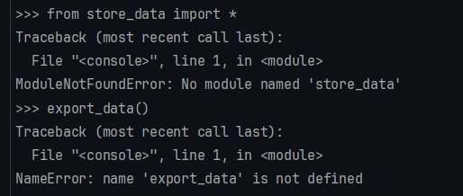
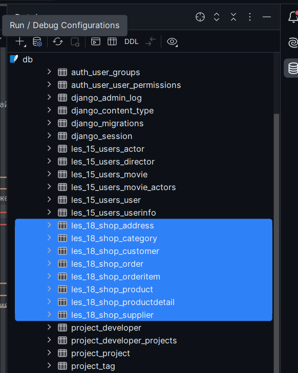
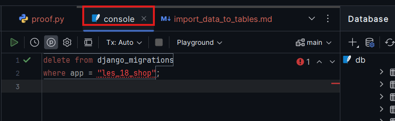
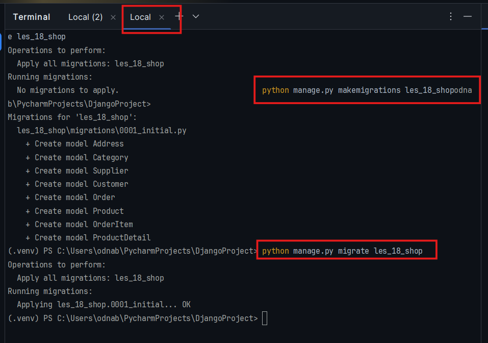
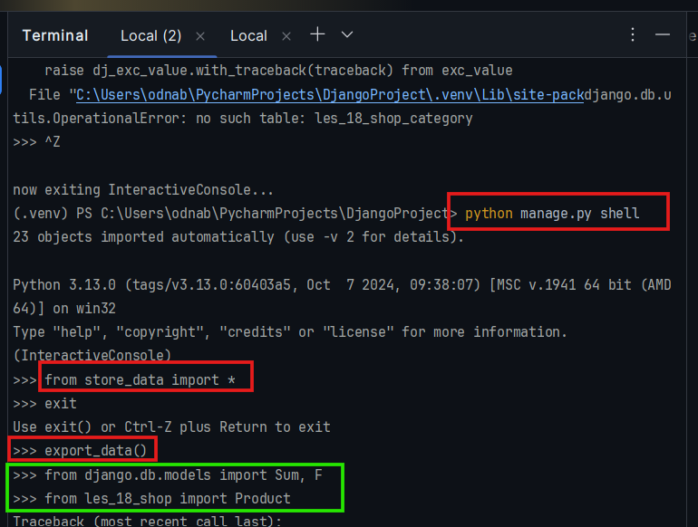
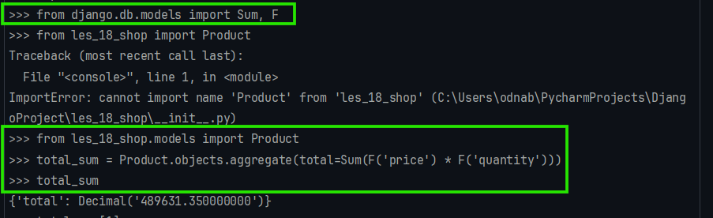
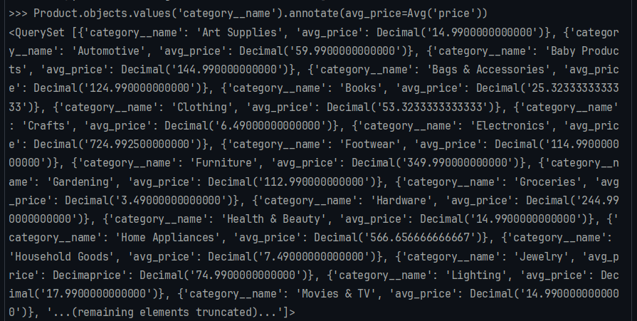
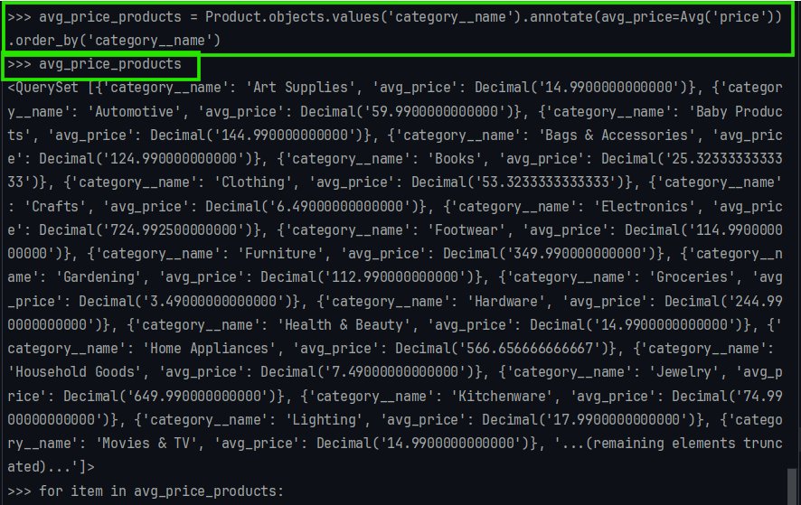

17.07.2025   
## <div style="color: #9000F0">Lesson 29, Practice 7</div>    
1-st Part of Lesson 29:
Presentation - <a>Les28-Django_Pr7.pdf</a>  
Conspectus - <a>Les28-Django_PrfS7.pdf</a>.  

[//]: # (2-nd Part of Lesson 29:)

[//]: # (Presentation - <a>Les28-Django_Pr8.pdf</a>  )

[//]: # (Conspectus - <a>Les28-Django_PrfS8.pdf</a>.  )


<div style="font: bold normal 110% sans-serif; color: #8A2BE2; white-space: pre; border-top: 2px dotted #008000; padding: 5px;"></div>  

### <span style="color: #008000">------</span>  


<div style="font: bold normal 110% sans-serif; color: #8A2BE2; white-space: pre; border-top: 2px dotted #008000; padding: 5px;"></div>  

<div style="margin: 20px 20px 20px 0;">
<b style="color: #F00000; border: 2px solid #6B0000; padding: 10px; margin: 0 10px 0 0;"> NB ! </b>
Если в Шелле <b style="color: red"> НЕ </b> выполняются команды импорта-экспорта данных
из файла в таблицы приложения:
</div>

  

<div style="color: dimgrey; margin: 0 0 0 40px; padding: 2px 10px 2px 10px; ">Fig. 1.</div>


  

<div style="color: dimgrey; margin: 0 0 0 40px; padding: 2px 10px 2px 10px; ">Fig. 2.</div>

  

<div style="color: dimgrey; margin: 0 0 0 40px; padding: 2px 10px 2px 10px; ">Fig. 3.</div>

  

<div style="color: dimgrey; margin: 0 0 0 40px; padding: 2px 10px 2px 10px; ">Fig. 4.</div>


  

<div style="color: dimgrey; margin: 0 0 0 40px; padding: 2px 10px 2px 10px; ">Fig. 5.</div>

6. снова выполнить команды експорта данных (см. рис. выше - красным):
```shell
  from store_data import *
```
```shell
  export_data()
```
7. Теперь МОЖНО выполнять команды в консоли :)  (см. рис. выше - зеленым)

<div style="font: bold normal 110% sans-serif; color: #8A2BE2; white-space: pre; border-top: 2px dotted #008000; padding: 5px;"></div>  

## <a style="color: #008000">ВОЗВРАЩАЕМСЯ к выполнению заданий:</a>  


<div style="font: bold normal 110% sans-serif; color: #8A2BE2; white-space: pre; border-top: 2px dotted #008000; padding: 5px;"></div>  

### <span style="color: #008000">Задача 1</span>  
Цель: Вычислить общую стоимость всех продуктов в базе данных.
Инструкция:
1. Используйте модель Product.
2. Рассчитайте общую стоимость всех продуктов (цена умноженная на количество) в базе данных.

```shell
    from django.db.models import Sum, F
    from les_18_shop.models import Product
    total_sum = Product.objects.aggregate(total=Sum(F('price') * F('quantity')))
    total_sum
```

  

<div style="color: dimgrey; margin: 0 0 5px 40px; padding: 2px 10px 2px 10px; ">Fig. 6.</div>

  

<div style="color: dimgrey; margin: 0 0 0 40px; padding: 2px 10px 2px 10px; ">Fig. 7.</div>

```shell
    avg_price_products = Product.objects.values('category__name').annotate(avg_price=Avg('price')).order_by('category__name')
    avg_price_products
```

  

<div style="color: dimgrey; margin: 0 0 0 40px; padding: 2px 10px 2px 10px; ">Fig. 8.</div>

```shell
    for item in avg_price_products:
      print(f"Category: {item['category__name']}, Avg_Price: {item['avg_price']}")
```
  

<div style="color: dimgrey; margin: 0 0 0 40px; padding: 2px 10px 2px 10px; ">Fig. 9.</div>


### <span style="color: #008000">Задача 2</span>  
Средняя цена продуктов по категориям 
Цель: Вычислить среднюю цену продуктов для каждой категории. 
Инструкция: 
1. Используйте модели Product и Category. 
2. Группируйте продукты по категориям и вычислите среднюю цену для каждой категории.

```shell

```


--- 
Pattern
### <span style="color: #008000">Задача __</span>  
```shell

```


