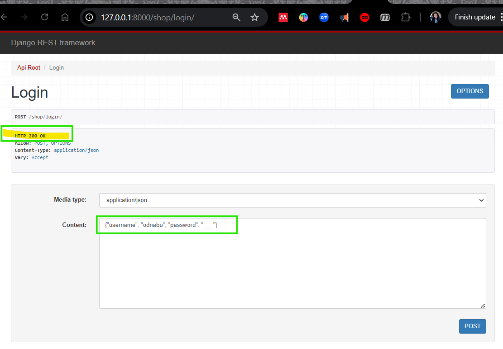
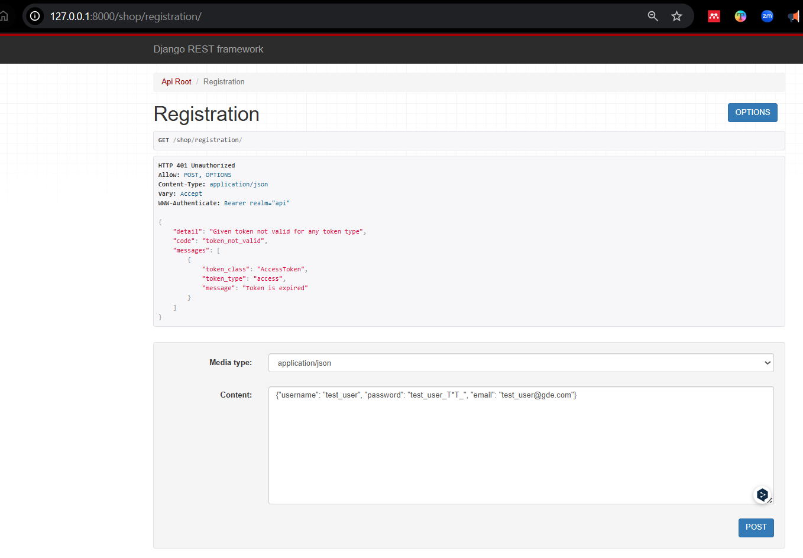
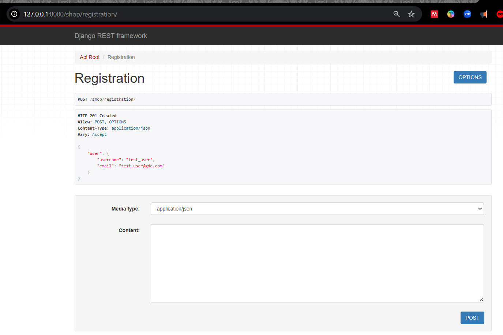
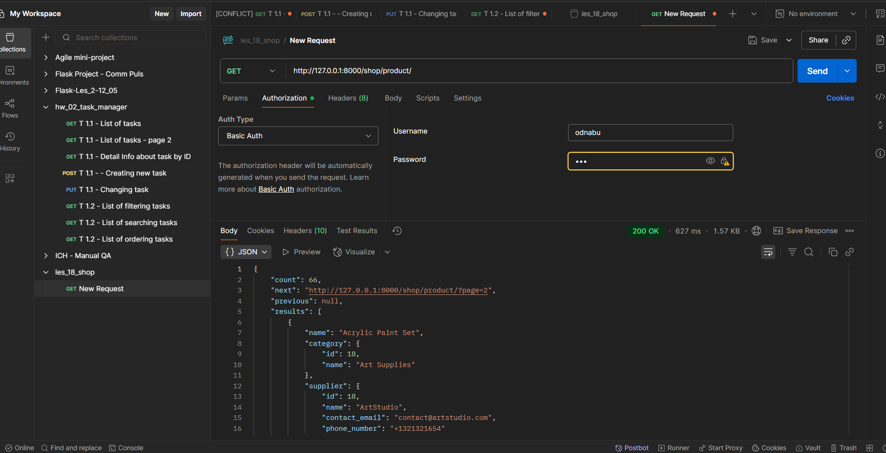
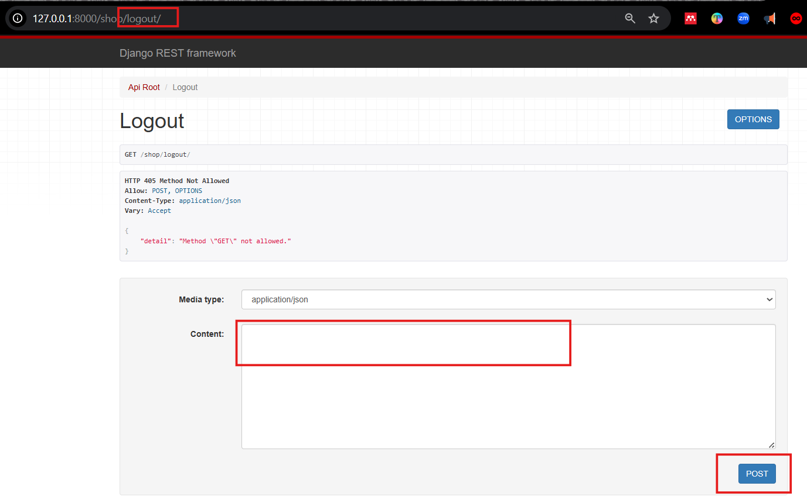
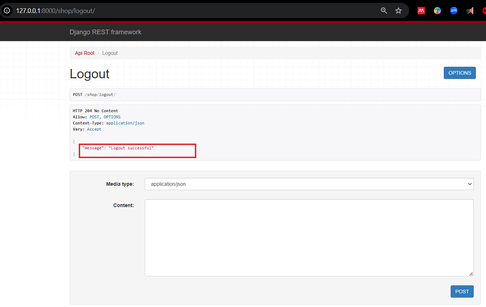
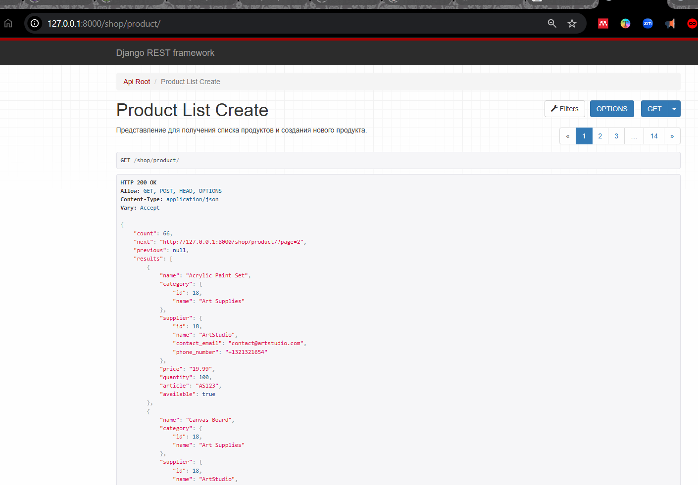
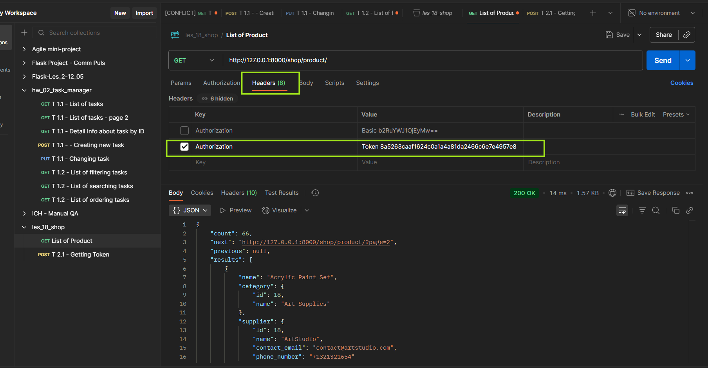

25.07.2025   
## <div style="color: #9000F0">Lesson 38 (Les 37 in the list of Module), Lecture 33</div>    
app "shop".

See <a>Les37-Python Adv_33-25_07.pdf</a>  and  <a>Les37-Python Adv_33---25_07.pdf</a>  

Смотри репу Бандыло со всеми приложениями: https://github.com/viacheslav-bandylo/111124-projects/tree/main

### 24.07.2025 - Les 38 (Les 37 in the list of Module), Lec 33: Автосохранение и автоиспользование JWT токенов

ЗАЛОГИНИВАНИЕ по адресу http://127.0.0.1:8000/shop/login/:
```python
{"username": "odnabu", "password": "123"}
```




### 24.07.2025 - Les 38 (Les 37 in the list of Module), Lec 33: Регистрация пользователя с JWT

Hanna Kulykovska 12:32
> USERNAME_FIELD = 'email' указывает Django использовать email вместо username для аутентификации.

РЕГИСТРАЦИЯ:
```python
{"username": "test_user", "password": "test_user_T*T_", "email": "test_user@gde.com"}
```




ЕСТЬ ДОСТУП


РАЗЛОГИНИВАНИЕ


ПОСЛЕ РАЗЛОГИНИВАНИЯ


Пользователь видит список продуктов, но не сможет видеть детали по продукту:




---
    %%%%%%%%%%%%%%%%%%%%%%%%%%%%%%%%%%%%%%%%%%%%%%%%%%%%%%%%%%%%%%%%%%%%%%%%%%%%%%%%%%%%
---

---

Почему может НЕ происходить автоматическое обновление access-токена в куки.

[ChatGPT](https://chatgpt.com/s/t_6884e176340c8191a9c2deb672e62122)

### Проблема
Ключевой участок:
```python
if response.status_code == 401 and b"Token is invalid or expired" in response.content:
```

**🔴 Проблема в этом условии:**
Middleware проверяет, содержится ли *байтовая строка* `"Token is invalid or expired"` в `response.content`. Но:

* DRF **не гарантирует**, что именно такая фраза попадёт в ответ.
* Сообщение может отличаться по версии DRF или `simplejwt`.
* Может быть HTML-ответ, JSON-ошибка, или другая структура.

---

### ✅ **Решение**

1. **Надёжнее проверять по коду ошибки и типу исключения.**

#### 🔧 Исправленный `process_response`:

```python
def process_response(self, request, response):
    if response.status_code == 401:
        refresh_token_cookie = request.COOKIES.get('refresh_token')

        if refresh_token_cookie:
            try:
                refresh = RefreshToken(refresh_token_cookie)
                new_access_token = str(refresh.access_token)

                # Обновим куки
                response.set_cookie('access_token', new_access_token, httponly=True, samesite='Lax', secure=False)
                response.set_cookie('refresh_token', str(refresh), httponly=True, samesite='Lax', secure=False)

                # Переотправим исходный запрос — ВНИМАНИЕ: этот подход нестабилен
                return response  # Лучше просто вернуть обновлённый токен, и клиент пусть сделает повторный запрос

            except TokenError:
                # Удаляем токены, если refresh невалиден
                response.delete_cookie('access_token')
                response.delete_cookie('refresh_token')
                return response
    return response
```

---

### 💡 **Альтернатива: обновление токенов через специальный эндпоинт**

Как делают обычно:

* На фронте ловят 401.
* Отправляют `refresh_token` на отдельный эндпоинт (`/token/refresh/`).
* Получают новый `access_token`.
* Повторяют исходный запрос.

💡 Но твоя идея с middleware — это круто, если всё работает "бесшовно".

---

### 🔍 Также проверь

1. **Ты точно используешь `SimpleJWT` в настройках?**

   ```python
   REST_FRAMEWORK = {
       'DEFAULT_AUTHENTICATION_CLASSES': (
           'rest_framework_simplejwt.authentication.JWTAuthentication',
       ),
   }
   ```

2. **Middleware зарегистрирован в `settings.py`?**

   ```python
   MIDDLEWARE = [
       ...
       'les_18_shop.middleware.JWTAuthenticationMiddleware',
   ]
   ```

3. **Ты тестируешь с `httponly=True` куками?**
   Их нельзя видеть в `document.cookie`, но они есть в запросах.

---

### 🔐 Совет: логируй ключевые шаги

Чтобы точно понять, **что именно не срабатывает**, можно временно добавить `print(...)` или логгирование:

```python
print('Access token not valid, trying refresh...')
```

