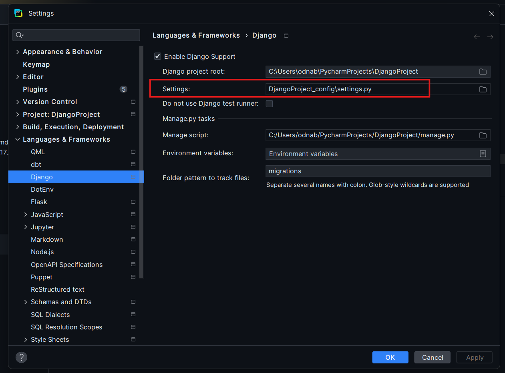
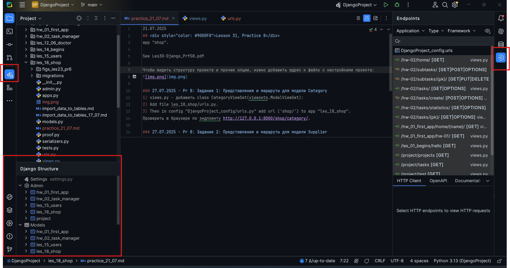
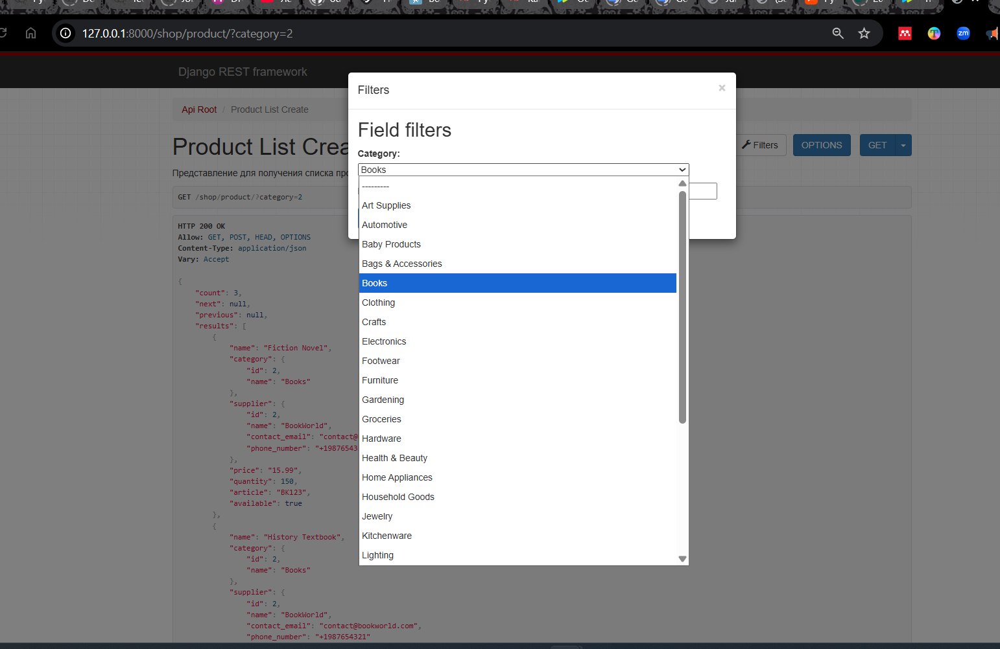
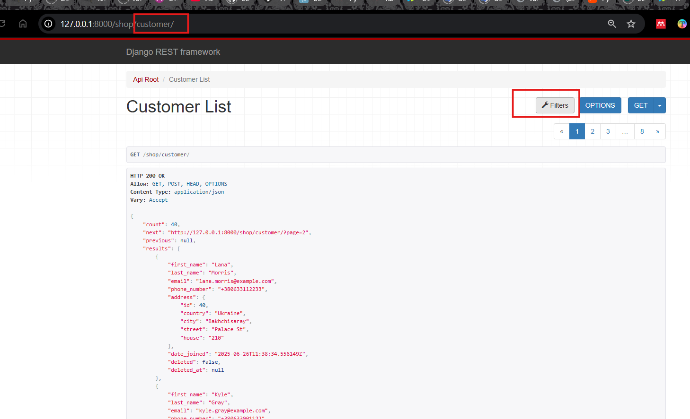

21.07.2025   
## <div style="color: #9000F0">Lesson 31, Practice 8</div>    
app "shop".

See Les30-Django_PrfS8.pdf

Чтобы видеть структуру проекта и прочие опции, нужно добавить адрес к файлу с настройками проекта:  

<br/>  

  

### 21.07.2025 - Pr 8: Задание 1: Представления и маршруты для модели Category
1) views.py - добавить class CategoryViewSet(viewsets.ModelViewSet):
2) Add file les_18_shop/urls.py.
3) Then in config "DjangoProject_config/urls.py" add url ('shop/') to app "les_18_shop".
Проверить в браузере по эндпоинту http://127.0.0.1:8000/shop/category/.

### 21.07.2025 - Pr 8: Задание 2: Представления и маршруты для модели Supplier
Проверить в браузере по эндпоинту http://127.0.0.1:8000/shop/category/.


### 21.07.2025 - Pr 8: Задание 3: Представления и маршруты для модели Product
Пути __НЕльзя__ добавить в router, потому что ProductListCreateView(=___ListCreateAPIView___=).  
Поэтому добавляются они сразу в urlpatterns.

Проверить в браузере по эндпоинту http://127.0.0.1:8000/shop/product/.
Проверить в браузере по эндпоинту http://127.0.0.1:8000/shop/product/1/.


### 21.07.2025 - Pr 8: Задание 4: Представления и маршруты для модели ProductDetail
Проверить в браузере по эндпоинту http://127.0.0.1:8000/shop/product-detail/41/

### 21.07.2025 - Pr 8: Задание 5: Представления и маршруты для модели Address
Проверить в браузере по эндпоинту http://127.0.0.1:8000/shop/address/.


### 21.07.2025 - Pr 8: Задание 6: Представления и маршруты для модели Customer 
Проверить в браузере по эндпоинту http://127.0.0.1:8000/shop/customer
Проверить в браузере по эндпоинту http://127.0.0.1:8000/shop/customer/40/


### 21.07.2025 - Pr 8: Задание 7: Представления и маршруты для модели Order
Проверить в браузере по эндпоинту http://127.0.0.1:8000/shop/order/

### 21.07.2025 - Pr 8: Задание 8: Представления и маршруты для модели OrderItem
Проверить в браузере по эндпоинту http://127.0.0.1:8000/shop/order-item/

### 21.07.2025 - Pr 8: Задание 9: Добавление filter_backends
Установить 
```bash
 pip install django-filter
```
В сеттинги добавить:
```python
INSTALLED_APPS = [
    # ____ Для practice_21_07.md
    'django_filters',
]
```
Задание 9.1: Настройка фильтрации для модели Product
Проверить в браузере по эндпоинту http://127.0.0.1:8000/shop/product/?category=2

<br/>  


Задание 9.2: Настройка фильтрации для модели Customer
Проверить в браузере по эндпоинту http://127.0.0.1:8000/shop/customer/

<br/>  

