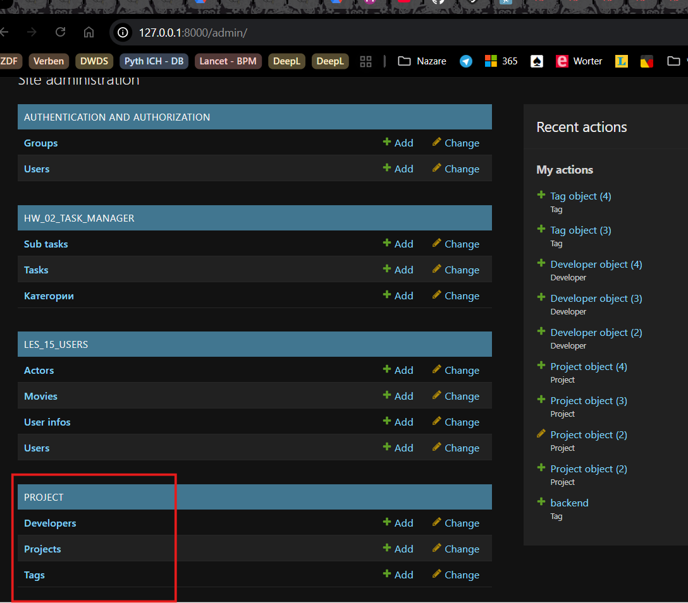

Нажать на ссылку и перейти в браузер http://127.0.0.1:8000/

Откроется страница:  

  

<a id="img1" style="margin: 40px; color:#606060;">Fig. 1. _____.</a>

Потом перейти в АДМИНКУ и Открыть ПРОЕКТ:

  

<a id="img2" style="margin: 40px; color:#606060;">Fig. 2. _____.</a>

___или___ можно ПЕРЕЙТИ по ЭНДПОИНТУ в адресной строке
СНАЧАЛА заполнить НАЗВАНИЯ проектов

  

<a id="img3" style="margin: 40px; color:#606060;">Fig. 3. _____.</a>

ДОБАВИТЬ разработчиков:

  

<a id="img4" style="margin: 40px; color:#606060;">Fig. 4. _____.</a>

Добавить ТЕГИ:

  

<a id="img4" style="margin: 40px; color:#606060;">Fig. 5. _____.</a>

ПОСЛЕ добавок во все urls.py, во views.py ПЕРЕЗАПУСКАЕМ сервер:

  

<a id="img6" style="margin: 40px; color:#606060;">Fig. 6. _____.</a>

ПЕРЕХОДИМ в ЭНДПОИНТ "/test":

  

<a id="img7" style="margin: 40px; color:#606060;">Fig. 7. _____.</a>

---
Можно добавлять проекты в базу через команды в ФУНКЦИИ в 
project/views.pyю. НО так лучше НЕ делатиь.
